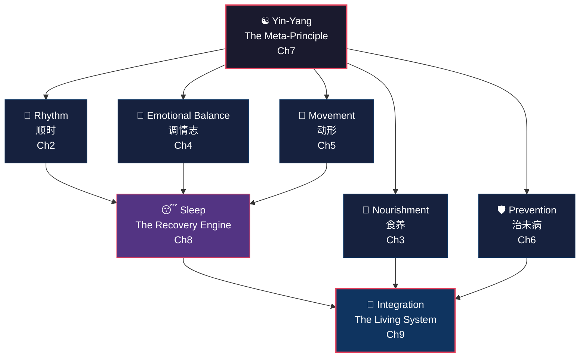

# Chapter 1: The Oldest Conversation About Health

> *I have heard that in ancient times, people all lived to be a hundred years old without their movements becoming feeble. But nowadays, people are already declining at fifty. Is this because times have changed, or because people have lost the Way?*
>
> — *Huangdi Neijing, Su Wen, Chapter 1: "The Treatise on the Heavenly Truth of Antiquity"*

## 1.1 A Question That Refused to Die

Twenty-five hundred years ago, a ruler sat down with his physician.

The setting was not a battlefield tent or an emergency sickbed, but a court chamber where the morning light was just breaking through. The air carried the faint scent of mugwort. The ruler did not ask about conquering enemies, filling treasuries, or managing floods. He asked a question so fundamental it could have been typed into a search engine last night.

"I have heard that in ancient times, people lived to a hundred and their bodies remained strong."

He paused, gazing past the courtyard.

"But the people of today are already deteriorating at fifty. Is this because the world has changed — or because we have lost the Way?"

The ruler was Huangdi, the Yellow Emperor of Chinese legend. His physician was Qi Bo, the court's chief medical sage — not merely a healer of ailments, but what we might today call a systems thinker of human health.

Qi Bo's answer did not involve a pill, a potion, or a single prescription. He described a *way of living*: rise and sleep with the sun, eat with restraint and rhythm, move the body daily, master the emotions, prevent disease before it takes root.

Simple principles. Devastatingly hard to practice. Almost never fully followed.

This dialogue was recorded, copied, and transmitted across generations until it became the opening chapter of the *Huangdi Neijing* (黄帝内经) — the foundational text of Chinese medicine and one of the oldest systematic health treatises in human civilization.

Here is what makes this ancient exchange uncanny: replace "the people of today" with "the average modern office worker," and the Emperor's complaint requires zero updating. Chronic fatigue by thirty. Back pain by forty. Metabolic syndrome by fifty. A medicine cabinet by sixty.

The numbers give the Emperor's lament statistical teeth. In 2024, *The Lancet* published a study spanning 190 countries, finding that over one billion people worldwide are now obese. Type 2 diabetes cases have quadrupled in three decades. The WHO reports that 17 million people die before age 70 each year from chronic non-communicable diseases — and the majority of these deaths are classified as "preventable."

The question stands, unanswered and urgent, across twenty-five centuries.

This book is Qi Bo's answer — decoded, validated, and made actionable for the 21st century.

## 1.2 What Is the Huangdi Neijing?

The *Huangdi Neijing* — often translated as *The Yellow Emperor's Classic of Internal Medicine* — is the single most influential medical text in East Asian history. But it is surrounded by misconceptions that we should clear up immediately.

**It was not written by an emperor.** The dialogue format is a literary device. Like Plato's dialogues using Socrates as a mouthpiece, the *Neijing* uses the Yellow Emperor figure to lend authority to a body of accumulated medical knowledge. The Socratic method of teaching through questions had a Chinese counterpart — centuries before Socrates walked the Agora.

**It was not written by one person, or even one generation.** Scholars date its compilation to roughly 300 BC through 100 BC, spanning the Warring States period into the early Han dynasty. Multiple generations of physicians, naturalists, and philosophical thinkers contributed to what is essentially a collective intelligence project — centuries of clinical observation, distilled into dialogue form.

From a textual perspective, the *Neijing* is remarkable precisely because it is a "living document" — revised, annotated, and supplemented across centuries. This means it records not one individual's theory, but an entire civilization's evolving collective understanding of the human body. Even the ruler's posture in the text carries meaning: the most powerful person in the realm sits humbly before his physician, asking questions. Health, the text implies, outranks power.

**It is not one book, but two:**

- **Su Wen** (素问, *Basic Questions*) — 81 chapters covering human physiology, pathology, prevention, the theory of yin-yang and the five phases, seasonal health practices, and the relationship between emotions and organ systems. This is the "why" of health.
- **Ling Shu** (灵枢, *Spiritual Pivot*) — 81 chapters focusing on the meridian system, acupuncture points, needling techniques, and therapeutic methods. This is the "how."

Together: 162 chapters. Roughly 200,000 characters. What may be the most comprehensive pre-modern investigation of human health ever assembled.

The *Neijing* discusses topics with surprising specificity:

- Why spring induces drowsiness (the liver's expansive energy in the wood phase)
- How rage damages the liver (the emotion-organ mapping system)
- Why winter demands more sleep (yang energy enters storage mode)
- How excessive worry impairs digestion (the spleen governs thought)

It reads less like mysticism and more like a field manual compiled by centuries of meticulous observers who simply lacked microscopes.

One detail deserves special attention. The *Neijing* devotes remarkably little space to traumatic injuries or acute epidemics — the deadliest health threats of its era. Instead, it pours the vast majority of its ink into chronic health management and lifestyle-related decline. This editorial choice seemed odd for its time. Today, it looks almost prophetic: in developed nations, chronic non-communicable diseases (cardiovascular disease, diabetes, cancer, mental health disorders) have overtaken infectious disease as the leading cause of death. The *Neijing* appears to have leapfrogged the age of acute illness entirely, writing an operating manual for the "chronic disease era" twenty-five centuries in advance.

## 1.3 Why This Book Matters Right Now

In 2017, Jeffrey Hall, Michael Rosbash, and Michael Young received the Nobel Prize in Physiology or Medicine for discovering the molecular mechanisms governing circadian rhythms.

Using fruit fly experiments, they proved that every cell in the human body runs on an internal clock — and that chronically disrupting that clock triggers metabolic disorder, immune suppression, and elevated cancer risk.

The *Su Wen*, Chapter 2 — written over two millennia before the Nobel committee convened — instructs:

- Spring: "Go to bed late and rise early; walk briskly in the courtyard" (春三月...夜卧早起，广步于庭)
- Summer: "Go to bed late and rise early; do not resent the long days" (夏三月...夜卧早起，无厌于日)
- Autumn: "Go to bed early and rise early; rise with the rooster" (秋三月...早卧早起，与鸡俱兴)
- Winter: "Go to bed early and rise late; wait for the sunlight" (冬三月...早卧晚起，必待日光)

This is not poetic metaphor. It is a precise, seasonally adjusted circadian lifestyle protocol.

And circadian biology is only one convergence point. Modern science is validating *Neijing* concepts across a remarkably wide front:

- **The gut-brain axis** (Mayer et al., 2014) confirms that the digestive system "governs thought" — gut microbiota demonstrably influence mood, cognition, and depression risk through the vagus nerve pathway.
- **Psychoneuroimmunology** validates the *Neijing*'s emotion-organ damage map — chronic anger elevates cortisol and impairs liver metabolism; sustained grief measurably suppresses respiratory immune function.
- **Time-restricted eating research** (Patterson & Sears, 2017) echoes "食饮有节" (*shí yǐn yǒu jié*, "eat and drink with moderation") — the *timing* of food intake may matter as much as calorie counts.
- **Forest bathing studies** (Li, 2010) align with "法于阴阳" (*fǎ yú yīn yáng*, "model yourself on yin-yang") — two hours of natural environment exposure significantly boosts NK cell activity and reduces cortisol.

The cultural moment is equally striking.

The WHO published its *Global Traditional Medicine Strategy 2025–2034*, formally integrating traditional medicine into global health governance for the first time. On social media, "Chinamaxxing" became a viral phenomenon in late 2025, with TCM-related searches doubling in the US and UK within six months. Acupuncture wait times in New York and London stretched to weeks.

Western medicine remains magnificent at acute intervention — trauma surgery, antibiotics, cancer immunotherapy. But for the slow-burn crises of modern life — chronic stress, metabolic syndrome, insomnia, anxiety, attention fragmentation — its toolkit is limited.

People are searching for a holistic, prevention-first philosophy of health. The *Huangdi Neijing* offers exactly that: a 2,500-year-old framework that cutting-edge science keeps independently rediscovering.

## 1.4 What This Book Is Not

Before we go further, four boundaries need drawing.

**This is not a translation of the Neijing.** Excellent scholarly translations already exist — Ilza Veith's pioneering 1949 edition (revised 2002), Paul Unschuld's monumental two-volume annotated translation (2011), Maoshing Ni's accessible reader (1995). This book is a *lifestyle wisdom extraction*: it distills the *Neijing*'s core principles into a practical, evidence-backed guide for modern living.

**This is not medical advice.** If you are under treatment for any condition, follow your physician's guidance. This book addresses lifestyle philosophy and prevention, not clinical prescription.

**This is not mysticism.** You will not encounter unsubstantiated metaphysical claims. Every ancient principle is paired, wherever possible, with modern scientific evidence — or an honest acknowledgment that evidence is still emerging.

**This is not exoticism.** We afford the *Neijing* the same intellectual seriousness given to Hippocrates, Galen, or Maimonides. It is a pillar of humanity's medical heritage — not an exotic curiosity to be romanticized or dismissed.

So what *is* this book? In one sentence: **a modern-science-informed reinterpretation of the wellness wisdom embedded in a 2,500-year-old physician-emperor dialogue, translated into a lifestyle guide you can begin practicing today.**

## 1.5 The Core Framework: Five Pillars of Neijing Wellness

Qi Bo's answer to the Emperor distills into five interconnected principles. I call them the **Five Pillars of Neijing Wellness** — and they form the structural spine of this book.

Each pillar maps to a core chapter:

1. **Rhythm (顺时, shùn shí)** — Living in harmony with the cycles of day, season, and life stage. The *Su Wen* opens: "法于阴阳，和于术数" (*fǎ yú yīn yáng, hé yú shù shù*) — "Model yourself on yin-yang; harmonize with the patterns of nature." Not a philosophical slogan — a precise lifestyle calendar. → Chapter 2

2. **Nourishment (食养, shí yǎng)** — Food as the primary medicine. Not just *what* you eat, but *when*, *how much*, and *in what rhythm*. "Eat and drink with moderation" carries four layers of meaning the ancients took seriously. → Chapter 3

3. **Emotional Balance (调情志, tiáo qíng zhì)** — Managing the inner landscape. The *Neijing* maps five core emotions — anger, joy, worry, grief, fear — to specific organ systems. Not moral philosophy; psychosomatic medicine, twenty-five centuries early. → Chapter 4

4. **Movement (动形, dòng xíng)** — The body in motion. Not extreme athletics, but consistent, gentle practice. "When the body does not move, essence does not flow; when essence stagnates, a hundred diseases arise." → Chapter 5

5. **Prevention (治未病, zhì wèi bìng)** — "上工治未病" (*shàng gōng zhì wèi bìng*) — "The superior physician prevents disease before it arises." The *Neijing*'s most radical proposition, and the one most deeply aligned with 21st-century integrative medicine. → Chapter 6

Yin-Yang (Chapter 7) is the meta-principle unifying all five pillars.

Sleep (Chapter 8) is the body's recovery engine, deeply linked to rhythm, emotion, and movement.

Chapter 9 integrates everything into a cohesive, actionable modern wellness practice.

## 1.6 How Qi Bo Would Diagnose Modern Life

Indulge a thought experiment. Qi Bo materializes in 2026 and shadows a typical urban professional for an entire day.

**6:00 AM** — An alarm clock wrenches the person from deep sleep. Outside, the winter sky is still pitch dark.

Qi Bo frowns: "In winter, one must 'go to bed early and rise late, waiting for the sunlight.' You force the body to activate before yang energy has risen. This is like pulling a seedling from frozen soil. It depletes root vitality."

**7:30 AM** — No breakfast. An iced coffee on the commute.

Qi Bo winces: "Cold liquid on an empty stomach wounds the spleen-yang — like pouring ice water on a fire just as it starts to kindle. The spleen governs transformation and transport. Damage it, and by noon your energy collapses. By three o'clock, you will reach for sugar. You think you lack caffeine; in truth, you extinguished your own digestive fire."

**9 AM–6 PM** — Nine hours of continuous sitting. Eyes fixed on a glowing screen. Lunch is delivery food eaten in five minutes at the desk.

Qi Bo sighs deeply: "Prolonged sitting damages the flesh. Prolonged gazing damages the blood. When the body does not move, essence stagnates and a hundred diseases arise. The ancients walked briskly in their courtyards. You are imprisoned in a luminous box, your sinews atrophying by the hour."

**8:00 PM** — After work, the person scrolls social media while eating dinner. Emotions swing between work anxiety and cheap dopamine hits from short videos.

Qi Bo observes: "Joy scatters the qi. Anger drives it upward. Fear sends it downward. Worry knots it. Within a single hour, you cycle through all five emotional extremes — the organs cannot stabilize. The spirit-mind will be restless tonight."

**11:30 PM** — In bed, still scrolling, blue light flooding the retinas.

Qi Bo is alarmed: "The *zi* hour — 11 PM to 1 AM — is when yang energy is reborn and the gallbladder meridian is on duty. You must be deeply asleep by now to nourish liver-blood. Instead, you assault the eyes with artificial brilliance and agitate the spirit. Persist in this, and vision will dim, heart-blood will wither, the liver-soul will lose its anchor. This is what we call 'taking recklessness as normal' — the path to self-destruction."

No blood panels. No MRI. No wearable device data. Just observation of one day's habits.

Yet Qi Bo would accurately predict this person's chief complaints: chronic fatigue, digestive trouble, cervical spine degeneration, insomnia, anxiety, inability to focus.

His prescription would be stunningly unglamorous — go to bed on time, eat real food, stand up and walk, manage your emotional swings, act on warning signals before they become crises.

Here is the striking part: if you translate Qi Bo's "diagnosis" into modern medical language, it aligns almost perfectly with the WHO's list of leading modifiable risk factors for preventable chronic disease — physical inactivity, unhealthy diet, insufficient sleep, and chronic psychosocial stress. Qi Bo knew nothing of cortisol, insulin resistance, or sympathetic nervous system overdrive. But through millennia of population-level observation, he arrived at convergent conclusions.

This is not coincidence. It is independent problem-solving across different eras and methodologies, arriving at the same answer. This "cross-temporal consensus" is the fundamental reason the *Neijing* deserves serious attention today — not as cultural heritage, but as a practical source of health intelligence.

## 1.7 Reflection Moment: Your Five-Pillar Self-Assessment

Before we begin this journey, take two honest minutes with yourself.

Rate each pillar from 1 to 5 (1 = poor, 5 = excellent):

| Pillar | Self-Assessment Question | Your Score |
|--------|------------------------|------------|
| Rhythm | Do I live in sync with natural light-dark cycles? Do I wind down after sunset? | ___/5 |
| Nourishment | Do I eat regular, whole-food meals at consistent times? | ___/5 |
| Emotional Balance | Am I aware of my emotional patterns and able to regulate them? | ___/5 |
| Movement | Do I move my body for at least 30 minutes daily? | ___/5 |
| Prevention | Do I invest in prevention (regular check-ups, early signals) rather than waiting until crisis? | ___/5 |

If your total is below 15 — do not despair. That is precisely why this book exists. Most modern people score low, and it is not a personal failure; it is a systemic drift in how our species now lives.

If you scored above 20, you may already be practicing *Neijing* wisdom intuitively. This book will help you turn instinct into knowledge and scattered habits into a coherent system.

Either way, the next eight chapters provide a framework that is ancient in origin, modern in evidence, and actionable starting tomorrow morning.

Remember your scores. At the end of this book, I will ask you to rate yourself again. The change itself will be the best answer sheet.

### Today's Actions

- ⚡ Complete the Five-Pillar self-assessment above. Write the scores on paper (not in a phone app — the act of writing is itself an awareness practice).
- ⚡ Answer the Emperor's question in one sentence: "Is your declining health because of the times, or because of your own choices?" Be honest.
- 🔄 For the next 7 days, observe ONE daily habit — when you wake, eat, exercise, or sleep — without changing anything. Just observe and record.

### Evidence Check

| Neijing Principle | Evidence Level | Notes |
|-------------------|---------------|-------|
| The ancients lived to 100 (longer-lived than moderns) | ✗ Disproven | Archaeological and demographic evidence shows ancient average lifespan was far below modern levels; however, the concept of "healthspan" merits discussion |
| 法于阴阳 — Model on yin-yang (align lifestyle with natural cycles) | ✓ Confirmed | Circadian biology, seasonal physiology, and exercise/recovery balance are well-supported |
| 食饮有节 — Eat and drink with moderation | ✓ Confirmed | Caloric restriction, intermittent fasting, and time-restricted eating research extensively supports dietary moderation |
| 不妄作劳 — Do not recklessly exhaust yourself | ✓ Confirmed | Overwork → burnout, immune suppression, cardiovascular risk; confirmed by extensive occupational health research |
| 形与神俱 — Body and spirit as one | ✓ Confirmed | Psychoneuroimmunology confirms bidirectional mind-body connection; meta-analyses support health benefits of mindfulness and meditation |

## 1.8 The Emperor's Question Remains Open

Let us return to where we started.

The Yellow Emperor asked: "Have the times changed, or have people lost the Way?"

Qi Bo's answer was clear and unsparing: people lost it themselves.

> *Those who knew the Way in ancient times modeled themselves on yin-yang, harmonized with the arts of calculation, ate and drank with moderation, maintained regular routines, and did not recklessly exhaust themselves. Therefore, body and spirit remained whole together, and they lived out their natural span — departing only after a hundred years.*
>
> — *Su Wen, Chapter 1*

Thirty-six characters in the original Chinese. The entire wellness philosophy of the *Huangdi Neijing*, compressed into a single paragraph. Every phrase maps to a dimension of wellness:

- "Modeled on yin-yang" → Rhythm (Chapter 2)
- "Ate and drank with moderation" → Nourishment (Chapter 3)
- "Maintained regular routines" → Rhythm and Sleep (Chapters 2, 8)
- "Did not recklessly exhaust themselves" → Movement and Emotional Balance (Chapters 4, 5)
- "Body and spirit remained whole together" → Integration (Chapter 9)

This passage is both manifesto and diagnosis — and the departure point for every chapter in this book.

In the pages ahead, we will unpack each keyword — yin-yang, natural patterns, dietary moderation, regular living, avoiding reckless exhaustion — and show how each maps onto cutting-edge science and translates into habits you can begin practicing tomorrow.

Next chapter, we start with the first pillar: **Rhythm**.

Why is the clock inside your body more important than the alarm clock on your nightstand? Why does *when* you sleep matter more than *how long* you sleep? Why did three Nobel laureates in 2017 prove something that Qi Bo described in 300 BC?

Turn the page. Qi Bo is waiting.

---

## References

1. *Huangdi Neijing, Su Wen*: Chapter 1 ("Treatise on the Heavenly Truth of Antiquity") and Chapter 2 ("Treatise on the Regulation of the Spirit by the Four Seasons"). Standard Wang Bing annotated edition.
2. Hall, J. C., Rosbash, M., & Young, M. W. (2017). Nobel Prize in Physiology or Medicine for discoveries of molecular mechanisms controlling the circadian rhythm. *Nobel Prize Committee, Stockholm*.
3. Unschuld, P. U. (2011). *Huang Di Nei Jing Su Wen: An Annotated Translation of Huang Di's Inner Classic — Basic Questions* (2 vols). University of California Press.
4. Mayer, E. A., Knight, R., Mazmanian, S. K., Cryan, J. F., & Tillisch, K. (2014). Gut microbes and the brain: paradigm shift in neuroscience. *Journal of Neuroscience*, 34(46), 15490–15496.
5. World Health Organization. (2025). *WHO Traditional Medicine Global Strategy 2025–2034*. Geneva: WHO.
6. Li, Q. (2010). Effect of forest bathing trips on human immune function. *Environmental Health and Preventive Medicine*, 15(1), 9–17.
7. Patterson, R. E., & Sears, D. D. (2017). Metabolic effects of intermittent fasting. *Annual Review of Nutrition*, 37, 371–393.
8. Veith, I. (2002). *The Yellow Emperor's Classic of Internal Medicine* (new edition). University of California Press.
9. Ni, M. (1995). *The Yellow Emperor's Classic of Medicine: A New Translation of the Neijing Suwen with Commentary*. Shambhala Publications.
