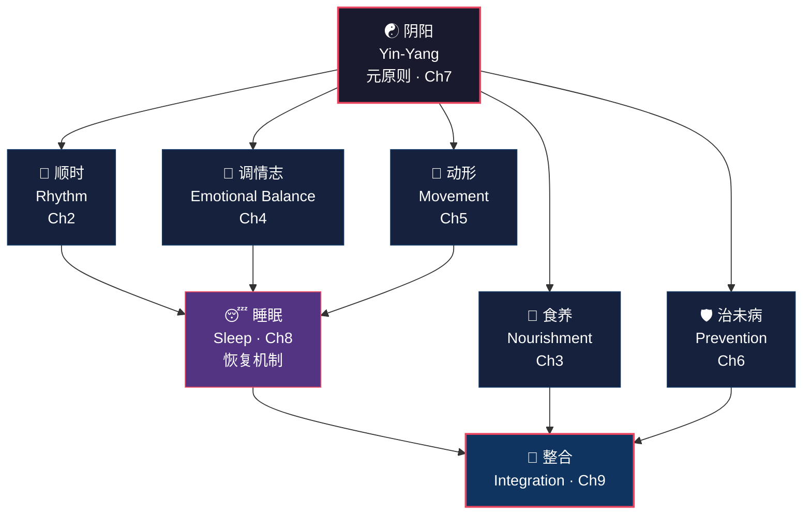

# 第一章：最古老的健康对话

> *余闻上古之人，春秋皆度百岁，而动作不衰；今时之人，年半百而动作皆衰者，时世异耶？人将失之耶？*
>
> ——《黄帝内经·素问·上古天真论》

## 1.1 两千五百年前的那个早晨

想象一下这个场景。

大约公元前三百年的某个清晨，天光初亮，一位帝王端坐在朝堂之上。面前摆的不是战争沙盘，不是税赋竹简，而是一位白发苍苍的老者。殿外鸟鸣阵阵，空气中弥漫着艾草的气味。这是一场不寻常的召见——帝王今天不问政事，不论军机，只问一个事关天下所有人的问题。

"我听说远古时代的人，都能活到一百岁，而且行动依然矫健。"

他停顿了一下，目光投向殿外的远山。

"可如今的人，刚到五十岁就已经衰退了。这是时代变了，还是人自己把养生之道弄丢了？"

这位帝王就是黄帝。他的对面坐着岐伯——不仅是御医，更是那个时代最博学的生命科学家。

岐伯的回答出人意料。他没有开药方，没有推荐补品，没有提出任何速效方案。他缓缓道出了一套完整的生活哲学：顺应天地四时的节律，饮食有节制，情绪有调和，身体常运动，疾病要预防。

这段君臣对话被后人一代代传抄，最终成为中华医学最重要的经典——《黄帝内经》的开篇第一章。

两千五百年后的今天，重新读这段话，你会感到一阵寒意。

它像是在直接描述我们这一代人——二十五岁开始颈椎不适，三十岁腰酸背痛成了常态，四十岁被各种慢性病缠身，五十岁依赖药物维持日常生活。

2024 年，《柳叶刀》发表了一项覆盖全球 190 个国家的研究，发现全球有超过 10 亿人患有肥胖症，2 型糖尿病患者在过去三十年间翻了两番。与此同时，世卫组织报告全球每年有 1700 万人在 70 岁之前死于慢性非传染性疾病——而这些疾病中的大多数，被公认为是"可预防的"。

黄帝的困惑，竟然就是我们此刻的困境。而岐伯的回答——那套关于节律、饮食、情志、运动和预防的完整体系——我们依然没有认真倾听。

## 1.2 黄帝内经是什么

先破除一个常见的误解：《黄帝内经》不是黄帝本人写的。

就像《论语》不是孔子亲笔，《黄帝内经》是战国至西汉时期（约公元前 300 年至公元前 100 年），由多代医家集体编撰而成的医学总集。"黄帝"是一个文学托名——借用上古圣王的权威，为这部书赋予正统地位。这种做法在古代世界十分普遍，正如古希腊人将智慧归于阿波罗神谕，古埃及人将医术归于托特神。

全书的结构非常独特：以黄帝与岐伯对话的形式展开。帝王发问，医者作答。这种"问答式"结构，比苏格拉底在雅典街头的对话录至少早了一个世纪，堪称人类最古老的启发式教学法之一。

帝王不耻下问，医者知无不言——这种姿态本身就包含了一种深刻的暗示：健康是比权力更重要的事情。即使是天下最有权势的人，面对衰老和疾病，也不得不谦卑地坐下来求教。

从文本考据的角度看，《内经》的成书过程也非常独特。它不像西方医学经典那样由单一作者在短期内完成，而是一部跨越数百年、不断修订和补充的"活文本"。这意味着它记录的不是某一个人的理论，而是整个文明在漫长时间里对人体健康的集体理解。

全书分为两大部分：

- **《素问》**（Basic Questions）：81 篇，讨论人体生理、病因病机、养生原则、阴阳五行、四季养生、情志与脏腑的关系。这是"为什么会生病、如何保持健康"的部分。
- **《灵枢》**（Spiritual Pivot）：81 篇，侧重经络系统、腧穴定位、针刺技术与治疗方法。这是"具体怎么做"的部分。

共 162 篇，总计约二十万字。

它不是一本玄之又玄的神秘主义读物，而是一部基于数百年临床观察和自然哲学的系统性人体健康指南。它详细讨论的话题包括：

- 为什么春天容易犯困？（春困与肝气升发的关系）
- 为什么暴怒会伤肝？（情绪与脏腑的映射）
- 为什么冬天要早睡晚起？（阳气收藏的生理机制）
- 为什么过度思虑会影响消化？（脾主思的脏腑情志学说）

令人惊讶的是，这些两千多年前的经验性观察，正在被现代实验科学逐一证实。

有一个细节值得注意：《内经》几乎不讨论外伤和急性传染病——这些是当时最致命的健康威胁。它把绝大部分篇幅留给了慢性健康管理和生活方式疾病。这个选择在两千年前显得奇怪，但放在今天，几乎像是一种预言：在发达国家，慢性非传染性疾病（心血管病、糖尿病、癌症、精神健康障碍）已经取代传染病，成为健康的头号杀手。《内经》仿佛跳过了急性病的时代，直接为"慢性病时代"写了一本操作手册。

## 1.3 为什么此刻它很重要

2017 年，三位美国科学家杰弗里·霍尔（Jeffrey Hall）、迈克尔·罗斯巴什（Michael Rosbash）和迈克尔·扬（Michael Young）获得诺贝尔生理学或医学奖。获奖原因：发现了控制昼夜节律的分子机制。

他们用果蝇实验证明了一件事——人体的每一个细胞内部都内置了一套精密的生物钟。这套时钟控制着激素分泌的节奏、体温的波动、免疫细胞的活跃周期。违背它——比如长期倒班、跨时区飞行、深夜暴露于人工光源——会导致代谢紊乱、免疫功能下降，甚至癌症风险增加。世卫组织已将"夜班工作导致的昼夜节律紊乱"列为 2A 类致癌因素。

翻开《黄帝内经·素问·四气调神大论》，两千多年前就写着：

- 春天应当"夜卧早起，广步于庭"
- 夏天应当"夜卧早起，无厌于日"
- 秋天应当"早卧早起，与鸡俱兴"
- 冬天应当"早卧晚起，必待日光"

这不是诗意的比喻——这是对昼夜节律养生法的精确描述，精确到连季节性调整都考虑在内了。

昼夜节律只是冰山一角。现代科学正在从多个方向与《内经》的古老智慧产生令人惊叹的交汇：

- **肠脑轴研究**（Mayer et al., 2014）证实了"脾主思"的古老观察——肠道微生物群落确实通过迷走神经通路直接影响情绪和认知功能
- **心理神经免疫学**验证了"怒伤肝、喜伤心、忧伤肺、恐伤肾"的情志脏腑学说——极端愤怒确实升高皮质醇并损害肝脏代谢功能
- **间歇性断食研究**（Patterson & Sears, 2017）呼应了"饮食有节"——进食时间窗口对代谢健康的影响，可能比热量计算更为关键
- **森林浴疗法**的科学证据（Li, 2010）印证了"法于阴阳"——在自然环境中暴露两小时，血液中的 NK 细胞活性显著提升

与此同时，世界卫生组织在 2025 年发布了《全球传统医学战略 2025-2034》，首次将传统医学系统性纳入全球公共卫生治理框架。

在社交媒体上，"Chinamaxxing"成为 2025 年底的文化现象——美国和英国的中医药相关搜索量在半年内翻了一番。针灸预约在纽约和伦敦的等待时间延长至数周。

这些并非巧合。当现代人被慢性压力、超加工食品、久坐办公和深夜蓝光屏幕围困时，西方医学擅长的急性病治疗——手术、抗生素、靶向药——显得力不从心。而那些缓慢侵蚀生活质量的慢性问题——失眠、焦虑、代谢综合征、慢性疲劳——需要一种完全不同的思维框架。

人们开始寻找一种更整体的、预防导向的健康哲学。而《黄帝内经》恰好提供了这样一套经过两千五百年实践检验的框架。

## 1.4 本书不是什么

在继续之前，有必要划清几条界线。

**本书不是《黄帝内经》的翻译。** 学术翻译已经有优秀版本：伊尔扎·维斯（Ilza Veith, 2002）的英译开山之作、保罗·恩施尔德（Paul Unschuld, 2011）两卷本注释学术版、倪毛信（Maoshing Ni, 1995）的大众读本。本书是一部"生活智慧提取"——将《内经》的核心原则转化为现代人可以直接实践的养生操作指南。

**本书不是医疗建议。** 如果你正在接受治疗，请遵从医生的方案。本书讨论的是生活方式哲学，而非临床处方。任何健康问题都应首先咨询专业医师。

**本书不是神秘主义。** 你不会在这里看到没有证据支撑的玄学论述。每一个古代观点，我都会尽可能匹配现代科学的验证——或者诚实地标注"尚待更多研究"。

**本书不是东方主义猎奇。** 我们以对待希波克拉底、盖伦、迈蒙尼德同样的学术严肃性来对待《黄帝内经》。它是人类医学遗产的核心组成部分，不是异域风情的文化装饰品。

那本书是什么？一句话概括：**用现代科学的语言，重新解读两千五百年前那场君臣对话中的健康智慧，并将其转化为你今天就能开始实践的生活指南。**

## 1.5 内经养生五柱

岐伯给黄帝的回答，归纳起来可以提炼为五大核心原则。我把它们称为"内经养生五柱"——这也是本书的整体骨架。

每一根柱子对应本书的一个核心章节：

1. **顺时（Rhythm）**—— 顺应四季昼夜的自然节律生活。《素问》开篇即言："法于阴阳，和于术数"（fǎ yú yīn yáng, hé yú shù shù），意即以阴阳变化为法则，与天地运行的规律相协调。这不是一句哲学口号，而是一套精确的生活时间表。→ 第二章

2. **食养（Nourishment）**—— 食物即药物，但药与毒只在分寸之间。"饮食有节"四个字，意味着吃什么、吃多少、什么时候吃、怎么吃，每一层都有讲究。→ 第三章

3. **调情志（Emotional Balance）**—— 管理内在情绪景观。《内经》将人的情志分为怒、喜、忧、思、恐五类，每一种情绪过度都会损伤对应的脏腑。这不是道德说教，而是一套情绪与生理的系统映射。→ 第四章

4. **动形（Movement）**—— 身体需要适度运动。"形不动则精不流，精不流则气郁。"《内经》推崇的不是极限运动，而是"导引按跷"式的柔和持续的身体练习。→ 第五章

5. **治未病（Prevention）**—— "上工治未病，不治已病"（shàng gōng zhì wèi bìng）。最高明的医者不是治好了多少病人，而是让多少人根本不生病。这是《内经》最具颠覆性的命题，也是与现代预防医学最深刻的共振。→ 第六章

阴阳（第七章）是贯穿五柱的元原则——它不是神秘概念，而是对自然界一切对立统一现象的系统描述。

睡眠（第八章）是身体的恢复引擎，与节律、情志、运动三根柱子深度联动。

第九章将所有柱子整合为一套可以在明天早晨就开始实践的现代养生系统。

## 1.6 岐伯会如何看待现代生活

让我们做一个思想实验。

假设岐伯穿越到 2026 年，隐身跟随一位典型的都市白领度过完整的一天。他会看到什么？他会说什么？

**早晨 6:00** —— 闹钟刺耳作响，把人从深度睡眠中粗暴拽出。窗外冬日的天空还是漆黑一片。

岐伯皱眉道："冬三月，此谓闭藏。当'早卧晚起，必待日光'。你为何在阳气未生之时强迫身体起床？逆时而动，首伤肾阳。长此以往，元气必亏。"

**早晨 7:30** —— 来不及吃早餐，灌一杯冰美式咖啡冲出家门。

岐伯摇头不止："空腹饮寒凉之物，如以冰雪浇灌初春之苗。脾阳受损，运化无力。脾为后天之本，气血化源。脾伤则半日便见倦怠，午后更觉昏沉，你以为是'缺咖啡'，实则是脾阳被你自己浇灭了。"

**上午 9:00 至下午 6:00** —— 连续坐在工位上九个小时，目不转睛盯着发光屏幕，午餐是外卖快餐，五分钟扒完。

岐伯长叹一声："久坐伤肉，久视伤血，久食肥甘厚味伤脾胃。形不动则精不流，精不流则气滞，气滞则百病丛生。古人'广步于庭'，你却困于方寸之间，筋脉何以畅通？"

**晚上 8:00** —— 下班后边吃晚餐边刷手机，情绪在工作焦虑和短视频的廉价快感间剧烈震荡。

岐伯点评："喜则气缓，怒则气上，恐则气下，忧则气结。你在一个时辰内经历数种情绪剧变，五脏如何承受？神明不安，夜必难寐。"

**晚上 11:30** —— 躺在床上继续刷手机，蓝光直射瞳孔。

岐伯大惊："子时（23:00-1:00）一阳初生，胆经当令。此时当已熟睡，以助阳气萌发、肝血回流。你却以强光刺目扰神，肝魂不安。日久必损目力、耗心血、伤肝胆。此乃'以妄为常'，自取衰败之道也。"

这位两千五百年前的医者，不需要任何化验报告，不需要 CT、核磁共振或血液生化指标。仅凭观察一日起居饮食，就能准确预测这位现代人最可能的健康投诉：慢性疲劳、消化不良、颈椎腰椎退行性病变、失眠、焦虑、注意力涣散。

他的处方同样不复杂——不需要灵丹妙药，不需要昂贵仪器。回归最基本的常识就够了：按时睡觉，好好吃饭，站起来走走，别让情绪失控，在身体发出警告信号时就采取行动。

有趣的是，如果你把岐伯的"诊断"翻译成现代医学术语，它与世界卫生组织关于"可预防慢性病的主要风险因素"的报告几乎完全重合：缺乏运动、不健康饮食、睡眠不足、慢性压力。岐伯不知道什么是皮质醇、胰岛素抵抗或交感神经过度激活——但他通过几千年的人群观察，抵达了同样的结论。

这不是巧合。这是不同时代、不同方法论对同一个问题的独立求解，得到了收敛的答案。这种"跨时空的共识"，正是《内经》在今天仍然值得认真对待的根本原因。

## 1.7 反思时刻：你的五柱自评

在开始本书旅程之前，花两分钟对自己做一个诚实的评估。

用 1-5 分（1 = 很差，5 = 很好）给自己的每根"柱子"打分：

| 养生柱 | 自评问题 | 你的评分 |
|--------|---------|---------|
| 顺时 | 我是否按照自然节律作息？天黑后是否减少光照和刺激？ | ___/5 |
| 食养 | 我是否规律三餐、少吃超加工食品、注意进食节奏？ | ___/5 |
| 调情志 | 我是否善于觉察自己的情绪波动并主动调节？ | ___/5 |
| 动形 | 我每天是否有至少 30 分钟的身体活动？ | ___/5 |
| 治未病 | 我是否注重预防（定期体检、早期干预），而非等到生病才行动？ | ___/5 |

如果总分在 15 分以下——不必焦虑，这恰恰是本书存在的意义。大多数现代人的得分都不会太高，这不是个人的失败，而是整个时代的生活方式出了系统性偏差。

如果总分在 20 分以上——恭喜，你可能已经在无意间践行着《内经》的智慧。本书将帮你把直觉升级为知识，把零散的习惯整合为体系。

无论处于哪个分数段，接下来的八章都将为你提供一个有古典根基、有现代证据、明天早晨就能开始实践的完整养生升级路径。

记住你此刻的分数。读完全书后，我会请你再评一次。变化本身就是最好的答卷。

### 今日行动

- ⚡ 完成上面的五柱自评打分，把分数写在纸上（不是手机备忘录——动笔写本身就是一次觉察行为）。
- ⚡ 用一句话回答黄帝的问题："你觉得自己的身体状态衰退，是时代的原因还是自己的原因？"诚实回答。
- 🔄 在接下来 7 天里，每天观察自己的一个生活习惯——什么时候醒来、什么时候吃饭、什么时候运动、什么时候入睡——不做任何改变，只是观察和记录。

### 证据强度标注

| 内经原则 | 证据等级 | 说明 |
|---------|---------|------|
| 上古之人度百岁（古人更长寿）| ✗ 已证伪 | 考古和人口学证据显示古代平均寿命远低于现代；但"健康寿命"的概念值得讨论 |
| 法于阴阳（顺应自然规律养生）| ✓ 已证实 | 昼夜节律、季节生理学、运动/恢复平衡等均有充分证据 |
| 食饮有节（饮食节制）| ✓ 已证实 | 热量限制、间歇断食、进食窗口等研究大量证实节制饮食的健康益处 |
| 不妄作劳（不过度消耗）| ✓ 已证实 | 过劳→倦怠/免疫下降/心血管风险，大量职业健康研究证实 |
| 形与神俱（身心一体）| ✓ 已证实 | 心理神经免疫学证实身心双向联系；正念/冥想对健康的益处有 meta 分析支持 |

## 1.8 总结：皇帝的问题仍在等待回答

让我们回到开篇那个场景。

黄帝问："时世异耶？人将失之耶？"——是时代变了，还是人自己把养生之道弄丢了？

岐伯的回答清晰而不留情面：是人自己丢的。

> *上古之人，其知道者，法于阴阳，和于术数，食饮有节，起居有常，不妄作劳，故能形与神俱，而尽终其天年，度百岁乃去。*
>
> ——《素问·上古天真论》

翻译成现代话："懂得养生之道的古人，以阴阳为法则，与自然规律协调一致，饮食有节制，作息有规律，不胡乱消耗精力。因此他们的身体和精神始终完整统一，能够活满天赋的自然寿命，过了百岁才安然离世。"

这段话只有三十六个字，却是整部《黄帝内经》养生哲学的总纲领。每一个词组都对应着一个完整的养生维度：

- "法于阴阳"→ 顺时（第二章）
- "食饮有节"→ 食养（第三章）
- "起居有常"→ 节律与睡眠（第二、八章）
- "不妄作劳"→ 动形与情志（第四、五章）
- "形与神俱"→ 整合（第九章）

也是本书每一章的出发点。

接下来的旅程中，我们将逐一拆解这段话的每一个关键词——阴阳、术数、食饮、起居、妄劳——看看它们在两千五百年后的今天，如何精准对应着最前沿的科学发现，又如何转化为你明天早晨就能着手实践的具体生活习惯。

下一章，我们从第一根柱子开始：**顺时**。

为什么你体内的生物钟比床头的闹钟更重要？为什么"睡对时间"比"睡够时间"更关键？为什么诺贝尔奖得主在 2017 年证明的事情，岐伯在公元前三百年就已经说清楚了？

翻页。岐伯正在等你。

---

## 参考文献

1. 《黄帝内经·素问》，上古天真论篇第一、四气调神大论篇第二。王冰注本，人民卫生出版社。
2. Hall, J. C., Rosbash, M., & Young, M. W. (2017). Nobel Prize in Physiology or Medicine for discoveries of molecular mechanisms controlling the circadian rhythm. *Nobel Prize Committee*.
3. Unschuld, P. U. (2011). *Huang Di Nei Jing Su Wen: An Annotated Translation of Huang Di's Inner Classic — Basic Questions*. University of California Press.
4. Mayer, E. A., Knight, R., Mazmanian, S. K., Cryan, J. F., & Tillisch, K. (2014). Gut microbes and the brain: paradigm shift in neuroscience. *Journal of Neuroscience*, 34(46), 15490–15496.
5. World Health Organization. (2025). *WHO Traditional Medicine Global Strategy 2025–2034*. Geneva: WHO.
6. Li, Q. (2010). Effect of forest bathing trips on human immune function. *Environmental Health and Preventive Medicine*, 15(1), 9–17.
7. Patterson, R. E., & Sears, D. D. (2017). Metabolic effects of intermittent fasting. *Annual Review of Nutrition*, 37, 371–393.
8. Veith, I. (2002). *The Yellow Emperor's Classic of Internal Medicine* (new edition). University of California Press.
9. Ni, M. (1995). *The Yellow Emperor's Classic of Medicine: A New Translation of the Neijing Suwen with Commentary*. Shambhala Publications.
