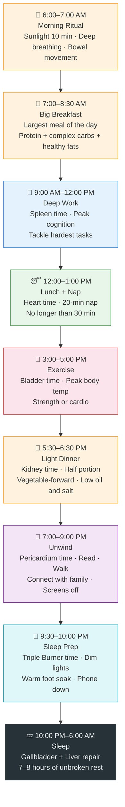

# Chapter 2: Living in Rhythm

> 春三月，此谓发陈。天地俱生，万物以荣。夜卧早起，广步于庭……此春气之应，养生之道也。
>
> *Chūn sān yuè, cǐ wèi fā chén. Tiāndì jù shēng, wànwù yǐ róng. Yè wò zǎo qǐ, guǎng bù yú tíng… cǐ chūn qì zhī yìng, yǎngshēng zhī dào yě.*
>
> "The three months of spring are called 'putting forth and unfolding.' Heaven and earth together produce life, and the ten thousand things flourish. Go to bed late and rise early, walk broadly in the courtyard… This is the response to spring qi — the way of nourishing life."
>
> — *Su Wen*, Chapter 2: *On Regulating the Spirit According to the Four Seasons*

## 2.1 The Healthy Overachiever Who Fell Apart

Chen Lu is a thirty-four-year-old CTO at a startup. On paper, he does everything right.

He drinks two liters of water a day. Eats whole-grain toast with avocado. Runs ten kilometers every weekend. He has six health apps on his phone, tracks every calorie, measures his protein-to-carb ratio with precision, and posts workout check-ins on social media to a chorus of "incredibly disciplined" comments.

But nobody sees his actual schedule. He doesn't start exercising until 11 PM — because the day is "just too packed." After a late-night snack, he scrolls his phone until 2 AM, watching one last short video before he's willing to close his eyes. Every morning, a triple-shot espresso barely gets him functional.

His annual checkup delivered a shock: abnormal thyroid markers, elevated fasting glucose, hormonal imbalance, and rising liver enzymes.

"I'm doing everything right. Why is my body falling apart?"

The answer lives in a single line from 2,500 years ago: **「食饮有节，起居有常，不妄作劳。」** (*Shí yǐn yǒu jié, qǐjū yǒu cháng, bù wàng zuò láo.*) — "Eat and drink with moderation, maintain regular daily routines, and do not overexert recklessly." (*Su Wen*, Chapter 1)

In modern terms: *what* you do matters, but *when* you do it matters more. One of the Neijing's most powerful insights is that the human body is not a machine you can run at any hour. It is a clock synchronized with heaven and earth. You can feed it premium fuel, but if you ignite the engine at the wrong time, the whole system breaks down.

Chen Lu wasn't doing too little. Every good habit was slotted into the wrong time of day.

---

## 2.2 The Twelve-Hour Organ Clock: 子午流注

The Neijing describes an elegant system: over twenty-four hours, qi flows sequentially through twelve meridians, each linked to an organ system. Each organ has a two-hour window of peak activity. This is the **子午流注** (*zǐ wǔ liú zhù*) — literally "the flow and circulation at the zi and wu hours," describing a complete day-night cycle.

This is not mysticism. Modern chronobiology has discovered that nearly every organ contains its own molecular clock — a set of genes that switch on and off in a 24-hour rhythm. The liver's metabolic peak, the stomach's enzyme secretion surge, the adrenal gland's cortisol rhythm — all follow precise circadian patterns. These molecular clocks are like musicians in an orchestra, each playing their own part but following a single conductor — the light signal from the brain's suprachiasmatic nucleus (SCN).

Place ancient and modern wisdom side by side, and the overlap is startling:

| Time | Organ (脏腑) | Neijing Wisdom | Modern Science |
|------|-------------|----------------|----------------|
| 3–5 AM | 肺 Lung | Deep breathing; the body awakens | Cortisol rise begins; airways dilate |
| 5–7 AM | 大肠 Large Intestine | Best time for elimination | Colonic motility peaks |
| 7–9 AM | 胃 Stomach | Eat the largest meal of the day | Digestive enzyme secretion peaks |
| 9–11 AM | 脾 Spleen | Transform and transport; deep focus | Insulin sensitivity at its highest |
| 11 AM–1 PM | 心 Heart | Rest at midday | Blood pressure dips; napping benefits cardiovascular health |
| 1–3 PM | 小肠 Small Intestine | Absorb nutrients | Post-meal absorption is most active |
| 3–5 PM | 膀胱 Bladder | Hydrate well; best time for exercise | Core body temperature peaks; physical performance is optimal |
| 5–7 PM | 肾 Kidney | Store essence; eat a light dinner | Muscle strength and flexibility peak |
| 7–9 PM | 心包 Pericardium | Relax and connect with others | Melatonin secretion begins |
| 9–11 PM | 三焦 Triple Burner | Wind down; prepare for sleep | Core body temperature drops |
| 11 PM–1 AM | 胆 Gallbladder | Deep sleep is critical | Growth hormone secretion peaks |
| 1–3 AM | 肝 Liver | Liver cleanses and repairs | Hepatic metabolic activity peaks; detox processes most active |

Back to Chen Lu's story. He exercised at 11 PM — the exact window when the Triple Burner is winding the body down for sleep. Intense exercise spiked his core temperature and cortisol, directly countering the body's sleep signal. He stared at a bright screen until 2 AM — the hours when the Liver meridian needs darkness and stillness for repair, while the blue light suppressed his melatonin and forced his liver to work overtime during what should have been deep rest.

He wasn't doing too little. Every good habit he practiced was loaded into the wrong time slot.

---

## 2.3 Seasonal Living: The Four-Season Protocol

The Meridian Clock governs the day. The Four Seasons govern the year. In *Su Wen* Chapter 2, the Neijing prescribes a radically different lifestyle for each season — not as poetic metaphor, but as survival strategy. This is, in effect, the world's oldest seasonal lifestyle guide.

**Spring (发陈 — Putting Forth):** "Go to bed late and rise early. Walk in the courtyard with hair unbound and clothing loose. Let your will come to life." Stretch. Move. Don't suppress the impulse to grow. The keyword for spring is *shēng* — birth, growth, vitality. Suppress this force, and the Neijing warns it "injures the liver."

**Summer (蕃秀 — Luxuriant Growth):** "Go to bed late and rise early. Do not resent the sun. Keep the will free of anger, and let the finest bloom come to flourish." Embrace heat and light. Let yang energy reach its fullest expression. The keyword is *zhǎng* — growth reaching its zenith. Defy it, and it "injures the heart."

**Autumn (容平 — Gathering Calm):** "Go to bed early and rise early — with the rooster. Keep the spirit tranquil and gather the vital force inward." This is the pivot from expansion to contraction. The keyword is *shōu* — gathering, pulling in. Resist it, and it "injures the lungs."

**Winter (闭藏 — Closing and Storing):** "Go to bed early and rise late. Wait for the sun. Keep your will hidden, as if you had a secret purpose. Avoid the cold and stay warm." Minimize output. Conserve everything. The keyword is *cáng* — storing, concealing. Break this rule, and it "injures the kidneys."

Modern research confirms this seasonal wisdom from multiple angles:

- **Immune function** declines in winter, with flu and upper respiratory infections surging — precisely why the Neijing demanded winter "closing and storing" to avoid depleting the body's reserves.
- **Vitamin D** synthesis drops in winter due to insufficient sunlight, directly linked to declining bone density and depressed mood.
- **Seasonal Affective Disorder (SAD)** prevalence rises sharply in high-latitude winters; light therapy is a first-line treatment.
- **Mortality patterns** show cardiovascular deaths in the Northern Hemisphere peak in winter and trough in summer.

The Neijing captured these patterns without statistics, without blood tests, without a single controlled trial — through pure observation and intuition, then prescribed precise countermeasures.

> 逆之则灾害生，从之则苛疾不起。
>
> *Nì zhī zé zāihài shēng, cóng zhī zé kējí bù qǐ.*

"Go against it, and disaster arises. Follow it, and serious illness will not occur." Twenty-five centuries later, that statement remains clinically valid.

---

## 2.4 The 2017 Nobel Prize and the Neijing

In 2017, Jeffrey Hall, Michael Rosbash, and Michael Young received the Nobel Prize in Physiology or Medicine for discovering the molecular mechanisms that control circadian rhythm.

Their breakthrough: a gene called **period** encodes a protein that accumulates at night and degrades during the day, creating a precise 24-hour feedback loop. Subsequent research revealed additional genes in the circuit — *timeless*, *cryptochrome*, *clock* — together forming an exquisitely precise molecular oscillator. This clock doesn't exist only in the brain. Every single cell in your body carries one. Liver cells have a liver clock. Heart cells have a heart clock. Gut lining cells have a gut clock.

What happens when you break the clock? The experimental evidence is sobering. Mice exposed to irregular light cycles develop obesity, diabetes, immune dysfunction, and accelerated tumor growth — without any change in diet or exercise. Simply disrupting the light-dark cycle was enough to collapse health across every system.

Epidemiological studies paint the same picture in humans. Chronic night-shift workers face a 40% higher risk of type 2 diabetes, a 30% increase in cardiovascular disease, and over 50% higher breast cancer risk among women. The World Health Organization has classified "shift work involving circadian disruption" as a Group 2A carcinogen — "probably carcinogenic to humans."

The Neijing anticipated the core principle:

> 「阳气者，一日而主外。平旦人气生，日中而阳气隆，日西而阳气已虚。」
>
> *Yáng qì zhě, yī rì ér zhǔ wài. Píng dàn rén qì shēng, rì zhōng ér yáng qì lóng, rì xī ér yáng qì yǐ xū.*

"Yang qi governs the exterior over the course of a day. At dawn, the body's qi is born. At noon, yang qi reaches its zenith. At dusk, yang qi is already depleted." (*Su Wen*, Chapter 3)

This maps almost perfectly onto the cortisol curve: a sharp rise between 6 and 8 AM ("at dawn, qi is born"), a peak around midday ("at noon, yang qi reaches its zenith"), and a steady decline into the night ("at dusk, yang qi is already depleted").

Twenty-five hundred years ago, Chinese physicians used the word "yang qi" to describe the same curve. They had no mass spectrometer. They drew the right graph anyway.

---

## 2.5 Chrono-Nutrition: When You Eat Matters More Than What

Satchin Panda is a circadian biologist at the Salk Institute and author of *The Circadian Code*. His research uncovered a counterintuitive finding:

**Two groups of mice ate the exact same high-fat diet — same calories, same fat ratio. One group could eat whenever they wanted. The other was restricted to an 8–10 hour window. The time-restricted group stayed lean and metabolically healthy. The unrestricted group became obese, developed fatty liver, and showed insulin resistance.**

The calories were identical. The macronutrients were identical. The only variable was timing.

This is the science behind **Time-Restricted Eating** (TRE). Your digestive system is not a 24-hour restaurant. It has opening hours and closing hours. Gastric acid secretion, bile release, insulin response — these functions ramp up during daylight and shut down at night. Force-feeding the system during closing time leads to metabolic chaos: impaired glucose control, fat accumulation, and gut microbiome disruption.

The Neijing prescribed the same principle 2,500 years ago. The Meridian Clock tells us that 7–9 AM is Stomach time — the window of peak digestive capacity. The Chinese folk saying "eat well at breakfast, eat full at lunch, eat little at dinner" (*zǎo chī hǎo, wǔ chī bǎo, wǎn chī shǎo*) is not superstition. It is the vernacular translation of the Meridian Clock, and the distilled wisdom of centuries of bodily observation.

A large clinical trial published in *Cell Metabolism* in 2022 delivered further confirmation: shifting caloric intake to an early window (8 AM to 2 PM) significantly improved insulin resistance, blood pressure, and oxidative stress compared to evenly distributed meals — even when total calorie intake was the same.

The conclusion couldn't be clearer. Your morning body is ready to digest. Your midnight body is ready to repair. Running the digestion program during repair hours is like opening a construction zone on a highway during rush hour — the repairs don't get done, and the traffic is a disaster.

---

## 2.6 Daily Practice: Your Circadian Wellness Schedule

Theory is over. Below is a schedule you can start tomorrow — fusing Neijing wisdom with modern circadian science. It requires no equipment, no supplements, and no purchases. All it asks is that you rearrange the sequence of things you're already doing.

**Three non-negotiable principles:**

**First, manage light.** The very first thing you do each morning should be getting sunlight — at least 10 minutes of unfiltered natural light (not through a window). This sends a "daytime has begun" signal to your suprachiasmatic nucleus, triggering the normal cortisol rise curve. After 9 PM, switch to warm, dim lighting and distance yourself from all bright screens. Light is the most powerful calibrator of your internal clock — scientists call it the *Zeitgeber*, German for "time-giver."

**Second, set an eating window.** Consume all food within a 10-hour window (e.g., 7 AM to 5 PM), giving your digestive system 14 full hours of rest. Within this window, follow the "big breakfast, moderate lunch, light dinner" principle. Outside the window, nothing caloric — black coffee, water, and unsweetened tea excepted.

**Third, anchor your sleep.** Go to bed and wake up at the same time every day — including weekends. "Catching up on sleep" on Saturday is a widely propagated myth. The "social jet lag" it creates takes a full week to repair. Rather than sleeping until noon on Saturday and feeling guilty, lock in a consistent 10:30 PM lights-out. Regularity matters more than duration.

---

## 2.7 Reflection Moment: How Aligned Are You?

Before reading further, score yourself honestly with this checklist. One point for each item that is true:

- [ ] I wake up at a consistent time every day (within 30 minutes, weekends included)
- [ ] I get natural sunlight within 30 minutes of waking (not through a window)
- [ ] Breakfast is my biggest or most nutritious meal of the day
- [ ] I finish my last full meal before 5 PM
- [ ] I schedule my main exercise between 3 and 5 PM
- [ ] I stop using electronic screens after 9 PM (or switch fully to night mode)
- [ ] I go to sleep at a consistent time every night (within 30 minutes)

**0–2 points:** Your body clock is staging a protest. Don't panic — pick any single item, commit to it for two weeks, and notice the difference.
**3–4 points:** Middle ground. You have a foundation. Identify the weakest link and tackle it first.
**5–7 points:** You are already living in rhythm. Maintain the pattern and fine-tune with the seasons — stay up a little later in spring, sleep earlier and rise later in winter.

Don't try to leap from 0 to 7 overnight. Choose the easiest item, turn it into a habit, then add the next one. The Neijing's wisdom is not meant to create anxiety. It is meant to be approached one step at a time.

---

## Today's Actions

Three things you can do the moment you finish this chapter:

⚡ Set a 10:30 PM "screens off" alarm tonight to remind yourself to begin your wind-down routine.

⚡ Tomorrow, get 10 minutes of unfiltered sunlight within 30 minutes of waking — not through a window.

🔄 Starting tomorrow, make breakfast your biggest meal of the day for 7 consecutive days and track your energy levels.

---

## 21-Day Micro-Experiment

**"The Eating Window Experiment"** — For 21 days, confine all eating to a 10-hour window (e.g., 7 AM–5 PM). Rate your daily energy (1–5) and sleep quality (1–5) each night. Change nothing about *what* you eat — only *when*. Compare your data after 21 days.

---

## Evidence Check

How the Neijing principles discussed in this chapter stack up against modern science:

| Neijing Principle | Evidence Level | Explanation |
|-------------------|---------------|-------------|
| Meridian Clock (organs follow time-of-day rhythms) | ✓ Confirmed | 2017 Nobel Prize validated cellular molecular clocks; organ-level circadian oscillations are extensively documented |
| Four-Season Living (adjust lifestyle by season) | ✓ Confirmed | Seasonal immune variation, SAD, and mortality seasonality are supported by extensive epidemiological evidence |
| Meal timing affects metabolism | ✓ Confirmed | Satchin Panda's TRE research + 2022 *Cell Metabolism* clinical trial |
| Yang qi rises at dawn, fades at dusk | ✓ Confirmed | The cortisol circadian curve closely mirrors the Neijing's description of yang qi |
| Falling asleep by 11 PM is critical | ? Plausible hypothesis | Growth hormone does peak in the first half of the night, but the precise 11 PM cutoff varies by individual chronotype |

---

## 2.8 Summary & Bridge to Chapter 3

This chapter taught one lesson: **you are not racing against time — you are meant to move with it.**

The Neijing recognized 2,500 years ago that the human body is not an isolated system. It is part of the turning of heaven and earth. Yang qi rises at dawn and recedes at dusk. Spring demands expansion; winter demands conservation. Stomach time demands food; Liver time demands sleep. These deceptively simple rules reflect the precision of a molecular clock ticking inside every one of your cells.

The 2017 Nobel Prize proved it. Panda's experiments proved it. Decades of epidemiological research proved it. The greatest health tragedy of modern life is not poor nutrition or insufficient exercise — it is the wholesale destruction of circadian rhythm by artificial light and electronic screens.

The good news is that repairing it requires no medication, no supplements, and no expensive devices. Four things are all you need:

- Morning sunlight
- Eating when the body is ready to digest
- Sleeping when the body is ready to repair
- Adjusting your rhythm with the seasons

That simple. And that hard.

You have now calibrated **when** to live. Next, we turn to **what** to eat. Chapter 3 explores the Neijing's food philosophy — a system that never mentions calories or meal plans, yet precisely describes how five flavors regulate five organ systems. Sour, bitter, sweet, pungent, salty — each taste is a key that opens a door to health.

---

## References

1. *Huangdi Neijing Su Wen*, Chapter 1 (*Shàng Gǔ Tiānzhēn Lùn* — On the Heavenly Truth of High Antiquity), Chapter 2 (*Sì Qì Tiáo Shén Dà Lùn* — On Regulating the Spirit According to the Four Seasons), Chapter 3 (*Shēng Qì Tōng Tiān Lùn* — On How the Vital Qi Communicates with Heaven).
2. Nobel Prize Committee. (2017). *The Nobel Prize in Physiology or Medicine 2017: Jeffrey C. Hall, Michael Rosbash and Michael W. Young.* nobelprize.org
3. Panda, S. (2018). *The Circadian Code: Lose Weight, Supercharge Your Energy, and Transform Your Health from Morning to Midnight.* Rodale Books.
4. Jamshed, H., et al. (2022). Early Time-Restricted Eating Improves 24-Hour Glucose Levels and Affects Markers of the Circadian Clock, Aging, and Autophagy in Humans. *Cell Metabolism*, 34(10), 1472–1485.
5. Scheer, F. A., et al. (2009). Adverse metabolic and cardiovascular consequences of circadian misalignment. *Proceedings of the National Academy of Sciences*, 106(11), 4453–4458.
6. Refinetti, R. (2016). *Circadian Physiology* (3rd ed.). CRC Press.
7. World Health Organization. (2013). *WHO Traditional Medicine Strategy 2014–2023.* WHO Press.
8. Vetter, C., et al. (2018). Night Shift Work, Genetic Risk, and Type 2 Diabetes in the UK Biobank. *Diabetes Care*, 41(4), 762–769.
