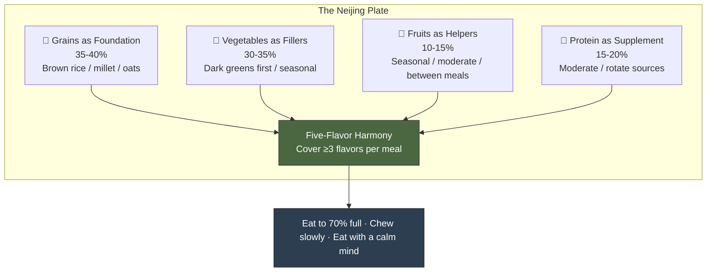

# Chapter 3 · You Are What You Eat

> 五谷为养，五果为助，五畜为益，五菜为充，气味合而服之，以补精益气。
> *Wǔ gǔ wéi yǎng, wǔ guǒ wéi zhù, wǔ chù wéi yì, wǔ cài wéi chōng, qì wèi hé ér fú zhī, yǐ bǔ jīng yì qì.*
>
> "Five grains nourish, five fruits assist, five meats benefit, five vegetables supplement. Combine their qi and flavors to replenish essence and boost vitality."
>
> — *Su Wen*, Chapter 22 (藏气法时论)

## 3.1 The Dinner Table Paralysis

You're staring at a menu, but five voices are arguing inside your head.

Keto says push away the rice — fat is fuel. Veganism says that steak is destroying your arteries and the planet. Intermittent fasting says it's not *what* you eat but *when*. The carnivore crowd says vegetables are poisoning you with plant toxins. The Mediterranean camp says everyone calm down, it's olive oil and red wine.

Each has peer-reviewed papers. Each has celebrity converts. Each insists — with impressive confidence — that everyone else is wrong.

Twenty-five centuries ago, a man named Qi Bo faced no such confusion. When the Yellow Emperor asked how to eat well, Qi Bo answered with a framework so elegant it fits in a single sentence: grains as the foundation, fruits as helpers, meats as supplements, vegetables as fillers. No food group demonized. No macronutrient worshipped.

This isn't vague "eat a bit of everything" advice. It's a structured nutritional model whose core logic is **balance, not elimination**.

In *In Defense of Food*, Michael Pollan famously distilled his entire food philosophy into seven words: "Eat food. Not too much. Mostly plants." He spent an entire book arriving at that conclusion. Qi Bo said essentially the same thing in one sentence twenty-five centuries earlier — and with greater precision, because he didn't exclude meat; he simply clarified its role: supplementary, not central.

Modern nutrition science is converging on exactly the same conclusion: dietary diversity is one of the strongest predictors of gut and metabolic health. The Neijing arrived at that endpoint through clinical observation alone — no microscopes required.

---

## 3.2 The Five Flavors: The World's First Functional Nutrition System

If "five grains nourish" answers *what* to eat, the Five Flavors system — 五味 (wǔ wèi) — answers *what happens after you eat it*.

The *Su Wen* puts it plainly: 「酸入肝，苦入心，甘入脾，辛入肺，咸入肾」— "Sour enters the Liver, bitter enters the Heart, sweet enters the Spleen, pungent enters the Lung, salty enters the Kidney." Each flavor isn't merely a sensation on the tongue. It's a pathway to a specific organ system — a precise flavor-organ-function mapping table.

| Flavor | Organ | Effect | Modern Parallel | Examples |
|--------|-------|--------|----------------|----------|
| 酸 Sour | Liver | Astringent, gathering | Polyphenols, antioxidants | Vinegar, citrus, plums, hawthorn |
| 苦 Bitter | Heart | Draining, drying | Alkaloids, anti-inflammatory compounds | Green tea, bitter melon, lotus seed core, dark chocolate |
| 甘 Sweet | Spleen | Tonifying, harmonizing | Complex carbs, polysaccharides | Jujube dates, honey, sweet potato, rice |
| 辛 Pungent | Lung | Dispersing, circulating | Volatile oils, capsaicin | Ginger, garlic, scallion, Sichuan pepper |
| 咸 Salty | Kidney | Softening, descending | Minerals, electrolytes | Kelp, miso, soy sauce, dried shrimp |

The point is never to isolate a single flavor — it's to **harmonize all five**. The Neijing warns repeatedly: excess of any one flavor damages its corresponding organ. Too much sweet injures the Spleen. Too much salt harms the Kidney. Too much sour damages the sinews.

Modern research confirms this principle from a different angle. The 2019 *Lancet* Global Burden of Disease study on dietary risks across 195 countries found that the world's biggest dietary danger isn't the absolute intake of sugar or fat — it's **structural imbalance**: too much sodium, too little whole grain, too little fruit. The logic is isomorphic with Five Flavor dysregulation.

---

## 3.3 The Thermal Nature of Food: Beyond Hot and Cold

In Chinese food culture, you'll hear people say "crab is cold-natured" or "lamb is hot-natured." They're not talking about serving temperature. They're referring to a core Neijing concept: the **Four Natures** (四气, sì qì) — Cold, Hot, Warm, Cool — plus a neutral middle ground.

**Cold and Cool foods** (clear heat, reduce inflammation): watermelon, mung bean, bitter melon, cucumber, green tea, pear. Best for people with heat signs — inflammation, dry mouth, constipation.

**Warm and Hot foods** (warm the body, boost circulation): ginger, cinnamon, lamb, chives, longan, chili pepper. Best for people with cold signs — cold extremities, sluggish digestion, sensitivity to cold.

**Neutral foods** (balanced, suitable for most): rice, potato, pork, yam, carrot. Safe year-round for most constitutions.

What's the practical use? Picture this: it's winter, and you have cold hands, a pale complexion, and a sluggish appetite. A Neijing practitioner would diagnose "yang deficiency" and adjust your diet before reaching for any medicine — ginger-jujube porridge for breakfast, lamb stew for lunch, a cinnamon-infused drink in the evening. You're systematically introducing warm-natured foods to rebalance the body.

Conversely, if you're breaking out with acne, feeling parched, and constipated — signs of "internal heat" — the prescription shifts to mung bean soup, cucumber salad, and chrysanthemum tea, while cutting back on fried and spicy foods.

Does this sound like superstition? Translate it into biochemistry.

"Cold" foods tend to be rich in **anti-inflammatory compounds**. Green tea's EGCG, watermelon's citrulline, cucumber's cucurbitacins — they share a common signature: downregulating inflammatory pathways like NF-κB and COX-2. "Hot" foods contain **thermogenic and circulation-promoting compounds**: capsaicin activates TRPV1 receptors to generate heat, cinnamaldehyde improves peripheral blood flow, gingerols in ginger stimulate gastric motility.

The Neijing didn't invent molecular biology. But through millennia of clinical accumulation, it built a food classification system that overlaps remarkably with the modern anti-inflammatory diet. Harvard's School of Public Health anti-inflammatory food pyramid — dark vegetables, berries, green tea, and turmeric at the top; red meat and refined sugar at the bottom — is, in essence, a contemporary remix of the Five Flavors and Four Natures.

---

## 3.4 Food as First Medicine: 药食同源

The Neijing's therapeutic hierarchy is unambiguous: first, adjust the diet (食疗, shí liáo). If that fails, use herbal medicine. Only then, resort to acupuncture or intervention. The principle of 药食同源 (yào shí tóng yuán) — "medicine and food share the same origin" — is the cornerstone of Chinese food therapy.

This isn't folk wisdom. Several "food-as-medicine" ingredients have withstood modern evidence-based scrutiny:

**Ginger (生姜, shēng jiāng):** Six systematic reviews confirm its anti-nausea effects, particularly for pregnancy-related and postoperative nausea. Mechanism: gingerols antagonize the 5-HT3 receptor.

**Turmeric (姜黄, jiāng huáng):** Its active compound curcumin has over 120 RCTs supporting its anti-inflammatory effects. The main bottleneck is poor bioavailability — and the traditional pairing with black pepper turns out to be a biochemical masterstroke. Piperine in black pepper boosts curcumin absorption by 2,000%. Ancient cooks didn't know what piperine was, but they knew turmeric needed pepper.

**Goji berries (枸杞, gǒu qǐ):** Rich in Lycium barbarum polysaccharides (LBP) and zeaxanthin. Animal studies and small human trials suggest benefits for retinal protection and immune modulation, but large-scale RCTs remain insufficient.

**Jujube dates (大枣, dà zǎo):** Traditionally used to calm the mind and tonify qi. A 2020 meta-analysis in *Nutrients* found moderate improvements in anxiety and sleep quality from jujube extracts, likely related to their cyclic adenosine monophosphate (cAMP) and saponin content.

**Green tea (绿茶, lǜ chá):** EGCG (epigallocatechin gallate) is one of the most studied natural antioxidants. Large-cohort studies associate daily green tea consumption with a 20–28% reduction in cardiovascular event risk.

Note the evidence gradient: ginger and green tea have strong evidence; goji berries need more research. The Neijing's "food as medicine" framework is sound, but each ingredient must be validated individually — and that's precisely the value of modern evidence-based medicine.

It's worth noting that "food as first medicine" isn't uniquely Chinese. Hippocrates, the father of Western medicine, famously declared: "Let food be thy medicine and medicine be thy food." India's Ayurvedic tradition classifies foods into three gunas (sattva, rajas, tamas) and treats dietary adjustment as the first line of therapy. Three great ancient medical traditions, evolving independently on three continents, converged on the same insight. That's not coincidence — it's a shared human recognition of a fundamental truth about health.

---

## 3.5 The Gut-Brain Axis: An Ancient Intuition

The Neijing makes a bold claim: the Spleen-Stomach (脾胃, pí wèi) is the "granary official" — the source from which all qi and blood are transformed. Everything you eat must pass through this central processing station before the body can use it.

Twenty-five centuries later, gut microbiome research has given this claim a stunning new commentary.

Your gut houses roughly 38 trillion microorganisms — a number comparable to your total human cells. They're not parasites; they're collaborators. They break down fiber, synthesize vitamins K and B12, train immune cells, and produce neurotransmitters. About 70% of your immune cells reside in the gut. Approximately 95% of your body's serotonin is manufactured there.

The vagus nerve acts as a superhighway, transmitting gut signals directly to the brain. This is why anxiety gives you a stomachache, and why patients with irritable bowel syndrome (IBS) have triple the rate of depression compared to the general population.

The Neijing didn't have the word "microbiome," but it placed the Spleen-Stomach at the absolute center of health and issued a clear warning: 「饮食自倍，肠胃乃伤」(*Yǐn shí zì bèi, cháng wèi nǎi shāng*) — "When eating doubles beyond measure, the gut is the first to suffer" (*Su Wen*, Chapter 43). Modern research fully supports this: chronic overeating increases intestinal permeability ("leaky gut"), triggering systemic low-grade inflammation — the shared upstream pathway of metabolic syndrome, type 2 diabetes, and cardiovascular disease.

What's even more remarkable is that the Neijing's core dietary advice — eat fermented foods (soy paste, vinegar, fermented bean curd), whole grains, and seasonal vegetables — aligns precisely with what modern microbiome science recommends. A 2021 Stanford study published in *Cell* found that a high-fermented-food diet (six or more servings daily) significantly increased gut microbial diversity and reduced levels of 19 inflammatory proteins. The fermented staples ubiquitous in traditional Chinese cuisine — soy sauce, vinegar, pickled vegetables, fermented tofu — may have been an unintentional masterclass in microbiome maintenance.

The Neijing's reverence for the Spleen-Stomach was, at its core, a correct intuition about the digestive system as the body's central health hub.

---

## 3.6 Daily Practice: The Neijing Plate

Enough theory. Here's an action guide you can start using tomorrow morning.

**Seasonal Eating Guide**

- **Spring (Liver-Wood dominant):** Add sweet, reduce sour. Favor yam, dates, and spinach. Support the Liver's upward energy without letting it become excessive.
- **Summer (Heart-Fire dominant):** Add sour, reduce bitter. Sour flavors help contain the Heart's expansive qi. Cool with mung bean soup, watermelon, and cucumber.
- **Autumn (Lung-Metal dry):** Add sour, reduce pungent. Focus on moistening — pear, white fungus, honey, lily bulb. Go easy on spices to avoid worsening autumn dryness.
- **Winter (Kidney-Water storing):** Add bitter, reduce salty. Moderate bitter flavors consolidate yin. Nourish the Kidney with black sesame, black beans, and walnuts.

**Three Principles You Can Use Immediately**

First, **eat a warm breakfast**. The Neijing holds that yang qi is just rising at dawn — the Spleen-Stomach needs warmth to activate. A bowl of hot congee serves this purpose better than cold cereal with ice milk. The modern explanation: warm foods reduce gastrointestinal smooth muscle spasm and enhance digestive enzyme activity.

Second, **stop at seventy percent full**. The Neijing warned that overeating injures the gut above all else. A 2023 primate caloric restriction study published in *Science* demonstrated that moderate caloric restriction extends lifespan and reduces inflammatory markers. You don't need to count calories — seventy percent full is your built-in gauge.

Third, **eat in stillness**. The Neijing emphasized a calm state of mind during meals. Modern research calls this "mindful eating": no phone, no stressful conversations, thorough chewing. A 2019 RCT in the *American Journal of Clinical Nutrition* found that the mindful eating group achieved 1.8 times the BMI reduction of the control group.

---

## 3.7 Reflection Moment: Your Five-Flavor Audit

Grab a piece of paper or open a note on your phone. Recall everything you ate over the past three days. Tag each food with its dominant flavor.

Now ask yourself three questions:

1. **Which flavor dominates?** For most modern eaters, the answer is "sweet" — refined sugar, processed carbs, and ultra-processed foods have made sweetness omnipresent.
2. **Which flavor is nearly absent?** Usually "bitter" and "sour." Bitter greens (kale, radicchio, arugula) and fermented sour foods (vinegar, kimchi, yogurt) are the blind spots in most diets.
3. **Does your diet shift with the seasons?** Or are you eating the same takeout rotation in January and July?

This isn't a test. It's an act of awareness.

If you discover that "sweet" dominates, try adding a small vinegar-dressed salad (sour) and a cup of unsweetened tea (bitter) to your next meal. If pungent flavors are consistently absent, drop a few slices of ginger into your soup. Change doesn't have to be dramatic — within a week, aim for two previously missing flavors to appear regularly on your plate.

Balancing the Five Flavors doesn't require a nutrition degree — just one question the next time you order a meal: *Are all five flavors accounted for?*

---

## Today's Actions

Three things you can do the moment you finish this chapter:

⚡ At your next meal, consciously identify how many of the five flavors (sour, bitter, sweet, pungent, salty) are present — which one is missing?

⚡ Tomorrow, swap your cold breakfast for something warm — congee, soup, or hot oatmeal instead of cold milk or iced coffee.

🔄 This week, buy one "bitter" food you never eat (bitter melon, green tea, dark chocolate) and add it to your diet.

---

## 21-Day Micro-Experiment

**"The 70% Full Experiment"** — For 21 days, stop eating at every meal when you feel "I could eat a few more bites." No calorie counting — just body awareness. Rate your post-meal comfort (1–5) and afternoon energy (1–5) daily. Most people notice a clear shift around day 7.

---

## Evidence Check

How the Neijing principles discussed in this chapter stack up against modern science:

| Neijing Principle | Evidence Level | Explanation |
|-------------------|---------------|-------------|
| Five-Flavor Balance (sour, bitter, sweet, pungent, salty in harmony) | ✓ Confirmed | The *Lancet* GBD study confirms dietary diversity is the strongest predictor of health outcomes |
| Food as First Medicine (diet before drugs) | ✓ Confirmed | Pharmacological activity of ginger, turmeric, and other food-medicines is supported by systematic reviews |
| Thermal Nature of Food (cold, cool, warm, hot) | ? Plausible hypothesis | "Cool" foods overlap significantly with anti-inflammatory foods, but the hot-cold classification lacks a unified biochemical definition |
| Spleen-Stomach as the Root of Health | ✓ Confirmed | Gut microbiome research confirms the digestive system is the central hub of immunity, mood, and metabolism |
| Overeating Injures the Gut (饮食自倍，肠胃乃伤) | ✓ Confirmed | Overeating drives metabolic syndrome, GERD, and systemic inflammation — extensive clinical evidence |
| Eating to 70% Full | ? Plausible hypothesis | Caloric restriction extends lifespan in animal models with strong evidence, but long-term human RCTs remain incomplete |

---

## 3.8 Summary & Bridge to Chapter 4

In Chapter 2, you realigned your daily rhythm — syncing your body to the ancient clock of day and night. In this chapter, you recalibrated your diet — replacing extreme food ideologies with Five-Flavor harmony, swapping blind supplementation for the food-as-first-medicine principle, and centering digestive health instead of calorie worship.

The Neijing's dietary philosophy can be distilled into a single character: 和 (hé) — **harmony**. Not prohibition. Not extremism. Not the tyranny of a single superfood, but the quiet coherence of diversity. This resonates strikingly with the 2024 *Nature* review of global Blue Zone diets: no single food is the key to longevity, but dietary diversity, caloric moderation, and a plant-forward structure are the common threads across every Blue Zone on Earth.

But the Neijing tells us that the most powerful force affecting your health is neither when you sleep nor what you eat — it's what you *feel*. In the next chapter, we enter the territory of 情志 (qíng zhì) — the emotional body. Anger injures the Liver. Joy scatters the Heart. Worry knots the Spleen. Grief dissolves the Lung. Fear drains the Kidney. Emotions aren't just psychology — they're physiological events written into your organs.

---

## References

1. *Huangdi Neijing Su Wen*, Chapters 22 (藏气法时论), 23 (宣明五气篇), 43 (痹论).
2. GBD 2017 Diet Collaborators. "Health effects of dietary risks in 195 countries, 1990–2017." *The Lancet*, 393(10184), 2019.
3. Daily, J.W. et al. "Efficacy of ginger for alleviating the symptoms of primary dysmenorrhea: A systematic review and meta-analysis." *Pain Medicine*, 16(12), 2015.
4. Hewlings, S.J. & Kalman, D.S. "Curcumin: A review of its effects on human health." *Foods*, 6(10), 2017.
5. Shoba, G. et al. "Influence of piperine on the pharmacokinetics of curcumin." *Planta Medica*, 64(4), 1998.
6. Sender, R., Fuchs, S., & Milo, R. "Revised estimates for the number of human and bacteria cells in the body." *Cell*, 164(3), 2016.
7. Pollan, Michael. *In Defense of Food: An Eater's Manifesto*. Penguin, 2008.
8. Mason, A.E. et al. "Effects of a mindfulness-based intervention on mindful eating, sweets consumption, and fasting glucose levels." *American Journal of Clinical Nutrition*, 2019.
