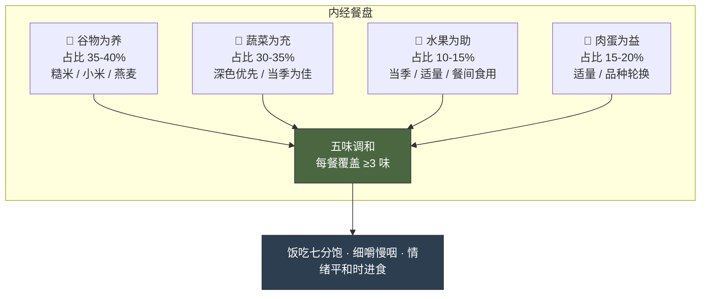

# 第三章 · 食养之道

> 五谷为养，五果为助，五畜为益，五菜为充，气味合而服之，以补精益气。
>
> — 《黄帝内经·素问·藏气法时论》

## 3.1 当代人的餐桌焦虑

你坐在餐厅里，对面是一份菜单，脑子里却响起五种声音。

生酮饮食说：把米饭推开，脂肪才是燃料。纯素主义说：那块牛排正在毁灭你的血管和地球。间歇性断食说：不是吃什么的问题，是几点钟吃的问题。食肉饮食说：蔬菜里的植物毒素才是炎症元凶。地中海饮食说：你们都别吵了，橄榄油和红酒才是正解。

每一种都有论文支撑，每一种都有成功案例，每一种都言之凿凿地告诉你——其他人都错了。

两千五百年前，一个人不会遇到这种焦虑。不是因为那时候没有选择，而是因为岐伯给了黄帝一个极其简洁的框架：五谷为养，五果为助，五畜为益，五菜为充。

四个短句，四种食物类别，各司其职。谷物打底，水果辅助，肉类补益，蔬菜填充。没有哪一类被妖魔化，没有哪一类被捧上神坛。这个框架的优雅之处在于：它不告诉你"不能吃什么"，而是告诉你"每一类的角色是什么"。

这不是模糊的"什么都吃点"。这是一个有结构的营养模型——它的核心逻辑是**平衡**，而不是**排除**。

Michael Pollan 在《为食物辩护》中用七个字总结了他对现代营养学的全部思考："吃食物，不要太多，以植物为主。"（Eat food. Not too much. Mostly plants.）他花了整本书才抵达的终点，岐伯用一句话就讲完了——而且更精确，因为岐伯没有排除肉类，只是明确了它的位置：辅助，而非主角。

今天的营养科学越来越趋向同一个结论：饮食多样性（dietary diversity）是肠道健康和代谢健康的最强预测因子之一。内经在没有显微镜的年代，凭临床观察走到了同一个终点。

---

## 3.2 五味系统：最早的功能性营养学

如果说"五谷为养"解决了吃什么的问题，那么**五味**（wǔ wèi）系统解决的是吃了之后会怎样。

《素问·宣明五气篇》写得很直接：「酸入肝，苦入心，甘入脾，辛入肺，咸入肾。」每种味道不只是舌头上的感觉，而是一条通往特定脏腑的通路。这是一套精密的"味道-器官-功效"映射表。

| 味 | 归经 | 效用 | 现代对照 | 常见食物 |
|----|------|------|---------|---------|
| 酸 | 肝 | 收敛、固涩 | 多酚类抗氧化物 | 醋、柑橘、乌梅、山楂 |
| 苦 | 心 | 清泄、燥湿 | 生物碱、抗炎化合物 | 绿茶、苦瓜、莲子心、黑巧克力 |
| 甘 | 脾 | 补益、缓和 | 复合碳水化合物、多糖 | 大枣、蜂蜜、红薯、粳米 |
| 辛 | 肺 | 发散、行气 | 挥发油、辣椒素 | 生姜、大蒜、葱白、花椒 |
| 咸 | 肾 | 软坚、润下 | 矿物质、电解质 | 海带、味噌、酱油、虾皮 |

重点不在于单独摄入某一味——而在于**五味调和**。内经反复强调：任何一味过量，都会反噬它所对应的脏腑。嗜甜伤脾，过咸伤肾，过酸伤筋，过苦伤骨，过辛伤皮毛。

现代研究从另一个角度证实了这个原则。2019 年《柳叶刀》发布的全球饮食负担研究（GBD Diet Collaborators）指出：全球最大的饮食风险因素不是糖或脂肪的绝对摄入量，而是**饮食结构的失衡**——钠摄入过高，全谷物和水果摄入不足。这与五味失调的逻辑完全同构。

---

## 3.3 食物的温度：不只是冷热

你可能听过老人说"螃蟹性寒""羊肉性热"。这不是在描述食物端上桌时的物理温度，而是内经体系中一个核心概念——**四气**：寒、热、温、凉，外加一个中间态"平"。

**寒凉食物**（清热泻火）：西瓜、绿豆、苦瓜、黄瓜、绿茶、梨。适合体内有热象（炎症、口干、便秘）的人。

**温热食物**（温阳散寒）：生姜、肉桂、羊肉、韭菜、桂圆、辣椒。适合体寒（手脚冰凉、消化迟缓、畏寒）的人。

**平性食物**（平和不偏）：大米、土豆、猪肉、山药、胡萝卜。大多数人都能吃，四季皆宜。

这个分类有什么实际用处？想象一个场景：冬天，你手脚冰凉、面色苍白、胃口差——中医说你"阳虚"。内经的建议不是去吃药，而是先调整饮食结构：早餐加一碗生姜红枣粥，午餐吃点羊肉，晚餐用肉桂煮一杯热饮。这不是安慰剂——你在系统性地向身体输入温热属性的食物。

反过来，如果你口干、便秘、脸上冒痘——内经判断你"内热"，会建议你加入绿豆汤、凉拌黄瓜、菊花茶，同时减少辛辣和煎炸。

这听起来是不是像玄学？把它翻译成现代语言：

"寒凉"食物往往富含**抗炎活性成分**。绿茶的 EGCG、西瓜的瓜氨酸、黄瓜的葫芦素——它们的共同特征是下调炎症通路（NF-κB、COX-2）。"温热"食物则多含**产热和促循环成分**：辣椒素激活 TRPV1 受体产热，肉桂醛改善外周血循环，生姜的姜辣素促进胃肠蠕动。

内经没有发明分子生物学，但它通过数千年的临床积累，建立了一套与现代抗炎饮食（anti-inflammatory diet）高度重叠的食物分类体系。哈佛大学公共卫生学院的"抗炎食物金字塔"——深色蔬菜、浆果、绿茶、姜黄排在顶端，红肉、精制糖排在底端——本质上是五味四气理论的现代翻版。

---

## 3.4 药食同源：食物是第一味药

内经的治疗层级非常清晰：先调饮食，再用草药，最后才动针石。「药食同源」（yào shí tóng yuán）——药和食物来自同一个源头——是中国食疗传统的基石。

这不是民间偏方。多种"药食同源"食材已经过现代循证检验：

**生姜（shēng jiāng）**：六项系统综述确认其止呕效果，尤其对妊娠呕吐和术后恶心有效。机制：姜辣素拮抗 5-HT3 受体。

**姜黄（jiāng huáng）**：其活性成分姜黄素（curcumin）的抗炎效果已有超过 120 项 RCT 支持。主要瓶颈在于生物利用度低，传统搭配黑胡椒（含胡椒碱）恰好解决了这个问题——胡椒碱可将姜黄素吸收率提升 2000%。古人不知道胡椒碱是什么，但他们知道姜黄要配胡椒。

**枸杞（gǒu qǐ）**：富含枸杞多糖（LBP）和玉米黄质。动物实验和小规模人体研究显示其对视网膜保护、免疫调节有积极作用，但大规模 RCT 仍然不足。

**大枣（dà zǎo）**：传统用于安神益气。2020 年发表于《Nutrients》的荟萃分析发现枣提取物对焦虑和睡眠质量有中等程度的改善作用，可能与其富含的环磷酸腺苷（cAMP）和皂苷有关。

**绿茶（lǜ chá）**：EGCG（表没食子儿茶素没食子酸酯）是研究最深入的天然抗氧化物之一。大规模队列研究表明每日饮用绿茶与心血管事件风险降低 20-28% 相关。

注意证据强度的差异：生姜和绿茶有强证据，枸杞仍需更多研究。内经的"药食同源"框架是合理的，但具体食材的效力需要逐一验证——这正是现代循证医学的价值。

值得一提的是，"药食同源"并非中国独有的思想。古希腊医学之父希波克拉底有一句名言："让食物成为你的药物，让药物成为你的食物。"（Let food be thy medicine.）印度阿育吠陀医学同样将食物分为三种属性（萨埵、罗阇、答摩），并以饮食调整作为首要治疗手段。三大古文明的医学传统独立地得出了同一个结论——这不是巧合，而是人类对健康本质的共同洞察。

---

## 3.5 脾胃与大脑的对话

内经有一个核心命题：「脾胃者，仓廪之官，五味出焉。」脾胃是全身气血化生的源头——你吃进去的一切，都要经过脾胃的"翻译"才能变成身体可用的能量。

两千五百年后，肠道微生物组研究给了这个命题一个全新的注脚。

你的肠道里住着大约 38 万亿个微生物——数量与你的人体细胞相当。它们不是寄生者，而是合作者。它们帮你分解纤维、合成维生素 K 和 B12、训练免疫细胞、生产神经递质。你体内约 70% 的免疫细胞驻扎在肠道，95% 的血清素在肠道合成。

迷走神经（vagus nerve）像一条高速公路，把肠道的信号直送大脑。这就是为什么焦虑的时候你会胃痛，为什么肠易激综合征（IBS）患者的抑郁发生率是普通人的三倍。

内经没有"微生物组"这个词，但它把脾胃放在健康体系的正中央，并反复告诫：「饮食自倍，肠胃乃伤」（《素问·痹论》）——暴饮暴食，首先受伤的就是肠胃。现代研究完全支持这一判断：过度进食导致肠道通透性增加（"肠漏"），触发全身性低度炎症，这是代谢综合征、二型糖尿病和心血管疾病的共同上游通路。

更令人惊叹的是，内经提出的核心饮食建议——多食发酵食品（如酱、醋、豆豉）、粗粮、应季蔬菜——恰好是现代肠道微生物多样性研究推荐的最佳方案。2021 年斯坦福大学发表于《Cell》的研究表明，高发酵食物饮食（每天 6 份以上）显著增加肠道微生物多样性并降低 19 种炎症蛋白的水平。中国传统饮食中无处不在的酱、醋、泡菜、豆腐乳，可能正是维护肠道生态的无意之举。

内经对脾胃的重视，本质上是对消化系统作为"健康枢纽"的正确直觉。

---

## 3.6 日常实践：内经餐盘

理论够了。下面是一份你明天早上就能用的行动指南。

**季节饮食指南**

- **春（肝木旺）**：增甘减酸。多吃山药、大枣、菠菜，少吃醋渍食品。帮助肝气舒发而不过亢。
- **夏（心火旺）**：增酸减苦。适当吃酸味收敛心气，多吃绿豆、西瓜、黄瓜清暑热。
- **秋（肺金燥）**：增酸减辛。润燥为主——梨、银耳、蜂蜜、百合。少吃辛辣以免加重秋燥。
- **冬（肾水藏）**：增苦减咸。适量苦味坚阴（如莲子心），多吃黑色食物养肾（黑芝麻、黑豆、核桃）。

**三个立即可用的原则**

一、**早餐吃热的**。内经认为清晨阳气初升，脾胃需要温煦。一碗热粥比冰牛奶加冷麦片更不伤脾胃。现代解释：温热食物减少胃肠平滑肌痉挛，促进消化酶活性。

二、**七分饱**。「饮食自倍，肠胃乃伤。」每顿吃到七成满即停。2023 年发表于《Science》的灵长类限食研究表明，适度热量限制延长寿命并减少炎症标志物。你不需要精确计算卡路里——七分饱就是你的直觉计量器。

三、**安静地吃**。内经强调进食时心态平和。现代研究称之为"正念进食"（mindful eating）：不看手机、不谈工作、细嚼慢咽。一项 2019 年《American Journal of Clinical Nutrition》的 RCT 发现，正念进食组的 BMI 下降幅度是对照组的 1.8 倍。

---

## 3.7 反思时刻：你的五味审计

拿出一张纸（或打开手机备忘录），回忆过去三天你吃的所有东西，然后给每种食物标上它的主要味道。

问自己三个问题：

1. **哪种味道占了绝对主导？** 大多数现代人的答案是"甘"——精制糖、精制碳水和加工食品让甜味无处不在。
2. **哪种味道几乎缺席？** 通常是"苦"和"酸"。苦味蔬菜（芥蓝、苦瓜、芝麻菜）和发酵酸味食品（醋、泡菜、酸奶）往往是饮食中的盲区。
3. **你的饮食跟着季节变化了吗？** 还是一年四季都在吃同样的外卖套餐？

这不是考试。这是一次自我觉察。

如果你发现"甘"味独大，试着在下一餐加入一碟醋拌凉菜（酸）和一杯不加糖的茶（苦）。如果你常年不碰辛味，试着在汤里加几片姜。改变不需要剧烈——一周内，让你的盘子上多出现两种原本缺席的味道。

五味平衡不需要你变成营养学家——只需要你在下一次点餐时多问一句：这顿饭里，五种味道到齐了吗？

---

## 今日行动

三件你读完这章就能做的事：

⚡ 下一餐饭时，有意识地辨别盘中食物包含几种味道（酸苦甘辛咸），看看缺了哪种。

⚡ 明天早餐换成温热食物（粥、汤、热燕麦），替代冷牛奶或冰咖啡。

🔄 本周去超市时，买一种你从不吃的"苦味"食物（苦瓜、绿茶、黑巧克力）加入饮食。

---

## 21 天微实验

**"七分饱实验"**——连续 21 天在每餐吃到"还能再吃几口"时放下筷子。不计算卡路里，只凭体感。记录每天的饭后舒适度（1-5 分）和下午精力（1-5 分）。大多数人会在第 7 天左右开始感受到明显变化。

---

## 证据强度标注

本章涉及的内经原则与现代科学验证对照：

| 内经原则 | 证据等级 | 说明 |
|---------|---------|------|
| 五味平衡（酸苦甘辛咸均衡） | ✓ 已证实 | Lancet GBD 研究证实饮食多样性是健康最强预测因子 |
| 药食同源（食疗优先于药疗） | ✓ 已证实 | 生姜、姜黄等多种食材的药理活性已有系统综述证据 |
| 食物寒热温凉 | ? 合理假说 | "凉性"食物与抗炎食物有高度重叠，但"寒热"分类本身缺乏统一的生化定义 |
| 脾胃为后天之本 | ✓ 已证实 | 肠道微生物组研究证实消化系统是免疫、情绪、代谢的核心枢纽 |
| 饮食自倍，肠胃乃伤（过食伤胃） | ✓ 已证实 | 过食导致代谢综合征、胃食管反流等，大量临床证据 |
| 七分饱 | ? 合理假说 | 热量限制延寿在动物模型中证据充分，人体长期 RCT 尚不完整 |

---

## 3.8 总结与过渡

在第二章，你调整了时间节律——让身体回到与昼夜同步的轨道。在这一章，你校准了饮食结构——用五味调和替代极端饮食法，用药食同源替代盲目进补，用脾胃为本替代热量崇拜。

两千五百年前的内经餐盘，核心只有一个字：**和**。不是禁忌，不是极端，不是某种超级食物的独裁，而是多样性的和谐。这与 2024 年《自然》杂志对全球长寿蓝区（Blue Zones）饮食的总结惊人一致：没有哪种单一食物是长寿的钥匙，但饮食多样性、适度热量和以植物为主的结构是所有蓝区的共同点。

但内经告诉我们，影响健康最强大的力量，不是你几点睡，也不是你吃了什么——而是你的情绪。下一章，我们进入「情志与身体」的世界：怒伤肝，喜伤心，思伤脾，悲伤肺，恐伤肾。七情不是心理学家的专属话题，它们是写在你身体里的生理事件。

---

## 参考文献

1. 《黄帝内经·素问》第 22 篇（藏气法时论）、第 23 篇（宣明五气篇）、第 43 篇（痹论）
2. GBD 2017 Diet Collaborators. "Health effects of dietary risks in 195 countries, 1990–2017." *The Lancet*, 393(10184), 2019.
3. Daily, J.W. et al. "Efficacy of ginger for alleviating the symptoms of primary dysmenorrhea: A systematic review and meta-analysis." *Pain Medicine*, 16(12), 2015.
4. Hewlings, S.J. & Kalman, D.S. "Curcumin: A review of its effects on human health." *Foods*, 6(10), 2017.
5. Shoba, G. et al. "Influence of piperine on the pharmacokinetics of curcumin." *Planta Medica*, 64(4), 1998.
6. Sender, R., Fuchs, S., & Milo, R. "Revised estimates for the number of human and bacteria cells in the body." *Cell*, 164(3), 2016.
7. Pollan, Michael. *In Defense of Food: An Eater's Manifesto*. Penguin, 2008.
8. Mason, A.E. et al. "Effects of a mindfulness-based intervention on mindful eating, sweets consumption, and fasting glucose levels." *American Journal of Clinical Nutrition*, 2019.
