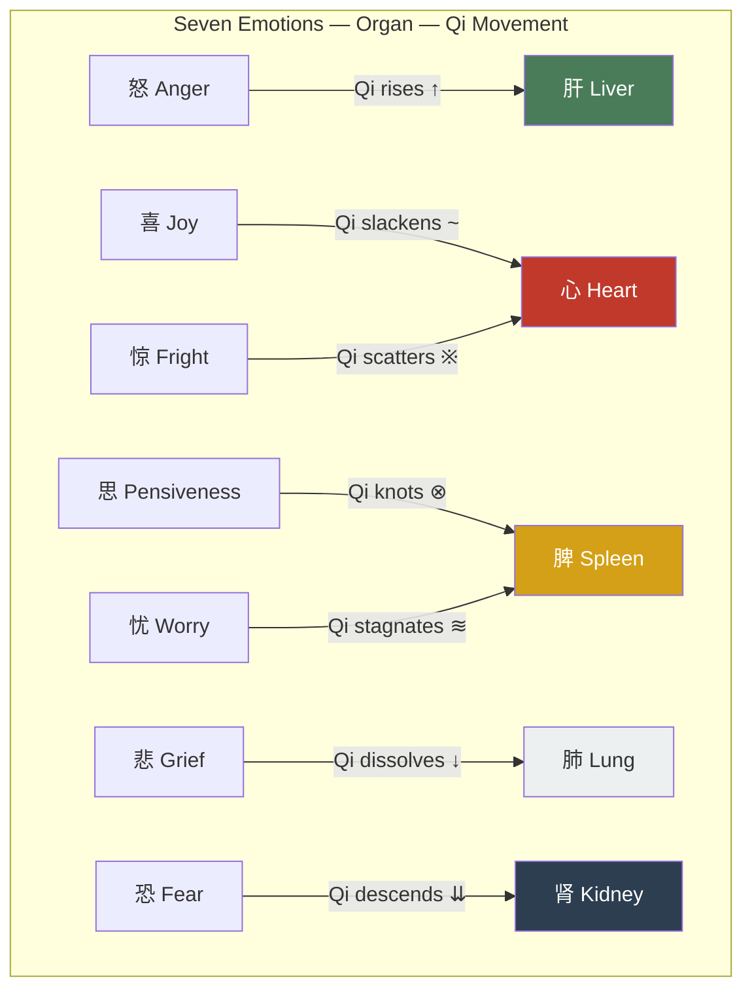

# Chapter 4 — The Emotional Body: Which Organ Are Your Emotions Destroying?

## 4.1 Opening Story: The Stomach That Medicine Couldn't Fix

Wei Lin was a product manager at a tech startup. Thirty-two years old, in excellent health — she'd run two half-marathons. Then her stomach fell apart.

Six months of bloating, loss of appetite, and a dull ache after every meal. She got an endoscopy. Tested for H. pylori. Ran a full panel. Everything came back normal. Her gastroenterologist shrugged: "It's functional dyspepsia — nothing structurally wrong." Translation: we have no idea.

Wei knew exactly what was wrong.

Six months earlier, her company had restructured. A new boss was hired above her, and she'd been quietly sidelined. Every day she sat at her desk running mental simulations: *Should I speak up or wait it out? Will I be laid off? Should I update my résumé?* Her mind was an engine running at redline, and her stomach was paying the toll.

Twenty-five hundred years ago, the *Huangdi Neijing* explained Wei's condition in five characters:

> **「思伤脾。」**
>
> *Sī shāng pí.*
>
> "Overthinking injures the spleen."

The full passage comes from the *Su Wen*, Chapter 5 (*Yīn Yáng Yìng Xiàng Dà Lùn*):

> **「怒伤肝，喜伤心，思伤脾，忧伤肺，恐伤肾。」**
>
> "Anger injures the liver. Excess joy injures the heart. Overthinking injures the spleen. Grief injures the lungs. Fear injures the kidneys."

This is not metaphor. This is not poetic license. It is a complete mind-body medical map — and it predates Western medicine's acknowledgment that emotions affect physical health by roughly 2,400 years.

---

## 4.2 The Seven Emotions Map: The Inner Landscape

The Neijing classifies the fundamental human emotions into seven — the *qī qíng* (七情). Each emotion is mapped to a specific organ, drives Qi in a specific direction, and produces observable physical symptoms.

| Emotion | Organ | Qi Movement | Physical Signs | Modern Validation |
|---------|-------|-------------|----------------|-------------------|
| **怒 Anger** | Liver 肝 | Qi rises | Headaches, hypertension, red eyes | Cortisol surge, cardiovascular stress |
| **喜 Joy** (excess) | Heart 心 | Qi slackens | Palpitations, insomnia, scattered focus | Takotsubo ("broken heart") cardiomyopathy |
| **思 Pensiveness** | Spleen 脾 | Qi knots | Poor appetite, bloating, fatigue | Stress-related IBS, gut-brain axis disruption |
| **忧 Worry** | Spleen 脾 | Qi stagnates | Digestive issues, muscle tension | Anxiety–GI disorder comorbidity |
| **悲 Grief** | Lung 肺 | Qi dissolves | Shortness of breath, weak voice, crying | Post-bereavement immune suppression |
| **恐 Fear** | Kidney 肾 | Qi descends | Incontinence, lower back weakness | Chronic fear → adrenal fatigue |
| **惊 Fright** | Heart 心 | Qi scatters | Panic, confusion, heart palpitations | PTSD, acute stress response |

The *Su Wen*, Chapter 39 (*Jǔ Tòng Lùn*), captures the entire Qi-movement model in a single sentence:

> **「怒则气上，喜则气缓，悲则气消，恐则气下，惊则气乱，思则气结。」**
>
> "Anger makes Qi rise. Joy makes Qi slacken. Grief makes Qi dissolve. Fear makes Qi descend. Fright makes Qi scatter. Pensiveness makes Qi knot."

And then the most thunderous declaration in the entire text:

> **「百病生于气也。」**（*Su Wen*, Chapter 39）
>
> "All diseases arise from Qi."

---

## 4.3 Fighting Fire with Fire: The Emotional Counter-System

The Neijing does not merely diagnose emotional illness. It prescribes a treatment — and it is breathtakingly elegant. The method is called *yǐ qíng shèng qíng* (以情胜情): using one emotion to overcome another, based on the Five Elements controlling cycle.

**The Five-Element Emotional Therapies:**

- **Grief overcomes Anger** (Metal controls Wood) — Compassion dissolves rage
- **Fear overcomes excess Joy** (Water controls Fire) — Awe reins in manic elation
- **Anger overcomes Pensiveness** (Wood controls Earth) — Decisive action breaks the overthinking loop
- **Joy overcomes Grief** (Fire controls Metal) — Laughter lifts deep sorrow
- **Pensiveness overcomes Fear** (Earth controls Water) — Rational analysis calms panic

This is, at its core, an ancient cognitive-emotional regulation framework. Modern psychology's *cognitive reappraisal* — changing how you interpret an event to shift its emotional impact — operates on the same principle. The difference is striking: the Neijing does not pit "reason" against emotion. It uses *another emotion* to redirect Qi and restore equilibrium.

A famous clinical case from the Ming dynasty physician Zhang Zihe illustrates this perfectly. He treated a woman whose chronic cough had resisted all herbal medicine. Her illness began after the death of her son — grief had collapsed her Lung Qi. Zhang did not prescribe herbs. He hired a comedy troupe to perform until she laughed uncontrollably. The cough resolved. Joy overcame grief. Fire controlled Metal.

---

## 4.4 The Science Catches Up: Psychoneuroimmunology

In 1975, Robert Ader at the University of Rochester accidentally discovered that the immune system of rats could be conditioned like a Pavlovian reflex. This single finding gave birth to an entirely new field — psychoneuroimmunology (PNI) — confirming what the Neijing had mapped millennia earlier: the brain, the nervous system, and the immune system talk to each other constantly.

The Neijing's emotion-organ map aligns with PNI findings in remarkable detail:

**Anger injures the Liver → chronic inflammation and liver damage.** Sustained anger activates the sympathetic nervous system, keeping cortisol and pro-inflammatory cytokines (IL-6, TNF-α) chronically elevated. Epidemiological data links trait hostility to significantly increased risk of non-alcoholic fatty liver disease and cardiovascular events.

**Grief injures the Lungs → respiratory vulnerability after loss.** A large-scale study published in *BMJ Open* found that hospitalization rates for pneumonia and respiratory infections rise approximately 40% in the first year of bereavement. Grief suppresses natural killer (NK) cell activity, directly weakening the respiratory immune barrier.

**Fear injures the Kidneys → adrenal exhaustion.** Chronic fear drives relentless release of adrenaline and cortisol from the adrenal glands (which sit atop the kidneys — a coincidence the Neijing would appreciate). Eventually, adrenal function deteriorates: profound fatigue, lower back pain, compromised immunity — symptoms that overlap almost perfectly with the Neijing's description of Kidney deficiency from fear.

**Overthinking injures the Spleen → the gut-brain axis.** The gut houses over 100 million neurons — a "second brain." The vagus nerve serves as a superhighway between brain and gut. Anxiety and rumination transmit signals via this nerve that directly disrupt intestinal motility and alter the gut microbiome. The "nervous stomach" is not psychosomatic folklore; it is neurophysiology.

The most powerful modern evidence comes from the ACE Study (Adverse Childhood Experiences), published by Felitti et al. in 1998. Tracking 17,000 participants, it demonstrated that childhood emotional trauma — abuse, neglect, household dysfunction — translates into heart disease, cancer, diabetes, and autoimmune disorders decades later. Emotions do not merely hurt feelings. They damage organs, over years, with the patience of water carving stone.

---

## 4.5 Anger: The Liver's Enemy

Of the seven emotions, the Neijing devotes the most attention to anger — because the Liver governs *shū xiè* (疏泄), the smooth flow of Qi throughout the entire body. When anger drives Qi upward, the Liver loses its regulatory function, and the disruption cascades into digestion, sleep, and mental clarity.

> **「怒则气上。」**
>
> *Nù zé qì shàng.* — "Anger makes Qi rise."

Modern life is an anger factory. Traffic jams. Workplace pressure. Social media outrage. The bottomless scroll of bad news. You do not need to slam your fist on a table to be angry. Chronic irritability, suppressed resentment, compulsive doomscrolling — these are all forms of slow-burn *nù zé qì shàng*.

Physiologically, chronic anger keeps the sympathetic nervous system in overdrive and blood pressure persistently elevated. A meta-analysis published in the *Journal of the American College of Cardiology* found that people with high trait hostility face 1.5 to 2 times the risk of coronary heart disease compared to their calmer peers.

The Neijing's prescription: *yǐ bēi shèng nù* (以悲胜怒) — "use grief to overcome anger." This does not mean wallowing in sadness. It means cultivating *compassion* — shifting perspective to see the suffering behind the situation that angered you. Next time road rage strikes, imagine the other driver rushing to a hospital to see a dying parent. That shift in perspective is the modern application of Metal controlling Wood.

---

## 4.6 The Overthinking Epidemic: Pensiveness Injures the Spleen

Wei Lin's story is not unique. In an age of information overload, *sī shāng pí* — pensiveness injuring the spleen — may be the most widespread emotional injury of the seven.

The Neijing says *sī zé qì jié* (思则气结): overthinking "knots" the Qi, and the digestive system is the first casualty. Have you noticed that when you are deep in a stressful project, you lose your appetite? That before an exam, your stomach bloats and cramps? That anxiety makes you either unable to eat or compulsively binge on junk food? This is not coincidence. This is knotted Spleen Qi.

Modern research tells the same story in molecular detail. Irritable bowel syndrome (IBS) and anxiety disorders are comorbid in over 60% of cases. When you are anxious, the brain releases corticotropin-releasing factor (CRF), which signals through the vagus nerve to suppress gastric motility, increase intestinal permeability, and disrupt the microbiome.

The Neijing's prescription: *yǐ nù shèng sī* (以怒胜思) — "use anger to overcome pensiveness." Here, *anger* does not mean rage. It means decisiveness, the courage to act, the willingness to make a choice and commit. When you are trapped in an endless loop of analysis paralysis, the medicine is not more thinking. It is standing up and making a decision — even a small one.

---

## 4.7 Daily Practice: Emotional Hygiene

The Neijing is not a theoretical treatise. It is a manual. Here are practical emotional wellness routines derived from its principles:

**Morning emotional check-in.** When you wake, take sixty seconds to notice your emotional baseline. No judgment, no fixing — just awareness. Irritable? Anxious? Calm? Flat? Awareness itself is the first act of regulation.

**The Six Healing Sounds (*Liù Zì Jué*: 嘘呵呼呬吹嘻).** An ancient breathwork practice rooted in Neijing organ theory, where each syllable's vibration corresponds to a specific organ:

- **Xū** (嘘) — soothes the Liver, releases anger
- **Hē** (呵) — calms the Heart, settles agitation
- **Hū** (呼) — strengthens the Spleen, dissolves overthinking
- **Sī** (呬) — moistens the Lungs, releases grief
- **Chuī** (吹) — tonifies the Kidneys, eases fear
- **Xī** (嘻) — harmonizes the Triple Burner, opens whole-body flow

**Seasonal emotional alignment.** In spring, Liver Qi rises — stretch, expand, and avoid suppressing your emotions. In summer, Heart Qi peaks — welcome joy, but do not let excitement scatter your focus. In autumn, Lung Qi descends — allow quiet reflection and a measure of wistfulness. In winter, Kidney Qi stores — rest deeply and avoid draining your reserves through worry.

**Movement as emotional medicine.** The Neijing implies a profound principle: physical movement redirects emotional Qi. When angry, walk (to disperse rising Qi). When grieving, open your chest (to expand collapsing Lung Qi). When fearful, practice standing meditation (to ground descending Qi). When overthinking, do rhythmic exercise like running or swimming (to unknot stagnant Qi).

**Evening emotional clearing.** Before sleep, take three deep breaths. With each exhale, visualize releasing the accumulated emotional residue of the day. This is not mysticism — it is a deliberate activation of the parasympathetic nervous system to lower cortisol and prepare the body for restorative sleep.

---

## 4.8 Reflection Moment

Close your eyes. Ask yourself one question:

**Over the past three months, which emotion has occupied the most space in your life?**

Persistent workplace anxiety (pensiveness)? Unresolved anger at someone or something (anger)? Sadness from a relationship that ended (grief)? Fear of an uncertain future (fear)?

Now return to the Seven Emotions Map. Which organ does your dominant emotion target? Have you noticed physical symptoms in that system — digestive trouble, breathing difficulty, lower back pain, headaches, insomnia?

This is not self-diagnosis. It is an awareness exercise. The moment you see the connection between your emotional life and your physical body, you reclaim a measure of agency over your own health.

---

## Today's Actions

- ⚡ Close your eyes for 60 seconds right now. Ask: what emotion dominates me at this moment? Where do I feel it in my body? (This is where awareness begins.)
- ⚡ Next time you feel anger rising, don't suppress or explode — walk for 10 minutes. (The Neijing's "怒则走": when angry, walk — to disperse the upward-rushing Qi.)
- 🔄 Starting tonight, take 3 slow exhales before sleep, imagining the day's emotional residue leaving your body. Do this for 14 days.

---

## 21-Day Micro-Experiment: The Emotion Journal

Each morning, write down ONE word describing your emotional baseline (e.g., anxious, calm, irritable, low, energized). No analysis, no judgment — just record. After 21 days, review the pattern. Which emotion appears most often? Does it correlate with specific events or times?

---

## Evidence Strength Ratings

| Neijing Principle | Evidence Level | Notes |
|-------------------|---------------|-------|
| Anger injures the Liver | ✓ Confirmed | Chronic anger → elevated cortisol/inflammatory cytokines → liver metabolic damage; confirmed by large-scale JACC studies |
| Overthinking injures the Spleen (digestion) | ✓ Confirmed | Anxiety–IBS comorbidity >60%; bidirectional gut-brain axis communication is established science |
| Grief injures the Lungs | ✓ Confirmed | BMJ research: respiratory infection hospitalization rises ~40% after bereavement |
| Fear injures the Kidneys | ? Plausible hypothesis | Chronic fear → adrenal cortisol depletion observed clinically, but the "Kidney"–adrenal correspondence needs further validation |
| Emotional counter-regulation (以情胜情) | ? Plausible hypothesis | Consistent with the logic of cognitive reappraisal, but the precise Five-Element pairings lack RCT evidence |
| All diseases arise from Qi | ? Plausible hypothesis | PNI confirms emotions affect immunity/metabolism, but the universal claim is overly absolute |

---

## 4.9 Summary and Bridge to Chapter 5

This chapter has revealed the Neijing's most forward-looking insight: emotions are not merely "in your head." They are physiological events that travel specific pathways and damage specific organs.

- Each of the Seven Emotions has an organ target and a Qi direction
- The *yǐ qíng shèng qíng* counter-system is one of the world's earliest emotional regulation frameworks
- Modern psychoneuroimmunology has rewritten the Neijing's 2,500-year-old map in the language of molecular biology
- Emotional hygiene is not an afterthought — it is a daily practice

> **「百病生于气也。」**
>
> "All diseases arise from Qi."

Every disease begins with disordered Qi, and emotions are Qi's most powerful movers. But there is another way to move Qi — consciously and beneficially — not through emotion, but through the body itself. In the next chapter, we explore the Neijing's philosophy of movement and vitality: not "fitness," but the art of nourishing life.

---

## References

1. *Huangdi Neijing Su Wen*, Chapter 5 (*Yīn Yáng Yìng Xiàng Dà Lùn*) and Chapter 39 (*Jǔ Tòng Lùn*).
2. Ader, R., & Cohen, N. (1975). Behaviorally conditioned immunosuppression. *Psychosomatic Medicine*, 37(4), 333–340.
3. Felitti, V. J., et al. (1998). Relationship of childhood abuse and household dysfunction to many of the leading causes of death in adults: The Adverse Childhood Experiences (ACE) Study. *American Journal of Preventive Medicine*, 14(4), 245–258.
4. Buckley, T., et al. (2012). Prospective study of early bereavement on psychological and behavioural cardiac risk factors. *BMJ Open*, 2(6), e001842.
5. Mayer, E. A. (2011). Gut feelings: the emerging biology of gut–brain communication. *Nature Reviews Neuroscience*, 12(8), 453–466.
6. Chida, Y., & Steptoe, A. (2009). The association of anger and hostility with future coronary heart disease. *Journal of the American College of Cardiology*, 53(11), 936–946.
