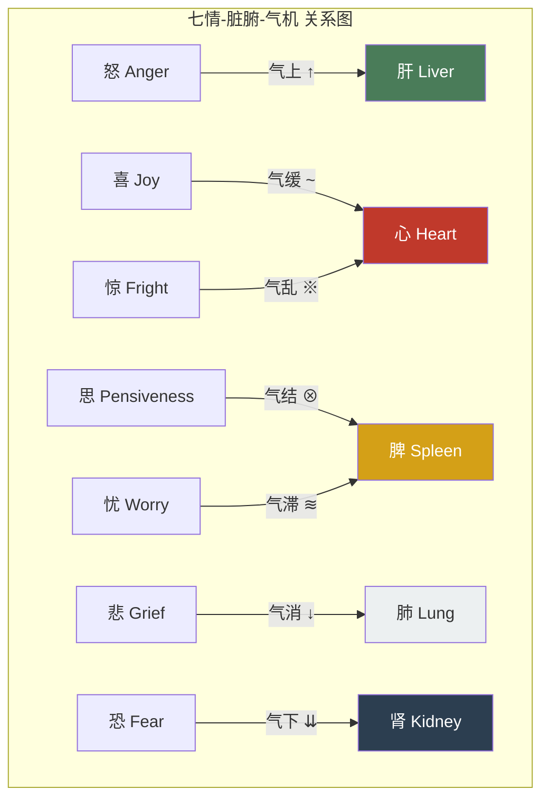

# 第四章 情志与身体：你的情绪正在伤害哪个器官？

## 4.1 开篇故事：胃病背后的真相

林薇在一家互联网公司做产品经理。三十二岁，身体一向健康，跑过两次半程马拉松。

然而过去半年，她的胃出了问题。饭后胀气、隐隐作痛、食欲全无。她做了胃镜，查了幽门螺杆菌，所有指标正常。医生说："器质上没问题，可能是功能性消化不良。"翻译成大白话——我们找不到原因。

林薇知道原因。

半年前，公司组织架构大调整，她被空降的新领导边缘化。每天坐在工位上反复推演：我该主动沟通还是等待？我会不会被裁？简历要不要更新？她的脑子像一台永不停机的服务器，而她的胃，正在为这台服务器买单。

两千五百年前，《黄帝内经》只用五个字就解释了林薇的症状——

> **「思伤脾。」**
>
> *Sī shāng pí.*
>
> 过度思虑损伤脾脏。

完整的原文出自《素问·阴阳应象大论》：

> **「怒伤肝，喜伤心，思伤脾，忧伤肺，恐伤肾。」**
>
> 愤怒伤害肝脏，过喜伤害心脏，思虑伤害脾脏，忧愁伤害肺脏，恐惧伤害肾脏。

这不是比喻。这不是诗意的修辞。这是一套完整的心身医学地图——比西方医学承认"心理影响生理"早了整整两千四百年。

---

## 4.2 七情地图：你身体里的情绪版图

《内经》将人的基本情绪归纳为七种，称为"七情"（*qī qíng*）。每一种情绪都对应特定的脏腑，驱动气的特定运动方向，并产生可观察的身体症状。

| 情绪 | 脏腑 | 气的运动 | 身体表现 | 现代医学印证 |
|------|------|---------|---------|------------|
| **怒** 愤怒 | 肝 | 气上 | 头痛、高血压、目赤 | 皮质醇飙升、心血管应激 |
| **喜** 过喜 | 心 | 气缓 | 心悸、失眠、心神涣散 | Takotsubo 心肌病（"心碎综合征"） |
| **思** 思虑 | 脾 | 气结 | 食欲不振、腹胀、乏力 | 应激性肠易激综合征、肠脑轴 |
| **忧** 忧愁 | 脾 | 气滞 | 消化不良、肌肉紧张 | 焦虑与胃肠紊乱共病 |
| **悲** 悲伤 | 肺 | 气消 | 气短、声弱、易哭 | 丧亲后免疫抑制、呼吸道感染率升高 |
| **恐** 恐惧 | 肾 | 气下 | 遗尿、腰膝酸软 | 慢性恐惧→肾上腺疲劳、皮质醇耗竭 |
| **惊** 惊吓 | 心 | 气乱 | 恐慌、意识模糊、心悸 | PTSD、急性应激反应 |

《素问·举痛论》用一句话概括了所有情绪的气机模型：

> **「怒则气上，喜则气缓，悲则气消，恐则气下，惊则气乱，思则气结。」**
>
> *Nù zé qì shàng, xǐ zé qì huǎn, bēi zé qì xiāo, kǒng zé qì xià, jīng zé qì luàn, sī zé qì jié.*

而最振聋发聩的一句：

> **「百病生于气也。」**（《素问·举痛论》）
>
> 一切疾病，都从气的失调开始。

---

## 4.3 以情胜情：古老的认知行为疗法

《内经》不仅诊断情绪疾病，还提出了治疗方案。这套方案叫"以情胜情"——用一种情绪去克制另一种情绪，原理来自五行相克。

**五行情志相克：**

- **悲胜怒**（金克木）—— 悲悯和同理心能化解愤怒
- **恐胜喜**（水克火）—— 敬畏之心能收敛狂喜散乱
- **怒胜思**（木克土）—— 果断的行动力能打破过度思虑
- **喜胜悲**（火克金）—— 欢乐能驱散深层悲伤
- **思胜恐**（土克水）—— 理性分析能平息恐惧

这本质上是一套两千五百年前的认知情绪调节框架。现代心理学中的认知重评（cognitive reappraisal）——通过改变对事件的解读来调节情绪——与"以情胜情"的底层逻辑惊人地一致。区别在于：《内经》不是用"理性思维"对抗情绪，而是用"另一种情绪"来调动气机，重建平衡。

举一个临床案例。明代医家张子和治疗一位因丧子悲痛过度而久咳不愈的妇人，并未开药，而是请来戏班表演滑稽剧目，令她大笑。笑过之后，咳嗽渐止。这正是"喜胜悲"——火克金。

---

## 4.4 现代科学的印证：心理神经免疫学

1975年，罗切斯特大学的罗伯特·阿德（Robert Ader）偶然发现，大鼠的免疫系统可以像巴甫洛夫条件反射一样被"训练"。这一发现催生了一个全新学科——心理神经免疫学（Psychoneuroimmunology, PNI），正式确认了大脑、神经系统和免疫系统之间的双向通信。

《内经》的情志-脏腑地图与 PNI 的发现惊人吻合：

**怒伤肝 → 慢性炎症与肝损伤。** 持续的愤怒情绪激活交感神经系统，使皮质醇和炎症因子（如 IL-6、TNF-α）长期升高。研究表明，敌意特质（trait hostility）与非酒精性脂肪肝病风险显著正相关。

**悲伤肺 → 丧亲后呼吸道易感。** 《英国医学杂志》（BMJ）的一项大规模研究显示，丧偶后第一年内，肺炎和呼吸道感染的住院率升高约40%。悲伤抑制自然杀伤细胞（NK 细胞）活性，直接削弱呼吸道免疫屏障。

**恐伤肾 → 肾上腺耗竭。** 长期处于恐惧状态的人，肾上腺不断释放肾上腺素和皮质醇。最终肾上腺功能失调，出现极度疲劳、腰痛、免疫低下——与《内经》描述的"恐伤肾"症状几乎完全重叠。

**思伤脾 → 肠脑轴。** 肠道拥有超过一亿个神经元，被称为"第二大脑"。迷走神经是大脑与肠道之间的高速公路。焦虑和过度思虑通过迷走神经直接干扰肠道蠕动和微生物群落，这就是为什么"紧张就拉肚子"不是心理作用，而是神经生理学事实。

最具震撼力的证据来自 ACE 研究（Adverse Childhood Experiences Study）。费利蒂（Felitti）等人在1998年发表的这项涉及17,000人的研究证实：童年期的情绪创伤——虐待、忽视、家庭暴力——会在数十年后转化为心脏病、癌症、糖尿病等实体疾病。情绪不仅"伤心"，它真的在伤害身体的每一个器官。

---

## 4.5 怒与肝：现代人最大的情志危机

在七情之中，《内经》对"怒"的论述最为详尽，因为肝主疏泄——它负责全身气机的通畅流动。愤怒使气上冲，肝失疏泄，连带影响脾胃消化、心神安宁。

> **「怒则气上。」**
>
> *Nù zé qì shàng.*

现代生活是一座愤怒工厂。早高峰堵车、工作压力、社交媒体上的戾气、刷不完的坏消息——这些都是《内经》所说的"伤肝"行为。你不需要拍桌子大骂才叫愤怒，持续的烦躁、压抑的不满、控制不住地刷负面新闻，都是慢性的"怒则气上"。

生理层面，慢性愤怒激活交感神经，血压持续偏高，肝脏代谢负担加重。大量流行病学研究证实，高敌意特质人群的心血管事件风险是低敌意人群的1.5至2倍。

《内经》的处方是「以悲胜怒」——不是让你去悲伤，而是唤起悲悯、同理心。当你下次因为路怒症想按喇叭时，试着想象对方可能正赶去医院看望病重的家人。这种视角转换就是"以悲胜怒"的现代应用。

---

## 4.6 思伤脾：知识工作者的职业病

林薇的故事不是个例。在一个信息过载的时代，"思伤脾"可能是七情致病中最普遍的一种。

《内经》说"思则气结"——思虑过度使气凝结不行，脾胃功能首当其冲。你有没有这样的经历：赶项目的时候根本不饿，考试前一周胃胀难受，焦虑的时候不想吃东西或者疯狂吃垃圾食品？这不是巧合，这是脾气被"结"住了。

现代医学给出了同样的答案。应激性肠易激综合征（IBS）与焦虑障碍的共病率高达60%以上。当你焦虑时，大脑释放促肾上腺皮质激素释放因子（CRF），通过迷走神经直接抑制胃肠蠕动，改变肠道通透性和微生物组成。

《内经》的处方是「以怒胜思」——这里的"怒"不是暴怒，而是果断、行动力、拍板的勇气。当你陷入无休止的内耗和反刍思维时，最好的药不是继续想，而是站起来做一个决定，哪怕是很小的决定。

---

## 4.7 日常实践：情志调养

《内经》不是一本只谈理论的书，它是实操手册。以下是从《内经》原理出发的情志调养方法：

**晨间觉察。** 每天醒来后，用一分钟感受自己的情绪基调。不评判，只觉察。今天是烦躁？焦虑？平静？低落？觉察本身就是调节的开始。

**六字诀呼吸（嘘呵呼呬吹嘻）。** 这是源自《内经》脏腑理论的古老吐纳法，每个字音对应一个脏器的振动频率：

- **嘘**（xū）—— 疏肝理气，化解愤怒
- **呵**（hē）—— 清心安神，平息躁动
- **呼**（hū）—— 健脾化湿，解除思虑
- **呬**（sī）—— 润肺宣气，释放悲伤
- **吹**（chuī）—— 补肾纳气，缓解恐惧
- **嘻**（xī）—— 调理三焦，通畅全身

**顺时调情。** 春季肝气升发，宜舒展身心，不宜压抑；夏季心气旺盛，宜欢畅，不宜过度亢奋；秋季肺气收敛，宜安宁，允许适度的感伤；冬季肾气封藏，宜静养，不宜过度惊恐消耗。

**以动化情。** 《内经》暗含一个深刻洞见：身体的运动可以疏导情绪的气机。怒的时候去走路（消散上冲之气），悲的时候做扩胸运动（打开肺气），恐的时候站桩（稳固下沉之气），思虑过重的时候做有节奏的运动如跑步、游泳（疏通结滞之气）。

**睡前清理。** 临睡前做一次情绪"清零"。深呼吸三次，每次呼气时想象把一天积累的情绪浊气排出体外。这不是玄学，而是通过激活副交感神经来降低皮质醇水平。

---

## 4.8 反思时刻

闭上眼睛，问自己一个问题：

**在过去三个月里，哪种情绪在你生活中占据了最多的空间？**

是工作中的持续焦虑（思）？是对某件事的愤怒和不满（怒）？是一段关系结束后的悲伤（悲）？还是对未来不确定性的恐惧（恐）？

现在回看七情地图。你的主导情绪对应哪个脏腑？你是否在那个系统出现了不适——消化问题、呼吸不畅、腰痛、头疼、失眠？

这不是要你自己诊断疾病。这是一次觉察练习。当你开始看见情绪与身体之间的连接，你就拿回了一部分对健康的主动权。

---

## 今日行动

- ⚡ 现在闭眼 60 秒，问自己：此刻主导我的情绪是什么？它在身体的哪个位置？（这就是觉察的起点）
- ⚡ 下次感到愤怒时，不压抑也不发作——出门走 10 分钟（怒则走，消散上冲之气）
- 🔄 从今天开始，每晚睡前做 3 次深长呼气，想象排出一天的情绪浊气。坚持 14 天。

---

## 21 天微实验：情绪日记

每天晨起时用一个词记录当下的情绪底色（如：焦虑、平静、烦躁、低落、兴奋）。不分析、不评判，只记录。21 天后回顾，你会看到自己的情绪模式——哪种情绪出现最频繁？是否与特定事件或时间段相关？

---

## 证据强度标注

| 内经原则 | 证据等级 | 说明 |
|---------|---------|------|
| 怒伤肝 | ✓ 已证实 | 慢性愤怒→皮质醇/炎症因子升高→肝脏代谢损伤，JACC 大规模研究证实 |
| 思伤脾（过度思虑伤消化）| ✓ 已证实 | 焦虑与 IBS 共病率 >60%，肠脑轴双向通信已成定论 |
| 悲伤肺 | ✓ 已证实 | BMJ 研究：丧亲后呼吸道感染住院率升高 ~40% |
| 恐伤肾 | ? 合理假说 | 慢性恐惧→肾上腺皮质醇耗竭有临床观察，但"肾"与"肾上腺"的对应仍需更多验证 |
| 以情胜情（情绪相克调节）| ? 合理假说 | 与认知重评（cognitive reappraisal）底层逻辑一致，但五行相克的精确对应缺乏 RCT 验证 |
| 百病生于气 | ? 合理假说 | PNI 证实情绪影响免疫/代谢，但"百病"的全称命题过于绝对 |

---

## 4.9 总结与过渡

本章揭示了《黄帝内经》最前沿的洞见：情绪不是"想出来的"，它们是真实的生理事件，沿着特定路径影响特定器官。

- 七情各有其脏腑归属和气机方向
- "以情胜情"是世界上最早的情绪调节系统之一
- 现代心理神经免疫学用分子生物学的语言，重新讲述了《内经》两千五百年前的故事
- 情志调养不是事后补救，而是日常功课

> **「百病生于气也。」**

一切疾病从气的失调开始，而情绪是气最强大的推动者。

但还有另一种方式可以主动推动气的运行——不是靠情绪，而是靠身体的运动。下一章，我们将探索《内经》对运动与生命力的深刻理解：不是"健身"，而是"养生"。

---

## 参考文献

1. 《黄帝内经·素问》第五篇《阴阳应象大论》，第三十九篇《举痛论》
2. Ader, R., & Cohen, N. (1975). Behaviorally conditioned immunosuppression. *Psychosomatic Medicine*, 37(4), 333–340.
3. Felitti, V. J., et al. (1998). Relationship of childhood abuse and household dysfunction to many of the leading causes of death in adults: The Adverse Childhood Experiences (ACE) Study. *American Journal of Preventive Medicine*, 14(4), 245–258.
4. Buckley, T., et al. (2012). Prospective study of early bereavement on psychological and behavioural cardiac risk factors. *BMJ Open*, 2(6), e001842.
5. Mayer, E. A. (2011). Gut feelings: the emerging biology of gut–brain communication. *Nature Reviews Neuroscience*, 12(8), 453–466.
6. Chida, Y., & Steptoe, A. (2009). The association of anger and hostility with future coronary heart disease. *Journal of the American College of Cardiology*, 53(11), 936–946.
