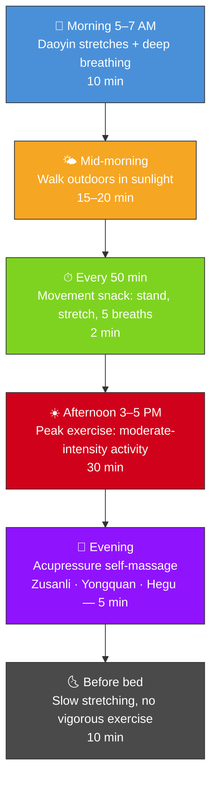

# Chapter 5 · Moving Like Water

> 形劳而不倦，气从以顺，各从其欲，皆得所愿。
> *Xíng láo ér bù juàn, qì cóng yǐ shùn, gè cóng qí yù, jiē dé suǒ yuàn.*
>
> "The body works but does not become exhausted. Qi flows smoothly, each follows their own nature, and all get what they wish."
>
> — *Su Wen*, Chapter 1 (上古天真论)

## 5.1 A Tale of Two Bodies

Every morning at six-thirty, in a small park near Shanghai's Bund, an eighty-three-year-old man named Old Chen practices Tai Chi. His movements are slow and unbroken, like seaweed swaying in a current. His knees don't ache. His back is straight. He takes no painkillers and rarely catches a cold. His community doctor says his blood pressure is better than most fifty-year-olds.

Eight thousand miles away in Los Angeles, a fifty-two-year-old CrossFit devotee named Mike lives by a different creed: No Pain, No Gain. He trains six days a week, over an hour each session. His wall is covered in race medals. But his knees have been surgically repaired twice, his rotator cuff once, he pops ibuprofen like mints, sleeps poorly, and has an elevated resting heart rate. His trainer calls him "strong." His orthopedic surgeon calls him "overdrawn."

Both men exercise. One grows more vital with each passing year. The other grows more fragile.

Put them in the same hospital for a checkup, and the results tell a counterintuitive story. The old man who practices twenty minutes of Tai Chi each morning has low C-reactive protein (an inflammation marker), intact joint cartilage, and autonomic nervous system flexibility resembling someone decades younger. The gym warrior in his prime has chronically elevated inflammatory markers, severely worn meniscal cartilage, and a sympathetic nervous system locked in permanent overdrive — his body isn't recovering between sessions; it's perpetually stressed.

The *Huangdi Neijing* explains why. The very first chapter of the *Su Wen* states: 「形劳而不倦」(xíng láo ér bù juàn) — "The body works but does not become exhausted." The ancients exercised to **accumulate** energy, not **annihilate** it. Six characters. One of the most elegant exercise principles ever articulated.

This is not an invitation to be sedentary. The Neijing never endorsed laziness. What it opposed was exercising to the point of collapse. Its ideal is water: always moving, never crashing.

Water has three qualities worth learning from:

- **Continuity** — water doesn't do interval training; it flows without pause.
- **Adaptability** — water conforms to square vessels and round ones alike, never fighting the container.
- **Inexhaustibility** — water flows downhill, following gravity, and therefore never runs out.

These three qualities are the pillars of the Neijing's movement philosophy.

---

## 5.2 Daoyin and Anqiao: The Neijing's Movement Prescription

Modern fitness culture frames exercise as an assault on the body — tear the muscle fibers, then wait for them to grow back thicker. The Neijing's movement philosophy is fundamentally different. Its core prescription is called 导引按跷 (dǎo yǐn àn qiāo).

**Daoyin** (导引) literally means "guide and lead" — using specific body postures to lead Qi along the meridians. It doesn't chase the limits of muscular contraction. It chases the free flow of energy. Daoyin is the common ancestor of Tai Chi and Qigong.

**Anqiao** (按跷) means self-massage and acupressure — manual techniques to move stagnant Qi and Blood. Not the percussive gun approach of a modern gym, but deliberate, awareness-infused self-healing. According to *Su Wen*'s Chapter on Regional Therapies (异法方宜论), Daoyin and Anqiao originated in the Central Plains, where people "ate varied foods but did not exert themselves" — the resulting lack of movement led to limb weakness and atrophy. Daoyin was the prescription for "not moving enough."

In 1973, archaeologists excavated a Han dynasty tomb at Mawangdui near Changsha and discovered a painted silk scroll dating to 168 BCE — the **Mawangdui Daoyin Tu**. It depicts forty-four figures performing different stretching and breathing postures, some mimicking bears climbing, others imitating birds stretching, each labeled with the exercise name and the ailment it addresses. This is the oldest known exercise manual in human history — predating Greek athletic training texts by at least two centuries.

Notably, none of the forty-four postures on the Mawangdui scroll look strenuous. There are no weights, no sprints, no grimaces of maximal effort. Every figure appears relaxed, extended, controlled. The Eastern Han physician Hua Tuo later distilled Daoyin into the "Five Animal Frolics" (五禽戏) — movements mimicking the tiger, deer, bear, ape, and crane — creating China's first systematized exercise routine for health cultivation.

The governing principle behind all of it: **movement should circulate Qi and Blood, not deplete them.**

---

## 5.3 Qi and Blood: The Neijing's Exercise Physiology

The Neijing knew nothing about mitochondria, lactate thresholds, or VO₂ max. It had its own exercise physiology framework — **Qi-Blood theory**.

The core equation: 「气为血之帅，血为气之母」(qì wéi xuè zhī shuài, xuè wéi qì zhī mǔ) — "Qi is the commander of Blood; Blood is the mother of Qi." Qi provides the motive force that propels blood through the body. Blood provides the material nourishment that sustains Qi. The two are interdependent.

In modern terms: Qi approximates the integrated function of bioelectric signaling and neuro-endocrine regulation. Blood corresponds to the circulatory system's delivery of oxygen, nutrients, and hormones. Exercise activates their synergy — heart rate rises (Qi propels Blood), and blood delivers oxygen and glucose to muscles (Blood nourishes Qi). Exercise keeps this partnership running. Overtraining bankrupts it.

When you sit still too long, Qi and Blood stagnate — the Neijing calls this 瘀 (yū), "stasis." Stasis is the root of disease. *Su Wen* Chapter 23 states plainly: 「久坐伤肉，久卧伤气」(jiǔ zuò shāng ròu, jiǔ wò shāng qì) — "Prolonged sitting damages the flesh; prolonged lying damages the Qi."

In 2016, a landmark meta-analysis in the *British Journal of Sports Medicine* pooled data from over 44,000 participants and concluded that sitting more than ten hours a day significantly increases all-cause mortality — even among people who exercise regularly. "Sitting is the new smoking" is a modern catchphrase. The Neijing said it in eight characters twenty-five centuries earlier.

But the Neijing warns against the opposite extreme with equal force. When Qi and Blood are spent to exhaustion, the body enters a state of deficit — immune function drops, joints erode, cardiac load spikes. That is Mike's story.

Think of your Qi and Blood as a bank account. Moderate exercise is an investment — the energy spent returns with interest. Extreme exercise is an overdraft — you withdraw more than you deposit, and eventually the account goes bankrupt. Wisdom lies not in "how much you train" but in "what your return on investment is."

---

## 5.4 The Five Exhaustions: The Toxicity of Any Sustained Posture

*Su Wen* Chapter 23 contains a remarkably modern ergonomic insight — the **Five Exhaustions** (五劳所伤, wǔ láo suǒ shāng):

| Behavior | Damage | Modern Parallel |
|----------|--------|----------------|
| 久视伤血 — Prolonged looking | Damages Blood | Screen fatigue, dry eye, digital eye strain |
| 久卧伤气 — Prolonged lying | Damages Qi | Bed rest-induced muscle atrophy, metabolic decline |
| 久坐伤肉 — Prolonged sitting | Damages Flesh | Sarcopenia, metabolic syndrome, deep vein thrombosis |
| 久立伤骨 — Prolonged standing | Damages Bones | Varicose veins, spinal compression |
| 久行伤筋 — Prolonged walking | Damages Sinews | Overuse injuries, tendinitis, stress fractures |

The profundity lies not in the list itself but in the logic beneath it: **the problem is never a particular posture — it is the word "prolonged."** Any position, held too long, becomes poison. The solution is not to find the one correct posture and freeze. It is **variety and flow**.

Modern exercise science is rediscovering this exact principle. The "movement snack" concept — standing up and moving for two minutes every fifty minutes — has been shown in multiple studies to significantly reduce blood glucose spikes and all-cause mortality. Standing desk research reveals that standing is barely better than sitting; **alternating between the two** is what matters.

If you're a knowledge worker spending eight hours a day at a computer, the first three of the Five Exhaustions — prolonged looking, prolonged sitting, and prolonged lying (collapsing on the couch after work) — describe your typical day with uncanny precision. A list written twenty-five centuries ago reads like a modern occupational health risk assessment.

The Neijing already knew: don't pick a posture. Flow like water.

---

## 5.5 Tai Chi, Qigong, and Baduanjin: The Neijing Alive in Motion

Daoyin didn't disappear. It evolved into three movement traditions practiced daily by hundreds of millions of people.

**Tai Chi** (太极拳, tài jí quán): meditation in motion. Every movement embodies yin-yang transition — advance contains retreat, rise contains descent, exertion contains release. It pursues not speed or power but continuity and roundness. A 2017 meta-analysis in the *Journal of the American Geriatrics Society* (26 randomized controlled trials) found that Tai Chi significantly improves balance in older adults, reducing fall risk by 20% — outperforming conventional physical therapy.

**Qigong** (气功, qì gōng): the precise coordination of breath and movement. It is Daoyin's direct descendant, centered on using intention to guide breath and breath to guide the body. A 2020 systematic review in the *Journal of Complementary and Integrative Medicine* found that Qigong significantly lowers systolic blood pressure (average reduction: 12 mmHg), reduces anxiety scores, and improves sleep quality.

**Baduanjin** (八段锦, bā duàn jǐn — "Eight Pieces of Brocade"): one of the oldest standardized exercise routines in existence. Eight movements, each targeting a specific meridian or organ system. The learning curve is nearly flat — ten minutes and you can follow along. China's General Administration of Sport published a standardized version in 2003 that remains a cornerstone of public health promotion.

Western medicine has taken notice. A 2018 Harvard Medical School report listed Tai Chi as one of the "five best exercises" — alongside swimming and strength training. The report emphasized that Tai Chi is especially effective for people who "haven't been active, are recovering, or are older." That is precisely the original design target of Daoyin — not athletes, but ordinary people seeking to cultivate health.

What these three traditions share: moderate intensity, breath-led movement, whole-body engagement, and zero depletion. They are 「形劳而不倦」made flesh.

---

## 5.6 Modern Validation: Exercise Science Meets Ancient Wisdom

Let's translate the Neijing's principles into the language of contemporary exercise science. You'll find that the laboratory's cutting-edge discoveries often amount to quantitative confirmations of ancient common sense.

**Zone 2 training and "the body works but does not become exhausted."** Zone 2 is the intensity at which you can sustain a conversation — roughly 60–70% of maximum heart rate. Exercise physiologist Iñigo San-Millán's research demonstrates that this intensity window optimizes mitochondrial function and fat oxidation efficiency. Elite endurance athletes spend 80% of their training hours in this zone. "The body is working, but not exhausted" — that is the literal definition of Zone 2.

**The U-shaped curve and the danger of excess.** A 2015 study in the *Journal of the American College of Cardiology* tracked 1,098 joggers and 413 sedentary individuals from the Copenhagen City Heart Study. Light-to-moderate joggers had the lowest mortality. But strenuous, high-frequency joggers had mortality rates approaching those of couch potatoes. The exercise benefit curve is U-shaped — both extremes are dangerous, the middle is safest. The Neijing's core logic — "excess is as harmful as deficiency" — has been drawn in precise statistical form.

**The return of walking.** *Su Wen* Chapter 2 prescribes 「广步于庭」(guǎng bù yú tíng) — "walk broadly in the courtyard." This was part of the ancients' daily wellness routine as described by the Yellow Emperor: rising before dawn, walking in the courtyard with hair unbound and body relaxed. A 2023 meta-analysis in the *European Journal of Preventive Cardiology* found that as few as 3,967 daily steps reduce all-cause mortality, with additional benefit for every 1,000 steps added. Walking — the humblest form of exercise — may be the Neijing's most prescient prescription.

**Breath-movement coupling.** The Neijing repeatedly emphasizes "regulate the body through breath." Modern research confirms that diaphragmatic breathing during exercise lowers sympathetic nervous system activation, improves exercise efficiency, and reduces perceived exertion. Breath is not an accessory to movement — it is the operating system.

**Post-exercise recovery.** The Neijing cares not only about how you move but how you stop. 「劳者温之」(láo zhě wēn zhī) — "warm and nourish after exertion." Modern recovery science increasingly favors "active recovery": low-intensity walking, gentle stretching, warm baths — strategies that promote circulation and accelerate metabolic waste clearance. This aligns perfectly with the Neijing's logic of "use warmth to resolve stasis." Ice baths and complete immobility — the passive recovery approach — may actually delay repair.

---

## 5.7 Daily Practice: The Neijing Movement Protocol

Here is a daily movement routine built on Neijing principles. Its logic is not "train harder" but "keep the body flowing all day long."

**Why 3–5 PM?** This is the Bladder meridian's active window — and it also happens to be when core body temperature peaks, muscles are most pliable, and reaction time is fastest. Meridian theory and exercise science converge at the same hour.

**Three key acupressure points for self-massage:**
- **Zusanli** (足三里, ST-36): four finger-widths below the kneecap, lateral to the shinbone. Strengthens the whole body and regulates digestion.
- **Yongquan** (涌泉, KI-1): the depression at the front of the sole. Nourishes the Kidney, calms the spirit, and draws fire downward.
- **Hegu** (合谷, LI-4): the fleshy web between thumb and index finger. Disperses wind, clears pain, and opens the meridians.

**A note on intensity:** For the afternoon peak session, the specific activity doesn't matter — brisk walking, swimming, cycling, Tai Chi, or Baduanjin all qualify. What matters is the intensity benchmark: you should be able to hold a conversation while moving, but singing would feel difficult. That's Zone 2 in modern exercise science. It's also the precise felt sense of 「形劳而不倦」.

You don't need a perfect one-hour workout window. You need movement to seep into every crack of your day — like water seeping into sand.

---

## 5.8 Reflection Moment: Water or Machine?

Take one minute. Rate each statement (1 = not at all like me, 5 = exactly like me):

1. My exercise routine is monotonous and unchanged for years. ___
2. I feel a workout "counts" only when I'm completely spent. ___
3. My typical day involves long stretches of sitting with almost no breaks. ___
4. I've had exercise-related injuries but continue the same training. ___
5. I almost never stretch, do breathwork, or practice self-massage. ___

**15 or above**: You're operating in machine mode — rigid, repetitive, high-wear. Consider dialing down intensity and adding variety.

**10–14**: Mixed state. You may flow well in some areas but lock up in others.

**5–9**: Your movement patterns are approaching water — varied, moderate, sustainable. Keep going.

Exercise is not about conquering the body. It's about conversing with it.

If you scored high, don't panic. Change can start with one absurdly simple act: tomorrow morning, stand by a window for three minutes. Take five slow, deep breaths. With each exhale, gently twist your torso. This isn't a workout. This is Daoyin. Twenty-five centuries of wellness wisdom, activated in three minutes.

---

## Today's Actions

- ⚡ Stand up. Right now. Stretch for 30 seconds, take 3 deep breaths. You just did a "movement snack."
- ⚡ Set a reminder every 50 minutes. When it rings, change your posture — stand, walk, stretch, anything.
- 🔄 This week, walk 15 minutes every day (morning preferred). No podcast, no phone — just walk.

---

## 21-Day Micro-Experiment: The Walking Experiment

Walk at least 15 minutes every day for 21 consecutive days. No running, no step counting, no heart rate tracking — just walk. Rate your post-walk energy (1–5) and overall mood (1–5) each day. Compare Day 21 to Day 1.

---

## Evidence Strength Ratings

| Neijing Principle | Evidence Level | Notes |
|-------------------|---------------|-------|
| The body works but does not become exhausted (形劳而不倦) | ✓ Confirmed | Zone 2 / moderate-intensity exercise yields far greater benefits than high intensity; dose-response follows a U-shaped curve |
| Prolonged sitting damages the flesh (久坐伤肉) | ✓ Confirmed | Lancet 2016: sedentary time positively associated with all-cause mortality; risk rises significantly beyond 8 hrs/day |
| Prolonged looking damages the blood (久视伤血) | ? Plausible hypothesis | Evidence for screen-induced eye fatigue, dry eye, and myopia progression exists, but the precise "damages Blood" correspondence is still under study |
| Health benefits of Daoyin / Tai Chi | ✓ Confirmed | Multiple meta-analyses confirm Tai Chi improves balance, lowers blood pressure, reduces stress, and enhances immune function |
| The Five Exhaustions (any sustained posture is harmful) | ✓ Confirmed | Modern ergonomic consensus: there is no "perfect posture" — the best posture is the next posture |

---

## 5.9 Summary & Bridge to Chapter 6

In Chapter 2, you recalibrated your biological clock. In Chapter 3, you restructured your plate. In Chapter 4, you learned to live alongside your emotions. In this chapter, you found the ancient frequency of human movement — not burning but flowing, not fighting but following.

Look at the four themes so far — rhythm, diet, emotion, movement — and notice the common logic beneath them all: **the middle way**. Not rigid asceticism. Not reckless indulgence. But finding the balance point where the body runs naturally. The Neijing's entire wellness philosophy is, at its root, an art of equilibrium.

「形劳而不倦」— these six characters are not an invitation to be lazy. They are an invitation to be wise. Move your body, but don't drain it. Like water: always flowing, never depleted, never stagnant.

Old Chen is eighty-three now. He has never run a marathon, never lifted a barbell, never had a single muscle that a fitness magazine would want to photograph. But he has flowed, every day, for over half a century. His Tai Chi, his morning walks, his post-meal acupressure — these "insignificant" micro-movements, compounded over decades, have built a fortress of health more durable than any gym membership ever could.

But the Neijing's highest teaching is not about what to eat when you're sick, how to move when you're stiff, or how to manage feelings when you're overwhelmed. It's about never getting sick in the first place. Chapter 6 reveals the Neijing's crown jewel: 治未病 (zhì wèi bìng) — **the art of prevention**. Don't treat disease after it arrives; prevent it before it forms. Don't restore order after chaos; maintain it before disorder begins. Prevention is not a footnote to medicine. It is medicine's highest form.

---

## References

1. *Huangdi Neijing Su Wen*, Chapters 1 (上古天真论), 2 (四气调神大论), 23 (宣明五气篇).
2. Banzer, W. et al. *The Mawangdui Daoyin Tu: An Ancient Chinese Exercise Chart*. Sport Archaeology Research, 2004.
3. Lomas-Vega, R. et al. "Tai Chi for risk of falls: A meta-analysis." *Journal of the American Geriatrics Society*, 65(9), 2017.
4. Schnohr, P. et al. "Dose of jogging and long-term mortality: The Copenhagen City Heart Study." *Journal of the American College of Cardiology*, 65(5), 2015.
5. Banach, M. et al. "The association between daily step count and all-cause and cardiovascular mortality: A meta-analysis." *European Journal of Preventive Cardiology*, 30(18), 2023.
6. Zou, L. et al. "Effects of mind-body exercises on blood pressure: A systematic review and meta-analysis." *Journal of Complementary and Integrative Medicine*, 17(4), 2020.
7. San-Millán, I. & Brooks, G.A. "Assessment of metabolic flexibility by means of measuring blood lactate, fat, and carbohydrate oxidation responses to exercise." *Frontiers in Physiology*, 9, 2018.
8. Ekelund, U. et al. "Does physical activity attenuate the detrimental association of sitting time with mortality?" *British Journal of Sports Medicine*, 50(22), 2016.
