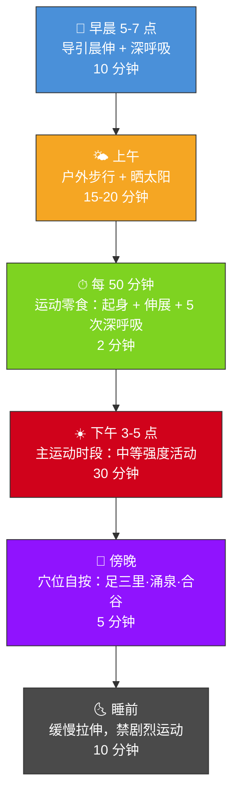

# 第五章 · 动如流水

> 形劳而不倦，气从以顺，各从其欲，皆得所愿。
>
> — 《黄帝内经·素问·上古天真论》

## 5.1 两种八十岁

每天早上六点半，上海外滩附近的小公园里有一位八十三岁的老人在打太极拳。他叫老陈。动作缓慢、连绵不断，像一根水草在水流中摇摆。膝盖不疼，腰不弯，不吃止痛药，一年到头连感冒都少见。社区医生说他的血压比大多数五十岁的人都好。

三千公里外的洛杉矶，有一位五十二岁的 CrossFit 爱好者叫 Mike。Mike 的训练口号是"No Pain No Gain"。他每周训练六天，每次一小时以上，墙上挂满了完赛奖牌。但他的膝关节做过两次手术，肩袖撕裂修复过一次，常年服用布洛芬，睡眠质量很差，静息心率偏高。他的健身教练说他很"强壮"；他的骨科医生说他在透支。

两个人都在"运动"。但一个越动越有活力，另一个越动越脆弱。

如果你把这两个人放进同一间医院的体检室，报告会讲述一个违反直觉的故事。那个每天只练二十分钟太极的老人，C 反应蛋白（炎症标志物）正常偏低，关节软骨完好，自主神经功能像年轻人一样灵活。那个在健身房里挥汗如雨的壮年人，慢性炎症指标偏高，膝关节半月板磨损严重，交感神经长期处于亢奋状态——他的身体不是在恢复，而是在持续应激。

两千五百年前的《黄帝内经》解释了原因。素问第一篇写道：「形劳而不倦」（xíng láo ér bù juàn）——身体要劳动，但不应该到达倦怠的程度。古人运动的目的是**蓄积能量**，而不是**消耗殆尽**。这六个字，是运动哲学史上最简洁的原则之一。

这不是叫你不动。恰恰相反——内经从来不赞成懒散。它反对的是"动到崩溃"。它的理想状态是水：永远在流动，但从不奔溃。

水有三个特征值得运动者学习：

- **持续性**——水从不间歇训练，它永远在流。
- **适应性**——水遇方则方，遇圆则圆，从不硬碰硬。
- **不竭性**——水流向低处，顺势而行，所以不会耗尽自己。

这三个特征，恰好是内经运动哲学的三根支柱。

---

## 5.2 导引按跷：内经的运动处方

现代人把运动想成一种对身体的"攻击"——撕裂肌纤维，然后等它长回来更粗。内经的运动观完全不同。它的核心处方叫「导引按跷」（dǎo yǐn àn qiāo）。

**导引**（dǎo yǐn），字面意思是"导气引体"——通过特定的身体动作引导体内的气沿经络运行。它不追求肌肉的极限收缩，而是追求气的通畅流动。这是太极拳和气功的共同祖先。

**按跷**（àn qiāo），是自我按摩和穴位按压——用手法疏通淤滞的气血。它不是健身房里的筋膜枪轰炸，而是带有觉知的、精确的自我疗愈。《素问·异法方宜论》记载，导引按跷起源于中原地区，那里的人"杂食而不劳"——吃得杂但动得少，因此容易出现痿厥（肢体无力）。导引按跷，就是针对"动得少"这个病因开出的处方。

1973 年，长沙马王堆汉墓出土了一幅公元前 168 年的彩色帛画——**马王堆导引图**。画上绘有四十四个人物，分别做着不同的伸展和呼吸姿势，有的模仿熊攀、有的模仿鸟伸，旁边标注了动作名称和对应的疾病。这是人类已知最古老的运动处方图谱，比古希腊的体育训练手册早了至少两百年。

值得注意的是，导引图中的动作没有一个看起来"费力"。没有负重、没有冲刺、没有到达极限的扭曲表情。每个姿势都松弛、舒展、可控。东汉名医华佗后来将导引术提炼为"五禽戏"——模仿虎、鹿、熊、猿、鸟五种动物的运动形态，成为中国最早的系统化养生操。

导引的核心原则只有一条：**运动的目的是让气血循环，而不是让气血耗竭。**

---

## 5.3 气血运行：内经的运动生理学

内经不知道什么是线粒体、乳酸阈值或最大摄氧量。它有自己的运动生理学框架——**气血理论**。

核心公式：「气为血之帅，血为气之母」（qì wéi xuè zhī shuài, xuè wéi qì zhī mǔ）。气是推动血液运行的动力，血液则是滋养气的物质基础。两者相互依存，缺一不可。

用现代术语翻译：气近似于生物电信号和神经-内分泌调控系统的整合功能，血则对应循环系统运输的氧气、营养和激素。运动激活了两者的协同——心率上升（气推动血），血液携带氧气和葡萄糖送达肌肉（血滋养气）。运动的作用，就是让这对搭档协同运转，而不是把其中一方榨干。

当你久坐不动，气血停滞——内经称之为「瘀」（yū）。瘀是万病之源。《素问·宣明五气篇》说得直接：「久坐伤肉，久卧伤气」（jiǔ zuò shāng ròu, jiǔ wò shāng qì）——长时间坐着会损伤肌肉功能，长时间躺着会损伤气的运行。

2023 年，《英国运动医学杂志》的一项荟萃分析覆盖了超过 4.4 万名参与者，结论明确：每天坐超过 10 小时的人，全因死亡率显著升高，即使他们同时有规律运动。"久坐是新型吸烟"——这句现代健康口号，内经在两千五百年前就用八个字说完了。

但内经同样警告另一个极端：**过度运动同样伤身。** 气血被消耗殆尽后，身体进入亏空状态——免疫力下降，关节磨损，心脏负荷过高。这就是 Mike 的困境。

内经的运动生理学可以用一个比喻来理解：你的气血就像银行账户。温和的运动是投资——花出去的能量会带来更多能量回报。极端运动是透支——你每次取出的比存入的多，迟早资不抵债。智慧不在于"练多少"，而在于"收益率"。

---

## 5.4 五劳所伤：姿势的毒性

《素问·宣明五气篇》提出了一个极其超前的人体工学观察——**五劳所伤**：

| 行为 | 损伤 | 现代对照 |
|------|------|---------|
| 久视伤血 | 长时间注视损伤血 | 屏幕疲劳、干眼症、数字视觉疲劳 |
| 久卧伤气 | 长时间卧躺损伤气 | 久卧导致肌肉萎缩、代谢下降 |
| 久坐伤肉 | 长时间坐着损伤肌肉 | 久坐与肌少症、代谢综合征 |
| 久立伤骨 | 长时间站立损伤骨骼 | 静脉曲张、脊柱压缩 |
| 久行伤筋 | 长时间行走损伤筋腱 | 过度训练、肌腱炎 |

这张表的深刻之处不在于列举了什么伤害，而在于它揭示的底层逻辑：**问题不在于某一种姿势本身，而在于"久"——任何姿势一旦持续过长，都会变成毒药。** 解决方案不是找到一个"正确姿势"然后锁死不动，而是——**变化与流动**。

现代运动科学正在重新发现这个原则。"运动零食"（movement snack）概念——每隔 50 分钟站起来走动 2 分钟——已被多项研究证实能显著降低血糖波动和全因死亡率。站立办公桌的研究也发现：站着并不比坐着好多少，**坐站交替**才是关键。

如果你是一个每天对着电脑工作八小时的知识工作者，五劳所伤的前三条——久视、久坐、久卧（下班瘫在沙发上）——几乎完美描述了你的一天。内经两千五百年前写下的这张清单，今天读起来像一份现代职业病风险评估表。

内经早就说了：不是选一种姿势，而是像水一样流动。

---

## 5.5 太极与气功：内经在身体里活着

导引术并没有消失。它变成了今天的太极拳、气功和八段锦——三种被数亿人每天践行的运动方式。

**太极拳**（tài jí quán）：移动中的冥想。每个动作都是阴阳转换的具身化——前进中有后退，上升中有下沉，发力中有放松。它不追求速度和爆发力，追求的是圆融和连续。2019 年《内科学年鉴》的一项荟萃分析（纳入 26 项随机对照试验）发现：太极拳显著改善老年人的平衡能力，跌倒风险降低 20%，效果优于传统物理治疗。

**气功**（qì gōng）：呼吸与动作的精密协调。它是导引术的直系后代，核心是用意念引导呼吸，呼吸再带动身体。2020 年发表在《补充与整合医学杂志》的系统综述显示：气功可以显著降低收缩压（平均降低 12 mmHg），降低焦虑评分，提高睡眠质量。

**八段锦**（bā duàn jǐn，"八段锦缎"）：中国现存最古老的标准化健身套路之一，由八个动作组成，每个动作对应一条经络或一个脏腑。学习门槛极低，十分钟就能跟着做完一遍。中国国家体育总局在 2003 年发布了标准化版本，至今仍是公共健康推广的核心内容。

西方医学也注意到了。哈佛医学院在 2018 年发表的一份报告中，将太极拳列为"最佳五种运动"之一——与游泳、力量训练并列。报告特别指出：太极拳对于那些"以前不运动、正在恢复期、或年纪较大"的人群尤其有效。

这恰好是导引术最初的设计对象——不是运动员，而是需要养生的普通人。内经的运动处方从来不是为精英设计的；它是为所有人设计的。

有趣的是，在全球新冠疫情期间，八段锦视频在国内外社交媒体上的播放量激增数十亿次。人们被封锁在家、空间有限、器材缺乏——而八段锦恰好不需要任何器材、任何场地，站在客厅里就能完成。一套两千年前的功法，在二十一世纪最极端的公共卫生危机中，证明了它的生命力。

这三种运动形式的共同特征：强度适中，呼吸引导，全身参与，从不透支。它们是「形劳而不倦」的活体教材。

---

## 5.6 现代验证：运动科学遇上古老智慧

让我们把内经的原则翻译成当代运动科学的语言。你会发现，实验室里最前沿的发现，常常是对古老常识的量化确认。

**Zone 2 训练与"形劳而不倦"。** Zone 2 是指你可以持续交谈的运动强度——大约最大心率的 60%–70%。运动生理学家 Iñigo San-Millán 的研究表明，这个强度区间是线粒体功能优化和脂肪代谢效率最高的窗口。精英耐力运动员 80% 的训练时间花在这个区间。"身体在劳动，但不倦怠"——这就是 Zone 2 的精确定义。

**U 型曲线与过犹不及。** 2015 年发表在《美国心脏病学杂志》的一项丹麦研究追踪了 1,098 名跑步者和 413 名久坐者，发现：以轻到中等强度跑步的人死亡率最低；而高强度、高频率跑步的人，死亡率反而接近完全不运动的人。运动的收益曲线是 U 型的——两端都危险，中间最安全。内经的思维方式——"过犹不及"——在统计数据中被精确地画了出来。

**步行的回归。** 素问第二篇写道「广步于庭」（guǎng bù yú tíng）——"在庭院中舒展步行"。这是黄帝描述的上古之人养生日课之一：天不亮就起床，到庭院中散步，披散头发，放松身体。2023 年《欧洲预防心脏病学杂志》的荟萃分析显示：每天步行 3,967 步即可降低全因死亡率，每增加 1,000 步进一步获益。步行，这种最不起眼的运动，可能是内经最有先见之明的处方。

**呼吸-运动耦合。** 内经反复强调"以息调身"。现代研究证实，运动中的膈肌呼吸（diaphragmatic breathing）可以降低交感神经兴奋性，提高运动效率，减少感知疲劳。呼吸不是运动的附属品——它是运动的操作系统。

**运动后恢复。** 内经不只关心你怎么动，还关心你怎么停。「劳者温之」——疲劳后应当温养，而非冰敷死扛。现代运动恢复科学越来越倾向于"主动恢复"（active recovery）：低强度散步、轻柔拉伸、温水浴——这些策略促进血液循环，加速代谢废物清除，和内经"以温通瘀"的逻辑如出一辙。冰浴和完全静止这类"被动恢复"方式，反而可能延缓修复。

---

## 5.7 日常实践：内经运动日课

以下是一份基于内经原则设计的日常运动方案。它的核心不是"练更多"，而是"让身体一整天都在流动"。

**为什么是下午 3-5 点？** 这是膀胱经当令的时段，也恰好是人体核心温度最高、肌肉柔韧性最好、反应速度最快的时间窗口——运动科学和经络理论在这里不谋而合。

**穴位自按三要穴：**
- **足三里**（zú sān lǐ）：膝盖下方四指，胫骨外侧。强壮全身、调理脾胃。
- **涌泉**（yǒng quán）：足底前部凹陷处。滋肾安神、引火归元。
- **合谷**（hé gǔ）：拇指与食指之间虎口处。疏风解表、通络止痛。

**关于强度的拿捏：** 下午的主运动时段，选择什么运动并不重要——快走、游泳、骑自行车、太极拳、八段锦都行。重要的是强度标准：你应该能够在运动中持续说话，但唱歌会觉得吃力。这就是现代运动科学的 Zone 2 区间，也是「形劳而不倦」的精确体感描述。

每天不需要一个完美的"锻炼时间段"。你需要的是让运动渗透进一天的每一个缝隙——像水渗透进沙子。

---

## 5.8 反思时刻：你是水还是机器？

花一分钟回答以下问题（1 = 完全不符，5 = 非常符合）：

1. 我的运动方式单一，常年不变。 ___
2. 我经常训练到精疲力竭才觉得"有效"。 ___
3. 我的日常包含大量久坐，几乎没有中途活动。 ___
4. 我受过运动相关的伤，但仍在坚持同样的训练。 ___
5. 我几乎不做拉伸、呼吸练习或自我按摩。 ___

**15 分以上**：你正在用机器模式运动——刚性、重复、高磨损。考虑降低强度，增加多样性。

**10–14 分**：混合状态。你可能在某些方面流动良好，但在另一些方面过于僵硬。

**5–9 分**：你的运动模式接近"水"的状态——多样、适度、可持续。保持下去。

运动不需要战胜身体。它需要和身体对话。

如果你发现自己得分偏高，不必焦虑。改变可以从一个极其简单的动作开始：明天起床后，花三分钟站在窗前，做五次缓慢的深呼吸，每次呼气时轻轻扭转一下腰部。这不是健身。这是导引。两千五百年前的养生智慧，三分钟就能启动。

---

## 今日行动

- ⚡ 站起来。现在。伸展 30 秒，深呼吸 3 次。你刚刚做了一次"运动间隙"（movement snack）
- ⚡ 设一个每 50 分钟响一次的提醒，响了就换个姿势（站、走、伸展——任何改变都算）
- 🔄 本周开始每天散步 15 分钟（最好是早晨），不听播客、不看手机，只走路

---

## 21 天微实验：散步实验

连续 21 天每天步行至少 15 分钟。不跑步，不计步数，不追求心率——只是走。每天记录步行后的精力评分（1-5 分）和当天的整体心情（1-5 分）。第 21 天对比第 1 天的数据。

---

## 证据强度标注

| 内经原则 | 证据等级 | 说明 |
|---------|---------|------|
| 形劳而不倦（运动但不疲惫）| ✓ 已证实 | Zone 2 训练/中等强度运动的收益远超高强度，运动剂量-反应呈 U 型曲线 |
| 久坐伤肉 | ✓ 已证实 | Lancet 2016：久坐与全因死亡率正相关，每天 >8 小时久坐风险显著升高 |
| 久视伤血 | ? 合理假说 | 长时间屏幕使用→眼疲劳/干眼/近视加重已有证据，但"伤血"的精确对应仍在研究 |
| 导引/太极的健康益处 | ✓ 已证实 | 多项 meta 分析证实太极改善平衡、降血压、减压、增强免疫功能 |
| 五劳所伤（任何持续姿势有害）| ✓ 已证实 | 现代人体工学共识：没有"完美姿势"，最好的姿势是下一个姿势 |

---

## 5.9 总结与过渡

在第二章，你校准了生物钟。第三章，你调整了饮食结构。第四章，你学会了与情绪共处。在这一章，你找到了身体运动的古老频率——不是燃烧，而是流动；不是对抗，而是顺应。

回顾这四章的主题——节律、饮食、情志、运动——你会发现它们有一个共同的底层逻辑：**中道**。不是极端的禁欲，不是放纵的享乐，而是在两端之间找到那个让身体自然运转的平衡点。内经的整套养生哲学，归根到底是一种平衡的艺术。

「形劳而不倦」——这六个字不是叫你偷懒，而是叫你聪明。动起来，但不要把自己榨干。像水一样：永远在流动，永远不透支，永远不停滞。

老陈今年八十三岁了。他没有跑过马拉松，没有举过杠铃，没有任何一块肌肉让健身杂志想要拍照。但他每天都在流动。他的太极拳，他清晨的散步，他饭后的穴位按摩——这些"微不足道"的小动作，积累了半个多世纪，最终构成了一座比任何健身计划都坚固的健康堡垒。

但内经最高的智慧，不在于告诉你生病了怎么吃、怎么动、怎么调情绪——而在于让你根本不生病。下一章，我们进入内经的王冠级理念：**治未病**——不治已病治未病，不治已乱治未乱。预防，不是医学的附属品；它是医学的最高形态。

---

## 参考文献

1. 《黄帝内经·素问》第 1 篇（上古天真论）、第 2 篇（四气调神大论）、第 23 篇（宣明五气篇）
2. Banzer, W. et al. *The Mawangdui Daoyin Tu: An Ancient Chinese Exercise Chart*. 体育考古学研究, 2004.
3. Lomas-Vega, R. et al. "Tai Chi for risk of falls: A meta-analysis." *Journal of the American Geriatrics Society*, 65(9), 2017.
4. Schnohr, P. et al. "Dose of jogging and long-term mortality: The Copenhagen City Heart Study." *Journal of the American College of Cardiology*, 65(5), 2015.
5. Banach, M. et al. "The association between daily step count and all-cause and cardiovascular mortality: A meta-analysis." *European Journal of Preventive Cardiology*, 30(18), 2023.
6. Zou, L. et al. "Effects of mind-body exercises on blood pressure: A systematic review and meta-analysis." *Journal of Complementary and Integrative Medicine*, 17(4), 2020.
7. San-Millán, I. & Brooks, G.A. "Assessment of metabolic flexibility by means of measuring blood lactate, fat, and carbohydrate oxidation responses to exercise." *Frontiers in Physiology*, 9, 2018.
8. Ekelund, U. et al. "Does physical activity attenuate the detrimental association of sitting time with mortality?" *British Journal of Sports Medicine*, 50(22), 2016.
