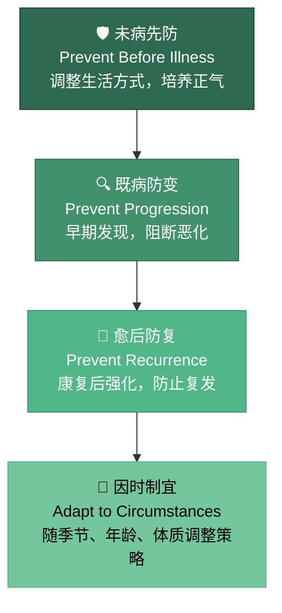

# 第六章 · 治未病

> 是故圣人不治已病治未病，不治已乱治未乱。夫病已成而后药之，乱已成而后治之，譬犹渴而穿井，斗而铸锥，不亦晚乎。
>
> — 《黄帝内经·素问·四气调神大论》

## 6.1 扁鹊的四次拜访

两千多年前，名医扁鹊路过蔡国，拜见蔡桓公。

他站在大殿上看了桓公片刻，说："君有疾在腠理，不治将恐深。"——你的皮肤表层有病，不治恐怕会加重。桓公摆了摆手："寡人无疾。"扁鹊退出后，桓公对左右说："医生这种人啊，就喜欢把没病的人说成有病来邀功。"

十天后，扁鹊再来。"君之病在肌肤，不治将益深。"病已经进到肌肉了。桓公不理他。

又过十天。"君之病在肠胃，不治将益深。"桓公依然不悦，沉默不语。

再过十天，扁鹊远远看见桓公，转身就走。桓公派人追问为什么。扁鹊说："病在腠理，汤熨之所及；在肌肤，针石之所及；在肠胃，火齐之所及。今在骨髓，司命之所属，无奈何也。"——皮肤上的病，热敷就行。肌肉里的，针灸可治。肠胃里的，药汤能到。但现在病入骨髓，连掌管生死的神都无能为力了。

五天后，桓公体痛而亡。

这个故事不是在赞美扁鹊多么高明。它是在警告：真正高明的医术不是在病入骨髓时力挽狂澜，而是在病在腠理时一举消除。

这正是《素问·四气调神大论》的核心宣言：**圣人不治已病治未病，不治已乱治未乱。** 等病已经形成才用药，等混乱已经发生才治理，就像渴了才开始挖井、打仗了才开始铸兵器——来不及了。

两千五百年后的今天，这个故事的变体每天都在上演。体检报告上的空腹血糖 6.0，被塞进抽屉。连续三个月的腰痛，靠止痛药应付。凌晨三点反复醒来，归咎于"最近压力大"。我们不是没有扁鹊的警告——我们有体检、有数据、有医生的建议——我们是在扮演蔡桓公。

---

## 6.2 三种医生：上工、中工、下工

内经用一个极具颠覆性的标准来衡量医生的水平——不是看你能治多重的病，而是看你能在多早的阶段介入。

**上工**：治未病。在疾病尚未形成时就化解风险，调整体质，维护正气。这种医生你可能永远不会意识到他有多厉害，因为他让你根本不会生病。

**中工**：治欲病。在疾病的萌芽期发现端倪，早期干预。病人可能刚觉得"最近有点不对劲"，中工就已经出手了。

**下工**：治已病。在疾病完全显现之后才开始治疗——对抗症状，处理危机，抢救性命。

这里有一个反直觉的悖论：上工的工作看起来最"不像"医生。他没有惊心动魄的手术台叙事，没有起死回生的戏剧性时刻。他的病人甚至可能觉得他什么都没做——因为他们根本没有生病。这恰恰是最高境界：**最好的医疗行为是让医疗不必发生。**

这个分级的震撼之处在于：现代西方医学最擅长、最引以为傲的领域——急诊医学、外科手术、ICU、肿瘤治疗——在内经的框架下恰恰是"下工"的范畴。这并非贬低，急诊和手术挽救了无数生命。但它揭示了一个结构性盲区：我们的医疗体系把最多的资源、最高的技术、最优秀的人才都投入到了疾病的下游——治疗，而不是上游——预防。

美国疾控中心（CDC）的数据已经反复证实：每在预防上投入 1 美元，可以在治疗上节省 5.60 美元。慢性病占美国医疗支出的 90%，而其中 80% 的心脏病、中风和 2 型糖尿病是可以通过生活方式干预来预防的。全球的医疗系统都在为"下工"买单，而"上工"的智慧被晾在一边。

今天正在兴起的生活方式医学（Lifestyle Medicine）运动——以运动处方、营养干预、压力管理、睡眠优化为核心——本质上就是在重新发现"上工"的思路。两千五百年后，医学终于开始往上游走。

---

## 6.3 治未病的四个层次

很多人把"治未病"简单理解为"预防"。但内经的预防哲学远比一个词复杂——它是一个包含四个层次的递进框架，覆盖了从健康到康复的完整生命周期。

**第一层：未病先防。** 你还没有任何症状，身体看起来健康。但上工已经在行动——调整作息节律（第二章）、校准饮食结构（第三章）、疏导情志（第四章）、保持运动（第五章）。这四章讲的所有内容，本质上都服务于这一层。关键经文是：「正气存内，邪不可干」（《素问·评热病论》）。当你的正气充足，外邪无隙可乘。

**第二层：既病防变。** 你已经出现了微妙的不适——睡眠变差、食欲波动、情绪低落、容易感冒。这不是"没什么大事"，这是疾病从腠理向肌肤推进的信号。中工在这里出手：及时干预，防止小问题演变成大疾病。

现代医学有一个对应的概念叫"亚健康"——体检指标正常，但人明显不舒服。内经两千五百年前就为这个灰色地带设计了完整的干预策略。扁鹊故事的教训正在于此：不是无药可救，而是错过了最佳窗口。

**第三层：愈后防复。** 你已经生过一场病，治好了。但内经提醒：病愈不等于体强。大病初愈是身体最脆弱的时候，正气尚未恢复，旧疾最容易趁虚复发。

这一层要求你在康复期加倍谨慎——饮食清淡、情绪平稳、适度休息、循序渐进地恢复活动。"病来如山倒，病去如抽丝"，这句民间俗语精准地描述了愈后防复的核心逻辑。

**第四层：因时制宜。** 预防策略不是一成不变的。春天防风，夏天防暑，秋天防燥，冬天防寒——第二章的四季节律在这里再次发挥作用。此外，二十岁和六十岁的预防重点截然不同：年轻人的重心是建设，老年人的重心是保存。气虚体质和湿热体质的策略更是南辕北辙。预防必须是个性化的、动态的——这也是下一节要讨论的核心问题。

---

## 6.4 体质辨识：没有适合所有人的养生方案

内经从不认为有一种放之四海而皆准的养生方法。它反复强调的核心概念是**体质**——你的先天禀赋与后天积累所形成的身体倾向性。

基于内经理论，现代中医学家王琦教授系统总结了九种基本体质类型：

| 体质 | 核心特征 | 易感倾向 | 调养方向 |
|------|---------|---------|---------|
| 平和质 | 精力充沛、面色红润、睡眠良好 | 这是目标状态 | 维持平衡 |
| 气虚质 | 容易疲劳、易感冒、说话声低 | 反复感冒、消化不良 | 补气健脾 |
| 阳虚质 | 畏寒怕冷、手脚冰凉、精神不振 | 关节冷痛、水肿 | 温阳散寒 |
| 阴虚质 | 口干咽燥、手足心热、失眠 | 便秘、盗汗 | 滋阴润燥 |
| 痰湿质 | 体型偏胖、腹部松软、容易困倦 | 代谢综合征、高血脂 | 化痰祛湿 |
| 湿热质 | 面部油腻、口苦、容易长痘 | 泌尿感染、皮肤病 | 清热利湿 |
| 血瘀质 | 面色晦暗、嘴唇偏紫、易瘀青 | 心脑血管疾病 | 活血化瘀 |
| 气郁质 | 情绪低落、胸闷叹气、失眠多梦 | 抑郁、甲状腺疾病 | 疏肝理气 |
| 特禀质 | 容易过敏、打喷嚏、皮肤敏感 | 哮喘、荨麻疹 | 益气固表 |

这本质上就是**个性化医学**。2,500 年前，内经就在告诉我们：同样的食物、同样的运动、同样的气候，在不同体质的人身上会产生截然不同的效果。一个阳虚的人拼命喝绿豆汤清热，只会越喝越虚。一个湿热的人天天吃桂圆红枣补气，只会越补越上火。

举一个具体的例子。冬天到了，养生公众号说"该进补了"，于是全办公室一起喝羊肉汤、泡枸杞。但在九种体质的框架下，这个建议只对阳虚质和气虚质成立。如果你是湿热质，冬天大量进补温热食物，结果不是精力充沛，而是口腔溃疡、痤疮爆发、烦躁失眠。同一碗羊肉汤，在不同的身体里走向截然不同的结局。

如今的精准医学（Precision Medicine）、药物基因组学（Pharmacogenomics）和个性化营养（Personalized Nutrition）正在用基因测序和 AI 算法做同样的事情——找到适合"这个人"而非"所有人"的健康方案。体质辨识是精准健康的中国原型。

---

## 6.5 未病的信号：身体在低声说话

内经教你的不只是"预防"这个理念，更是一套具体的早期预警信号识别方法。

**面色。** 《素问·脉要精微论》有一套完整的"五色诊"系统：青色主肝（痛、怒），赤色主心（热、火），黄色主脾（虚、湿），白色主肺（寒、气虚），黑色主肾（寒极、血瘀）。清晨洗脸时看一眼镜子——不是看美丑，而是看颜色基调。如果面色较平时有异常变化，身体正在发出信号。重点不在某一天的偶然变化，而在于持续性的偏移。

**脉象。** 这是内经诊断体系的核心。虽然精准把脉需要专业训练，但你可以关注一个简单指标：安静时把手指放在手腕桡动脉处，感受脉搏的力度和节律。平稳有力是正常，细弱无力提示气虚，跳动紊乱需要就医。

**睡眠。** 入睡困难、夜间频繁醒来、多梦、早醒——这些不是"压力大"可以简单解释的。在内经看来，睡眠障碍是阴阳失调的早期表达。

**消化。** 食欲突然变化、腹胀、大便性状改变。内经以脾胃为后天之本，消化系统的异常往往是全身失衡的最早信号。

**情绪。** 无缘由的烦躁、持续的低落、莫名的焦虑——情绪变化不仅是心理事件，更是脏腑气机变化的外在投射。

**精力波动。** 你以前下午三点还能集中注意力，现在午饭后就犯困到无法思考。你以前周末还有精力社交，现在只想躺着。这种基线的下移，是"精气"消耗超过补给的早期指标。内经称之为"气虚"的前兆。

现代可穿戴设备——Apple Watch 的心率变异性监测、Oura Ring 的睡眠评分、连续血糖监测仪的波动曲线——本质上在做同一件事：捕捉症状出现之前的微妙生理变化。区别在于，内经用的是医者的感官和经验，现代用的是传感器和算法。目标完全一致：**在低语变成尖叫之前，听到身体的声音。**

---

## 6.6 古今交汇：现代预防医学的内经回响

当你把现代预防医学的核心举措逐一展开，会发现它们几乎可以一一映射到内经的治未病体系。

**年度体检** → 上工思维。每年系统性地审视身体状态，在症状出现之前发现异常指标。

**疫苗接种** → 未病先防。在疾病到来之前建立免疫屏障——"正气存内，邪不可干"的现代科技版。

**癌症筛查** → 既病防变。早期发现、早期治疗，阻断从"腠理"到"骨髓"的进程。

**慢病管理** → 愈后防复。糖尿病、高血压的长期管理，就是防止疾病反复恶化的持续干预。

**生活方式医学**（American College of Lifestyle Medicine）→ 这就是完整的内经方法论：以饮食、运动、睡眠、压力管理、社交连接和减少有害物质为六大支柱。

**蓝区研究。** Dan Buettner 在《蓝区》中记录了世界上五个最长寿的社区——冲绳、撒丁岛、洛马琳达、尼科亚、伊卡里亚。他们的共同点惊人地呼应内经：植物为主的饮食（第三章）、规律的体力活动（第五章）、强烈的社区归属感（情志调节的外部支持）、适度饮酒或不饮酒、生活有节奏有目的感。没有一个蓝区的居民在吃补剂、跑马拉松或购买健身房会员——他们只是在过内经描述的那种生活。

**肠道微生物组革命。** 近十年来，微生物组研究揭示了肠道菌群与免疫、情绪、代谢的深层联系。内经两千五百年前就把脾胃定义为"后天之本"——所有后天健康的根基。科学绕了一大圈，又回到了同一个起点。

有趣的是，这些现代健康策略最终都在回答同一个问题：如何在疾病发生之前采取行动？而内经用四个字就给出了回答——治未病。区别不在理念，在系统性。内经把这些散落的策略编织成一个统一的预防哲学，而现代医学正在把它们重新拼凑起来。

---

## 6.7 日常实践：你的个人预防方案

治未病不是宏大的哲学宣言。它是可以落地的日常行为。

**每周身体扫描。** 每周日晚上花五分钟，回顾七个维度：精力水平（1-10 分）、睡眠质量、消化状态、情绪基调、疼痛或不适、皮肤状态、运动意愿。不需要精确打分——觉察本身就是治未病的第一步。如果连续两周某个维度持续走低，这就是你的"腠理信号"。你可以用一个简单的手机备忘录记录每周的七维评分。一个月后回看，趋势比单次数字更有意义。

**季节性预防调整。** 春季重在疏肝——多户外活动、保持情绪舒展、饮食偏清淡。夏季重在养心——避免暴晒、午间小憩、适量苦味食物。秋季重在润肺——保湿、多梨多百合、避免过度悲伤。冬季重在藏肾——早睡晚起、温补食物、减少消耗性活动。季节之间的转换期尤其需要注意——换季是身体最容易失衡的窗口，也是"腠理"信号最频繁出现的时候。

**七分饱原则。** 内经的"留有余地"哲学渗透在所有维度：吃到七分饱，练到七分力，工作到七分累。永远不要把任何资源耗到极限。日本冲绳——世界上最长寿的地区之一——有一个词叫"腹八分"（Hara Hachi Bu），吃到八分饱就停。这个理念与内经完全相通。

**建立健康储备。** 内经将人的生命能量概括为精、气、神三个层次。治未病的高级策略是：在身体状态好的时候主动储蓄——规律睡眠积蓄精，适度运动培育气，精神愉悦涵养神。这样当挑战来临——加班季、情绪低谷、季节更替——你有储备可以消耗，而不是在赤字状态下硬撑。

这就像财务管理中的"应急基金"：你不会等到失业了才开始存钱。健康储备的逻辑完全一样——在身体状态最好的时候，就是最应该"存健康"的时候。

**何时自调，何时就医。** 如果你的"腠理信号"——轻微的睡眠波动、短暂的消化不适、偶尔的情绪起伏——在一两周内通过生活方式调整回到正常，这是自调的范畴。但如果信号持续超过两周、强度加重、或出现你从未经历过的新症状，不要犹豫——去找医生。上工的智慧不是替代就医，而是减少不必要的就医。

---

## 6.8 反思时刻：你是在预防，还是在等待？

问自己三个问题：

1. **你最近一次在没有任何症状的情况下主动关注健康，是什么时候？** 如果答案是"想不起来"，你目前的模式是下工——等到问题出现才反应。

2. **你能说出自己当前最大的三个健康风险因素吗？** 家族病史、久坐习惯、长期睡眠不足、慢性情绪压力、饮食单一——如果你对自己的风险地图一无所知，预防就无从谈起。风险意识是上工思维的起点。

3. **你有没有一个可持续的健康基线？** 不是某次心血来潮的健身打卡，而是一个你能坚持十年的最低限度健康习惯——比如每天走 6,000 步、每晚 11 点前入睡、每顿饭有蔬菜。

治未病的起点不是知识，不是技术，不是补剂——是**觉察**。觉察自己的身体，觉察风险的方向，觉察改变的时机。扁鹊看到了蔡桓公的腠理之疾，但桓公没有觉察到自己的身体——或者说，他拒绝觉察。这才是最致命的。

今天花五分钟做一件事：闭上眼睛，从头顶到脚底扫描一遍你的身体。哪里紧张？哪里疲惫？哪里有隐隐的不适？你上一次这样做，是什么时候？如果答案是"从来没有"——这正是你的起点。

---

### 今日行动

- ⚡ 打开你最近一次体检报告，找出一项处于"正常偏高"或"临界"的指标——这就是你的预警信号。
- ⚡ 用 30 秒做一次全身扫描：精力、睡眠、消化、情绪、疼痛——每项 1-5 分。把结果记下来。
- 🔄 从本周开始，每周日晚上做一次"五维身体扫描"，连续做 4 周，建立基线数据。

### 21 天微实验

**"预警信号追踪实验"**——选择你身体最近最常出现的一个小信号（如：午后犯困、饭后胀气、晨起口苦、入睡困难），连续 21 天每天记录它的强度（0-5 分）和当天的生活变量（睡眠时间、进食、运动、情绪）。21 天后寻找关联——什么条件下信号变强？什么条件下减弱？

### 证据强度标注

| 内经原则 | 证据等级 | 说明 |
|---------|---------|------|
| 上工治未病（最高医术是预防）| ✓ 已证实 | CDC 数据：预防每投入 $1 节省 $5.60；生活方式干预可预防 80% 的心血管病 |
| 九种体质（个性化养生）| ? 合理假说 | 王琦体质学说在中医界被广泛应用，但缺乏大规模西医框架下的 RCT 验证 |
| 正气存内邪不可干 | ? 合理假说 | 免疫功能强则不易感染这一原则是正确的，但"正气"与免疫力的精确映射仍在研究 |
| 面色/脉象早期预警 | ? 合理假说 | 部分面诊与现代诊断有相关性（如面色苍白与贫血），但系统性验证不足 |

---

## 6.9 总结与过渡

治未病是整部《黄帝内经》的最高纲领，也是贯穿全书的主线。前五章讲的一切——时间节律、饮食调和、情志养护、运动导引——最终汇聚到这一个核心：**不要等到病了才行动。** 它不是一项具体的技术，而是一种生活态度：对身体保持觉察，对风险保持敬畏，对平衡保持追求。

但如果你仔细回看所有这些原则，会发现它们背后有一个更深的共同结构。节律是阴阳的节律。食物有寒热温凉的属性。情绪在脏腑间此消彼长。运动在动与静之间寻找平衡。每一条养生法则，最终都指向同一个元原理——**阴阳**。

如果说前五章是"怎么做"，这一章是"为什么要做"，那么下一章就是"这一切背后的原理是什么"。

下一章，我们进入内经的终极哲学：阴阳之道。这不是玄学，不是神秘主义，而是一个惊人实用的思维框架。它解释了为什么平衡不是静止，为什么健康是一个动态过程，以及如何在日常生活中运用这个两千五百年前的"统一场论"。

---

## 参考文献

1. 《黄帝内经·素问》第 2 篇（四气调神大论）、第 33 篇（评热病论）
2. 韩非子·喻老篇：扁鹊见蔡桓公
3. Trust for America's Health. "Prevention for a Healthier America." CDC data on cost-effectiveness of prevention, 2024.
4. Buettner, Dan. *The Blue Zones: Lessons for Living Longer from the People Who've Lived the Longest*. National Geographic, 2008.
5. Wang, Qi. "Classification and Diagnosis Basis of Nine Basic Constitutions in Chinese Medicine." *Journal of Beijing University of Traditional Chinese Medicine*, 28(4), 2005.
6. American College of Lifestyle Medicine. "The Six Pillars of Lifestyle Medicine." ACLM Position Statement, 2024.
7. Rippe, James M., ed. *Lifestyle Medicine*. 3rd edition, CRC Press, 2019.
8. Gilbert, J.A. et al. "Current understanding of the human microbiome." *Nature Medicine*, 24(4), 2018.
