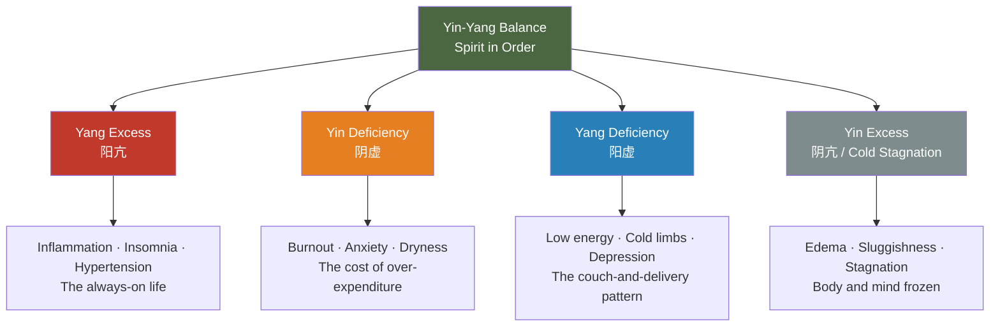

# Chapter 7 · Balance, Not Perfection

> 阴平阳秘，精神乃治；阴阳离决，精气乃绝。
> *Yīn píng yáng mì, jīng shén nǎi zhì; yīn yáng lí jué, jīng qì nǎi jué.*
>
> "When Yin is calm and Yang is secure, the spirit is in order. When Yin and Yang separate, the vital essence is exhausted."
>
> — *Su Wen*, Chapter 3 (生气通天论)

## 7.1 The Optimization Addict

His name is David. Thirty-six, VP of Engineering at a startup.

Eleven health apps on his phone. Calories tracked to single digits — 2,180 per day, 142 grams of protein, 245 grams of carbs. Sleep locked to exactly eight hours, 10:30 PM to 6:30 AM, enforced by blackout curtains, a white noise machine, and melatonin. Twenty minutes of meditation daily — his Headspace streak stands at 387 consecutive days. Five workouts a week, alternating between running and strength training, heart rate zones managed like a Swiss watch.

His annual physical is flawless. BMI 22.3. Fasting glucose 4.8. Blood pressure 118/76. If health were a scorecard, he'd be near perfect.

But he's miserable.

At dinner with friends, he silently calculates the macros of every dish. He declines any social invitation that threatens his routine. Business travel triggers anxiety because he can't execute his full morning protocol. His wife says: "You care more about your body than you do about me." He knows she's right. He can't stop — because whenever a single metric drifts from its "optimal" value, panic sets in.

David treated wellness as an equation to solve, not a dance to join. He pursued perfection, not harmony.

This is precisely the trap the *Huangdi Neijing* identified twenty-five centuries ago. The Neijing's core formula is not "find the optimal parameters and lock them in." It is six characters: **阴平阳秘，精神乃治.**

Yin "calm" — not Yin maximized, but Yin settled. Yang "secure" — not Yang at peak intensity, but Yang contained. Spirit "in order" — and so life organizes itself naturally.

Health is not a number you can pin down. It's a living path that adjusts constantly between two poles.

---

## 7.2 Yin-Yang Demystified

Let's clear an obstacle first. For many people, the words "Yin and Yang" conjure images of Taiji symbols, feng shui compasses, or martial arts mysticism. These associations bury a profoundly practical thinking tool under a layer of esoteric dust.

The essence of Yin-Yang is strikingly simple. It consists of four observations about how nature works:

**First, everything has complementary opposites.** There is day and there is night. There is inhale and there is exhale. There is work and there is rest. This is not philosophical speculation — it is a description of observable reality.

**Second, the opposites are interdependent.** Without the contrast of night, the concept of "day" would not exist. Without rest as a baseline, activity loses its meaning. Yin cannot exist without Yang, nor Yang without Yin.

**Third, the opposites transform into each other.** Summer pushed to its extreme becomes autumn and winter. Activity pushed to its extreme demands stillness. Reversal at the extreme is not moral advice — it is natural law.

**Fourth, the opposites exist in dynamic balance.** Balance does not mean a perfectly level scale. It means a seesaw in constant, rhythmic motion — tilting one way, then the other, never still.

| Yin (阴) | Yang (阳) |
|----------|----------|
| Rest | Activity |
| Night | Day |
| Cool | Warm |
| Receiving | Giving |
| Conserving | Expending |
| Nourishing | Transforming |
| Winter | Summer |
| Solitude | Social |

*Su Wen*, Chapter 5 declares: 「阴阳者，天地之道也，万物之纲纪，变化之父母，生杀之本始。」 *Yīn yáng zhě, tiān dì zhī dào yě, wàn wù zhī gāng jì, biàn huà zhī fù mǔ, shēng shā zhī běn shǐ.* — "Yin and Yang are the Way of heaven and earth, the guiding principles of all things, the parents of all change, the root and beginning of life and death."

This is not a claim about supernatural forces. It is the assertion that the dynamic interplay of complementary opposites is the operating logic behind all natural processes.

The Neijing uses Yin-Yang not for philosophical meditation but for clinical diagnosis. When a person falls ill, the first question is not "What disease is this?" but "Where has the Yin-Yang balance shifted?" This is systems thinking of a remarkably sophisticated kind.

---

## 7.3 The Four Imbalances

When Yin-Yang drifts out of equilibrium, it takes one of four patterns. Understanding these four patterns gives you a diagnostic lens for reading your own state.

**Yang Excess (阳亢, yáng kàng)** — Yang energy running too hot, like an engine red-lining. Manifests as inflammation, insomnia, high blood pressure, irritability, flushed face and red eyes. In modern terms, this is the "always on" person: packed schedules, constant stimulation, adrenaline powering everything. The system is overheating.

**Yin Deficiency (阴虚, yīn xū)** — The reserves that nourish and repair have been depleted. This often appears alongside Yang Excess — burn too hot and the fuel runs out. Manifests as bodily dryness, anxiety, night sweats, weight loss, palpitations. This is the body's overdraft alarm going off after months of 3 AM finishes and caffeine-fueled mornings.

**Yang Deficiency (阳虚, yáng xū)** — Vital energy insufficient, like a flame barely flickering. Cold extremities, low spirits, sluggish metabolism, depressive tendencies. This is the opposite extreme: the inertial loop of couch, delivery food, and phone scrolling — the body has lost its capacity to ignite.

**Yin Excess / Cold Stagnation (阴亢/寒凝, yīn kàng / hán níng)** — Cold and stagnation have congealed the system. Edema, weight gain, mental fog, stiff joints. The body becomes standing water, having lost its will to flow.

Here is the paradox of modern life: most people suffer from **two imbalances simultaneously** — Yang Excess plus Yin Deficiency. Daytime is overstimulation: information bombardment, back-to-back meetings, caffeine. Nighttime brings no real recovery: blue light, shallow sleep, anxious rumination. The accelerator is floored while the fuel tank hits empty. This is the Yin-Yang reading of the contemporary burnout epidemic.

---

## 7.4 Homeostasis, Allostasis, and the Neijing

If you consider Yin-Yang merely an ancient metaphor, modern biology may change your mind.

In 1932, American physiologist Walter Cannon introduced the concept of **homeostasis**: the body maintains stable internal conditions through feedback mechanisms — temperature, blood sugar, pH, blood pressure, all precisely locked within narrow ranges. This is almost word-for-word the same idea as "Yin calm, Yang secure." Yin-Yang balance *is* homeostasis.

But homeostasis has a limitation: it implies that balance is static, like a thermostat locked at 22°C. In 1988, Peter Sterling and Joseph Eyer proposed **allostasis**: the body does not maintain fixed set points but continuously adjusts its targets in response to the environment. Heart rate rises and cortisol spikes under stress — this is not "imbalance" but active adaptation. Balance itself is dynamic.

This is exactly the insight at the heart of Yin-Yang theory: balance is not stillness. It is rhythmic oscillation.

Sterling also introduced **allostatic load**: when the body is forced into prolonged adaptive adjustment, the cumulative cost of adjustment itself becomes damage — chronic inflammation, immune suppression, accelerated organ aging. This maps directly to the Neijing's warning: 「阴阳离决，精气乃绝」— when the dynamic regulatory system of Yin and Yang itself breaks down, vital energy is exhausted.

One more concept resonates powerfully with Yin-Yang: **hormesis**. Small doses of stress strengthen the system — cold water immersion, intermittent fasting, high-intensity exercise are all mild disruptions that activate the body's repair capacity. In Yin-Yang language: moderate Yang (challenge) stimulates Yin (repair), making the whole system more resilient.

The Neijing did not use modern terminology, but it grasped the same truth: balance is not rigid maintenance. It is elastic responsiveness.

---

## 7.5 Yin-Yang in Your Daily Life

Yin-Yang is not a framework that only matters in theory. It is a lens you can apply to everyday decisions starting today.

**Work and rest.** Focused work is the Yang phase — expending energy, producing output. Rest is the Yin phase — restoring energy, absorbing and integrating. The critical distinction: true Yin-phase rest is not "productive rest." Scrolling social media, organizing to-do lists, listening to business podcasts — these are still Yang. Yin rest is staring out a window. Walking with no destination. Sitting quietly with your phone off. Letting the mind go offline.

**Social and solitude.** Social activity is Yang — projecting energy outward. Solitude is Yin — drawing attention inward. Even the most extroverted person needs solitude to digest experience. Even the most introverted person needs social connection to activate vitality.

**Exercise and recovery.** Training is Yang — it tears muscle fibers. Recovery is Yin — it repairs and rebuilds them stronger. Training without recovery is not discipline; it's self-harm. Overtraining syndrome is the athletic version of 阴阳离决.

**Stimulation and stillness.** Information intake is Yang — news, social media, podcasts, video. Reflection is Yin — letting information settle, integrate, and form your own thoughts. We consume hundreds of times more information daily than we did twenty years ago, but allocate almost zero time for digestion.

**Eating.** Warm, nourishing food is Yang — replenishing energy, warming the body. Light, simple food is Yin — cleansing the system, reducing burden. You don't need to eat "perfectly" all the time. You need to respond to what your body asks for in the moment.

**Seasons.** Expand outward in spring and summer (Yang) — more outdoor activity, socializing, earlier rising. Contract inward in autumn and winter (Yin) — more indoor quiet, solitude, earlier sleep. The seasonal wellness practices from Chapter 2 are, at their core, following the natural Yin-Yang rhythm of the year.

One central insight: **modern life carries a massive Yin deficit.** Our culture worships Yang — productivity, hustle, stimulation, growth, "always be shipping." We devalue Yin — rest is called laziness, solitude is called antisocial, doing nothing is called wasting your life. But Yin-Yang theory states clearly: without Yin to sustain it, Yang becomes a rootless fire. The brighter it burns, the faster it dies.

---

## 7.6 The Paradox of Perfection

Let's return to David.

His problem was not doing too little. It was doing too "right." His wellness behaviors themselves had become a source of stress. This is a paradox: **when the pursuit of health damages health, "wellness" becomes just another form of depletion.**

This trap is not unique to our era. *Su Wen*, Chapter 1 prescribed the antidote long ago:

> 法于阴阳，和于术数，食饮有节，起居有常，不妄作劳，故能形与神俱，而尽终其天年，度百岁乃去。
> *Fǎ yú yīn yáng, hé yú shù shù, shí yǐn yǒu jié, qǐ jū yǒu cháng, bù wàng zuò láo, gù néng xíng yǔ shén jù, ér jìn zhōng qí tiān nián, dù bǎi suì nǎi qù.*
>
> "Model on Yin and Yang, harmonize with the arts of calculation, moderate food and drink, regularize daily life, and do not overexert recklessly — and so body and spirit remain whole, living out the natural span, departing at a hundred years."

Notice the word choices. 法于阴阳 — *model on* Yin-Yang's patterns, not *control* them. 和于术数 — *harmonize* with methods, not be *enslaved* by them. 有节 — with moderation, not calculated to decimal points. 有常 — with regularity, not timed to the minute. 不妄作劳 — don't *recklessly* exhaust yourself, but it doesn't say "never exert."

The keyword of this entire passage is **和** (hé) — harmony. Not **完** (wán) — perfection.

Modern society has coined clinical names for the pathology of over-optimization. Orthorexia — an obsessive fixation on "clean eating." Exercise addiction — turning fitness into self-punishment. Sleep anxiety — when monitoring sleep quality is precisely what causes insomnia. The dark side of the Quantified Self movement — data tracking that becomes data anxiety.

Yin-Yang thinking offers an elegant remedy: **being roughly right is healthier than being precisely right.** Allow fluctuation. Allow drift. Allow an occasional dinner that isn't nutritionally ideal, as long as the overall rhythm holds. The seesaw tilts — that's fine. It will come back.

---

## 7.7 Daily Practice: The Yin-Yang Audit

Spend five minutes each week on a Yin-Yang audit. No app required, no data needed — just honest self-awareness.

**Step 1: Overall sense.** Was this week more Yang (doing a lot, high expenditure, heavy stimulation) or more Yin (doing less, low drive, feeling stagnant)?

**Step 2: Six-domain scan.**

| Domain | Yang-leaning signals | Yin-leaning signals |
|--------|---------------------|---------------------|
| Work | Overtime, packed tasks, breathlessness | Procrastination, no motivation, emptiness |
| Exercise | Too many intense sessions, body aching | Didn't move all week, body stiff |
| Social | Too many obligations, social fatigue | No meaningful connection all week |
| Food | Greasy/spicy, overeating | No appetite, monotonous diet |
| Sleep | Trouble falling asleep, vivid dreams, early waking | Oversleeping, can't get up, more tired after rest |
| Screens | Dry eyes, scattered attention | Boredom, hollowness |

**Step 3: Write the prescription.**

If the week was Yang-heavy (over-expenditure), write a "Yin prescription": go to bed an hour earlier, cancel one unnecessary social event, walk instead of run, eat a simple light meal, sit for ten minutes with your phone off.

If the week was Yin-heavy (stagnation), write a "Yang prescription": go outside and get sunlight, call a friend, do one workout that makes you sweat, eat a warm hearty meal, tackle one task you've been putting off.

This is not precision medicine. It is the simplest form of self-awareness — sensing the tilt and gently correcting. The art of the seesaw.

---

## 7.8 Reflection Moment

Close the book. Close your eyes. Ask yourself one question:

**Right now, where does my Yin-Yang lean?**

Yang Excess — system overheating, unable to stop? Yin Deficiency — reserves depleted, running on willpower alone? Yang Deficiency — flame barely flickering, can't summon the energy to start? Or perhaps two at once — burning too hard by day, unable to recover by night?

You don't need an answer immediately. But asking the question is itself the beginning of balance — because awareness is Yin.

---

### Today's Actions

- ⚡ Review the past week: was your life more Yang (busy, stimulated, social, output-heavy) or more Yin (quiet, restful, solitary, input-heavy)? Recognizing the imbalance is the first step toward correcting it.
- ⚡ If the answer is "too Yang" (true for most modern people), schedule 30 minutes of pure "Yin time" tonight — no screens, no socializing, no learning. Just sitting quietly or walking with no destination.
- 🔄 This week, try "Yin-Yang Work Cycles": after every 90 minutes of focused work (Yang), take 15 minutes of genuine rest (Yin) — not phone scrolling, but eyes closed, stretching, or staring out the window.

### 21-Day Micro-Experiment

**"The Yin-Yang Diary"** — Each evening, summarize your day's balance in one word: "too Yang," "too Yin," or "balanced." Record this for 21 consecutive days. If a day was too Yang, intentionally add a Yin activity the next day — a slow walk, a bath, ten minutes of silence. If it was too Yin, add a Yang activity — a workout, a phone call with a friend, tackling a task you've been avoiding. After 21 days, observe how your overall energy and mood have shifted.

### Evidence Strength Ratings

| Neijing Principle | Evidence Level | Notes |
|-------------------|---------------|-------|
| Yin calm, Yang secure (dynamic balance sustains health) | ✓ Confirmed | This is the ancient formulation of homeostasis/allostasis, a cornerstone of modern physiology |
| Yin deficiency = over-expenditure / burnout | ✓ Confirmed | The core mechanism of burnout syndrome: chronic over-activation → insufficient recovery |
| Yin and Yang are mutually rooted and mutually transforming | ✓ Confirmed | Sympathetic/parasympathetic antagonistic cooperation; hormesis (moderate stress strengthens the system) |
| Yang excess = hyperactivation / inflammation | ✓ Confirmed | Chronic sympathetic overdrive → inflammation → metabolic disruption, supported by extensive epidemiological evidence |
| Seasonal Yin-Yang cycles precisely map to the human body | ? Plausible hypothesis | Seasonal effects on physiology are confirmed, but the Neijing's precise season–organ–emotion mapping lacks complete validation |

---

## 7.9 Summary & Bridge to Chapter 8

The first six chapters addressed specific dimensions of wellness: seasonal rhythm, the way of food, emotional regulation, movement, and the art of prevention. What is Yin-Yang? It is the operating system running beneath all of them.

Seasonal wellness is, at its core, following the annual Yin-Yang macro-rhythm. Dietary moderation is, at its core, balancing Yin and Yang in food. Emotional regulation is, at its core, the Yin-Yang flow of emotional energy. Movement practice is, at its core, alternating between motion (Yang) and stillness (Yin). Prevention is, at its core, maintaining Yin-Yang equilibrium before it breaks.

The Neijing calls Yin-Yang "the Way of heaven and earth, the guiding principles of all things," because it truly is the meta-principle governing everything else.

And among all the means of restoring Yin-Yang balance, one stands as the most powerful, the most fundamental, and the most neglected by modern people — **sleep**. It is the ultimate expression of Yin: consciousness steps aside, the body takes over, repairing every expenditure of the day. The Neijing regarded sleep as the microcosm of heaven and earth's alternation between Yin and Yang, enacted within the human body every single night.

In Chapter 8, we enter the world of sleep — a miracle that happens every day, yet one that most of us treat with astonishing carelessness.

---

## References

1. *Huangdi Neijing Su Wen*, Chapters 1 (上古天真论), 3 (生气通天论), and 5 (阴阳应象大论)
2. Cannon, W.B. (1932). *The Wisdom of the Body*. W.W. Norton. — Foundational text on homeostasis
3. Sterling, P. & Eyer, J. (1988). "Allostasis: A New Paradigm to Explain Arousal Pathology." In *Handbook of Life Stress, Cognition and Health*. — Allostasis theory
4. Calabrese, E.J. & Baldwin, L.A. (2002). "Defining Hormesis." *Human & Experimental Toxicology*, 21(2), 91-97. — Systematic review of hormesis
5. Maslach, C. & Leiter, M.P. (2016). "Burnout." In *Stress: Concepts, Cognition, Emotion, and Behavior*. Academic Press. — Modern burnout research
6. Bratman, S. & Knight, D. (2000). *Health Food Junkies: Orthorexia Nervosa*. Broadway Books. — Coining of the orthorexia concept
