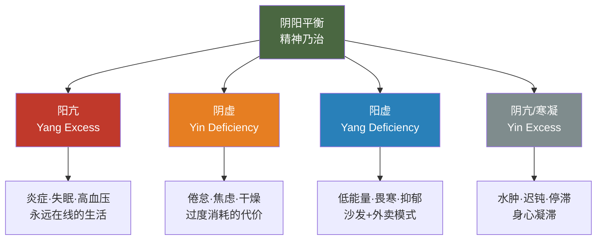

# 第七章 · 阴阳之道

> 阴平阳秘，精神乃治；阴阳离决，精气乃绝。
>
> — 《黄帝内经·素问·生气通天论》

## 7.1 完美主义者的崩溃

他叫李明，三十六岁，创业公司技术总监。

他的手机里装着十一个健康 App。卡路里精确到个位数——每天 2,180 大卡，蛋白质 142 克，碳水 245 克。睡眠严格执行八小时，从 22:30 到 6:30，用遮光窗帘、白噪音机和褪黑素三重保障。冥想每天二十分钟，用 Headspace 打卡已连续 387 天。运动每周五次，交替跑步和力量训练，心率区间控制得如同瑞士钟表。

他的体检报告无可挑剔。BMI 22.3，空腹血糖 4.8，血压 118/76。如果健康可以用数字衡量，他接近满分。

但他很痛苦。

他在朋友聚餐时默默计算每道菜的热量，无法享受食物。他拒绝任何打乱作息的社交邀约。出差时因为无法执行完整的晨间流程而焦虑。他的妻子说："你对自己的身体比对我更用心。"他知道她说得对，但停不下来——因为一旦某项数据偏离"最优值"，他就会陷入恐慌。

李明把健康当成了一道数学题，而不是一场舞蹈。他追求的是完美，不是和谐。

这恰恰是《黄帝内经》两千五百年前就指出的误区。内经的核心公式不是"找到最优参数并锁定"，而是六个字：**阴平阳秘，精神乃治。**

阴"平"——不是阴最大化，而是阴安定。阳"秘"——不是阳最强，而是阳固守。精神"乃治"——于是生命自然有序。

健康不是一个可以锁定的数值。它是一条在两极之间不断调整的活路。

---

## 7.2 阴阳不神秘

先清理一个障碍：很多人一听到"阴阳"，脑海中浮现的是八卦图、风水罗盘或武侠小说里的内功口诀。这种联想让一个极其实用的思维工具蒙上了神秘主义的灰尘。

阴阳的本质极其朴素。它是古人观察自然后归纳出的四条规律：

**第一，万物皆有互补的两面。** 有白天就有黑夜，有呼就有吸，有工作就有休息。这不是哲学玄想，而是对现实的如实描述。

**第二，两面相互依存。** 没有黑夜的对比，就不存在"白天"这个概念。没有休息做底色，活动就失去了意义。阴不能独存，阳亦然。

**第三，两面相互转化。** 夏天走到极致就转入秋冬，活动到极致身体会要求静止。物极必反不是道德训诫，而是自然规律。

**第四，两面处于动态平衡。** 平衡不是天平两端一样重，而是跷跷板般的往复运动——偏过去，再回来，永不静止。

| 阴 | 阳 |
|---|---|
| 休息 | 活动 |
| 黑夜 | 白天 |
| 凉爽 | 温热 |
| 接受 | 给予 |
| 储藏 | 消耗 |
| 滋养 | 转化 |
| 冬季 | 夏季 |
| 独处 | 社交 |

《素问·阴阳应象大论》说：「阴阳者，天地之道也，万物之纲纪，变化之父母，生杀之本始。」这不是在宣称阴阳是某种超自然力量。它是在说：互补对立的动态平衡，是自然界一切变化的底层逻辑。

内经用阴阳不是做哲学冥想，而是做临床诊断。一个人生病了，不问"得了什么病"，先问"阴阳偏在哪里"。这是一种令人惊叹的系统思维。

---

## 7.3 四种失衡

阴阳偏离平衡，具体有四种模式。理解了这四种模式，就拿到了解读自身状态的诊断框架。

**阳亢（Yang excess）**——阳气过旺，像引擎长期超转。表现为炎症、失眠、高血压、容易激怒、面红目赤。现代语境下，这是"永远在线"的人：日程排满，刺激不断，肾上腺素驱动一切。系统过热。

**阴虚（Yin deficiency）**——滋养和修复的资源被耗尽。与阳亢常常同时出现——燃烧太猛，储备枯竭。表现为身体干燥、焦虑不安、夜间盗汗、消瘦、心悸。这是加班到凌晨三点、靠咖啡续命的身体在发出透支警报。

**阳虚（Yang deficiency）**——活力不足，像火焰微弱。四肢冰冷、精神萎靡、代谢迟缓、抑郁倾向。这是另一种极端：沙发-外卖-刷手机的惯性循环，身体失去了点火的能力。

**阴亢/寒凝（Yin excess / Cold stagnation）**——阴寒凝滞，系统停摆。水肿、体重增加、思维迟钝、关节僵硬。身体像一潭死水，失去了流动的意愿。

现代生活的吊诡之处在于：大多数人同时处于两种失衡——**阳亢加阴虚**。白天过度刺激（信息轰炸、背靠背会议、咖啡因），晚上无法真正恢复（屏幕蓝光、浅睡眠、焦虑反刍）。油门踩到底，同时油箱见底。这就是当代倦怠流行病的阴阳解读。

---

## 7.4 稳态、适应性平衡与内经

如果你觉得阴阳只是古老的比喻，现代生物学会让你重新审视这个判断。

1932 年，美国生理学家沃尔特·坎农提出了"稳态"（homeostasis）概念：身体通过一系列反馈机制维持内环境的稳定——体温、血糖、pH 值、血压，全部被精密地锁定在狭窄的范围内。这与"阴平阳秘"几乎是同一句话的不同语言版本。阴阳平衡就是稳态。

但稳态的概念有一个局限：它暗示平衡是静态的，像恒温器锁定 22°C。1988 年，彼得·斯特林和约瑟夫·艾尔提出了"适应性稳态"（allostasis）：身体不是维持固定参数，而是根据环境不断调整目标值。面对压力时心率升高、皮质醇上升——这不是"失衡"，而是主动适应。平衡本身是动态的。

这恰恰是阴阳理论的精髓：平衡不是静止，而是有节奏的往复运动。

斯特林还提出了"适应性负荷"（allostatic load）：当身体长期被迫做出适应性调整，调整本身的代价会累积成损伤——慢性压力导致的炎症、免疫下降、器官老化。这正是内经所说的"阴阳离决，精气乃绝"——当阴阳的动态调节系统本身被击穿，生命力就枯竭了。

还有一个概念与阴阳遥相呼应：**毒物兴奋效应**（hormesis）。小剂量的压力反而增强系统——冷水浸泡、间歇性断食、高强度运动，都是轻微的"破坏"，激发身体的修复能力。用阴阳的语言说：适度的阳（挑战）会激发阴（修复），使整个系统变得更强韧。

内经没有用现代术语，但它理解的真相是一样的：平衡不是僵硬的维护，而是有弹性的应变。

---

## 7.5 日常中的阴阳

阴阳不是只在理论里才有意义的框架。它是一个可以立刻应用于每日决策的透镜。

**工作与休息。** 专注工作是阳相——消耗精力、输出成果。休息是阴相——恢复精力、吸收沉淀。关键区别：真正的阴相休息不是"高效休息"。刷短视频、整理待办清单、听商业播客——这些仍然是阳。阴相的休息是发呆、散步、无目的地坐在窗边。让大脑离线。

**社交与独处。** 社交活动是阳——向外输出能量。独处是阴——向内收回注意力。即使是最外向的人也需要独处来消化体验。即使是最内向的人也需要社交来激活生命力。

**运动与恢复。** 训练是阳，撕裂肌纤维。恢复是阴，修复并使其更强。没有恢复的训练不是勤奋，是自我伤害。过度训练综合征就是运动领域的"阴阳离决"。

**刺激与静默。** 信息摄入是阳——新闻、社交媒体、播客、视频。反思是阴——让信息沉淀、整合、形成自己的想法。我们每天摄入的信息量是二十年前的数百倍，但留给消化的时间几乎为零。

**饮食。** 温热丰盛的食物是阳——补充能量、温暖身体。清淡简素的食物是阴——清理肠胃、减轻负担。不需要永远吃得"完美"，而是根据身体当下的状态做出回应。

**四季。** 春夏向外扩展（阳）——更多户外活动、社交、早起。秋冬向内收敛（阴）——更多室内静养、独处、早睡。第二章谈过的四季养生，底层逻辑就是顺应阴阳的自然节律。

一个核心洞察：**现代生活存在巨大的阴性赤字。** 我们的文化崇拜阳——生产力、拼搏、刺激、增长、"永远在路上"。我们贬低阴——休息被视为懒惰，独处被视为孤僻，无所事事被视为浪费生命。但阴阳理论清楚地告诉我们：没有阴的支撑，阳就是无根之火，烧得越旺，熄灭越快。

---

## 7.6 完美主义的悖论

让我们回到李明。

他的问题不是做得太少，而是做得太"对"。他的养生行为本身变成了一种压力源。这是一个悖论：**当对健康的追求本身损害了健康，"养生"就变成了另一种形式的耗损。**

这不是现代才有的陷阱。《素问·上古天真论》早就给出了解药：

> 法于阴阳，和于术数，食饮有节，起居有常，不妄作劳，故能形与神俱，而尽终其天年，度百岁乃去。

注意用词。"法于阴阳"——效法阴阳的规律，不是控制阴阳。"和于术数"——与方法和谐相处，不是被方法奴役。"有节"——有节制，不是计算到小数点。"有常"——有规律，不是精确到分钟。"不妄作劳"——不胡乱消耗，但也没说"不作劳"。

整段话的关键字是**和**——和谐，不是**完**——完美。

现代社会已经为过度优化起了病名。正食症（orthorexia）——对"健康饮食"的病态执念。运动成瘾——把健身变成自我惩罚。睡眠焦虑——对睡眠质量的监控反而制造失眠。量化自我运动的阴暗面——数据追踪变成数据焦虑。

阴阳思维提供了一个优雅的解法：**追求"大致对"比追求"精确对"更健康。** 允许波动。允许偏离。允许有时候吃一顿不那么健康的晚饭，只要整体节奏是对的。跷跷板偏一偏没关系，它会回来。

---

## 7.7 日常实践：阴阳审计

每周花五分钟做一次阴阳审计。不需要 App，不需要数据——只需要诚实的自我感知。

**第一步：整体感觉。** 这周总体偏阳（做得多、消耗大、刺激多）还是偏阴（做得少、动力低、停滞感）？

**第二步：六个维度扫描。**

| 维度 | 偏阳信号 | 偏阴信号 |
|------|---------|---------|
| 工作 | 加班多、任务密集、喘不过气 | 拖延、无动力、空虚感 |
| 运动 | 高强度训练过多、身体酸痛 | 整周没动、身体僵硬 |
| 社交 | 应酬过多、社交疲劳 | 整周没与人深度交流 |
| 饮食 | 辛辣油腻、暴饮暴食 | 没食欲、饮食单调 |
| 睡眠 | 入睡困难、多梦、早醒 | 嗜睡、起不来、越睡越累 |
| 屏幕 | 眼睛干涩、注意力涣散 | 无聊感、空虚感 |

**第三步：开处方。**

如果本周偏阳（过度消耗），开一张"阴方"：早睡一小时、取消一个不必要的社交、散步代替跑步、吃一顿清淡的饭、关掉手机坐十分钟。

如果本周偏阴（停滞低迷），开一张"阳方"：出门走走晒太阳、约一个朋友聊天、做一次让身体出汗的运动、吃一顿热乎丰盛的饭、着手做一件拖了很久的事。

这不是精密的医学干预。这是最朴素的自我觉察——感知偏差，轻轻纠回。跷跷板的艺术。

---

## 7.8 反思时刻

合上书，闭上眼，问自己一个问题：

**此刻，我的阴阳偏在哪里？**

是阳亢——系统过热，停不下来？还是阴虚——储备耗尽，靠意志力硬撑？或者阳虚——火焰微弱，提不起精神？又或者是两种同时——白天过度燃烧，夜晚无法修复？

不需要立刻找到答案。但问这个问题本身就是阴阳平衡的开始——因为觉察，是阴。

---

### 今日行动

- ⚡ 回顾过去一周：你的生活更偏阳（忙碌、刺激、社交、输出）还是更偏阴（安静、恢复、独处、输入）？意识到失衡就是调整的第一步。
- ⚡ 如果答案是"偏阳"（多数现代人如此），今晚给自己安排 30 分钟纯粹的"阴性时间"——不看屏幕、不社交、不学习，只是静坐或散步。
- 🔄 本周尝试"阴阳交替工作法"：每 90 分钟高强度工作（阳）后，安排 15 分钟真正的休息（阴）——不是刷手机，而是闭眼、伸展或发呆。

### 21 天微实验

**"阴阳日记实验"**——每晚用一个词概括今天的阴阳状态（"太阳"/"太阴"/"平衡"）。连续记录 21 天。如果某一天"太阳"，第二天有意加入一项阴性活动；如果"太阴"，第二天有意加入一项阳性活动。观察 21 天后的整体能量变化。

### 证据强度标注

| 内经原则 | 证据等级 | 说明 |
|---------|---------|------|
| 阴平阳秘（动态平衡维持健康）| ✓ 已证实 | 即 homeostasis/allostasis 的古代表述，现代生理学核心概念 |
| 阴虚=过度消耗/倦怠 | ✓ 已证实 | 倦怠综合征（burnout）的核心机制：长期过度激活→恢复不足 |
| 阴阳互根互转 | ✓ 已证实 | 交感/副交感神经系统的拮抗协作；hormesis（适度压力增强系统） |
| 阳亢=过度兴奋/炎症 | ✓ 已证实 | 慢性交感神经亢奋→炎症→代谢紊乱，大量流行病学证据 |
| 四季阴阳消长精确对应人体 | ? 合理假说 | 季节影响生理已证实，但内经的精确四季-脏腑-情志映射缺乏完整验证 |

---

## 7.9 总结与过渡

前六章谈了具体的养生维度：四季节律、饮食之道、情志调摄、运动养生、治未病思维。阴阳是什么？阴阳是贯穿所有这些维度的底层操作系统。

四季养生的本质是顺应阴阳的年度大节奏。饮食有节的本质是食物中阴阳的平衡。情志调摄的本质是情绪能量的阴阳流动。运动养生的本质是动（阳）与静（阴）的交替。治未病的本质是在阴阳尚未失调时维持平衡。

内经把阴阳称为"天地之道，万物之纲纪"，因为它确实是统摄一切的元原则。

而在所有恢复阴阳平衡的手段中，有一种最强大、最基本、却最被现代人忽视——**睡眠**。它是阴的极致表达：意识退场，身体接管，修复昼间所有损耗。内经将睡眠视为天地阴阳交替在人体中的缩影。

第八章，我们进入睡眠的世界——一个每天发生、却被大多数人对待得漫不经心的奇迹。

---

## 参考文献

1. 《黄帝内经·素问》，第一篇《上古天真论》、第三篇《生气通天论》、第五篇《阴阳应象大论》
2. Cannon, W.B. (1932). *The Wisdom of the Body*. W.W. Norton. ——稳态（homeostasis）概念的开创性著作
3. Sterling, P. & Eyer, J. (1988). "Allostasis: A New Paradigm to Explain Arousal Pathology." In *Handbook of Life Stress, Cognition and Health*. ——适应性稳态理论
4. Calabrese, E.J. & Baldwin, L.A. (2002). "Defining Hormesis." *Human & Experimental Toxicology*, 21(2), 91-97. ——毒物兴奋效应的系统综述
5. Maslach, C. & Leiter, M.P. (2016). "Burnout." In *Stress: Concepts, Cognition, Emotion, and Behavior*. Academic Press. ——现代倦怠研究
6. Bratman, S. & Knight, D. (2000). *Health Food Junkies: Orthorexia Nervosa*. Broadway Books. ——正食症概念的提出
