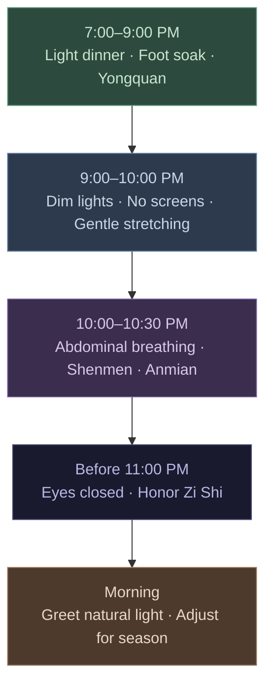

# Chapter 8 · Sleep: The Great Healer

> 卫气昼日行于阳，夜行于阴……阳气尽则卧，阴气尽则寤。
> *Wèi qì zhòu rì xíng yú yáng, yè xíng yú yīn... yáng qì jìn zé wò, yīn qì jìn zé wù.*
>
> "Defensive Qi travels through Yang channels during the day and through Yin channels at night... When Yang Qi is exhausted, one sleeps. When Yin Qi is exhausted, one wakes."
>
> — *Ling Shu*, Chapter 18 (营卫生会篇)

## 8.1 The Five-Hour Badge

Derek Zhou is a vice president at an investment bank. He's thirty-six. His social media bio reads: "Sleep is for the weak." Every night he goes to bed at 1 AM, wakes at 6 AM — five hours, like clockwork. He's proud of it. He considers it proof of discipline and efficiency, the same way Silicon Valley founders brag about sleeping four hours a night.

For the first two years, everything appeared normal. In the third year, the body quietly presented its invoice.

First came brain fog. During afternoon meetings she'd find herself unable to follow a single sentence, her mind wrapped in cotton wool. Then the weight. Her diet hadn't changed, but her waistline grew six centimeters in six months. Then the infections — three colds in a single quarter. Finally, her annual physical report displayed a line in red: fasting blood glucose 6.8 mmol/L. Pre-diabetes.

Her endocrinologist asked one question: "How many hours do you sleep?"

Derek said five hours — a trace of pride still in his voice. The doctor paused for two seconds, then said: "Your blood sugar, weight gain, and immune decline may not stem from diet at all. They may stem from sleep."

Twenty-five centuries ago, the authors of the *Huangdi Neijing* didn't have the term "pre-diabetes." But their understanding of sleep ran far deeper than Derek's — and far deeper than most modern people's. *Ling Shu* Chapter 18 states: 「卫气昼日行于阳，夜行于阴……阳气尽则卧，阴气尽则寤」— Defensive Qi (卫气, wèi qì) travels along the body's surface during the day and retreats deep into the organs at night. When Yang Qi is spent, you sleep. When Yin Qi completes its cycle, you wake.

Sleep is not optional downtime. It is the body's command to switch into repair and defense mode.

---

## 8.2 Wei Qi and Sleep: The Neijing's Sleep Model

The Neijing's explanation of sleep is remarkably elegant. The central concept is **Wei Qi** (卫气) — the body's defensive energy.

During the day (the Yang phase), Wei Qi circulates on the body's surface. It performs three functions: maintaining alertness, regulating body temperature, and defending against pathogenic invasion. Your daytime energy, sharp reflexes, and warm skin are all signs of Wei Qi operating on the exterior.

At night (the Yin phase), Wei Qi withdraws from the surface and descends into the five Zang organs. It shifts from guarding the perimeter to repairing the interior — restoring damaged organ tissue, rebuilding immune reserves, clearing metabolic waste accumulated during the day.

The Neijing records that Wei Qi completes fifty circuits every twenty-four hours — twenty-five during the day (Yang circuits) and twenty-five at night (Yin circuits). When the daytime twenty-five circuits are finished and Yang Qi is exhausted, drowsiness arises. When the nighttime twenty-five circuits are complete and the Yin phase ends, waking follows naturally.

Map this model onto modern physiology and the precision is startling:

- **Daytime**: sympathetic nervous system dominance, cortisol sustaining alertness, immune surveillance in "patrol mode"
- **Nighttime**: parasympathetic dominance, melatonin inducing sleep, growth hormone surging, immune system entering "deep repair mode"
- **Sleep cycles**: modern sleep science identifies roughly five 90-minute cycles per night, totaling approximately 7.5 hours — strikingly close to the Neijing's twenty-five Yin circuits

Wei Qi traveling through Yang by day and Yin by night — this is not mysticism. It is a high-level abstraction of the human circadian rhythm.

---

## 8.3 The Brain's Cleaning System: The Neijing Was Right

In 2012, Danish-born neuroscientist Maiken Nedergaard at the University of Rochester discovered a system that rewrote the neuroscience textbook — the **glymphatic system**.

Her team found that during sleep, glial cells in the brain shrink by roughly 60%, widening the interstitial spaces. Cerebrospinal fluid then surges through like a pressure washer, flushing out metabolic waste accumulated during waking hours — including beta-amyloid protein, whose abnormal accumulation is the hallmark pathology of Alzheimer's disease.

In other words, the brain takes a bath every night. And this cleansing process **activates fully only during sleep**. In the waking state, glymphatic clearance efficiency drops by approximately 90%.

Now revisit the Neijing's Wei Qi theory: during the day, Wei Qi patrols the surface (external defense); at night, it retreats into the organs (internal repair and cleansing). The brain redirecting resources from outward vigilance to inward washing during sleep is precisely the physiological substance of "Wei Qi traveling through Yin at night." Chinese physicians twenty-five centuries ago had no microscopes, no cerebrospinal fluid tracers. But through meticulous observation of countless patients, they captured this core pattern with remarkable accuracy.

Nedergaard's landmark paper in *Science* (2013) shook the medical world. But for anyone who had read the *Ling Shu*, the discovery was not a surprise — it was ancient truth retold in the language of molecular biology.

---

## 8.4 Seasonal Sleep: Sleeping With the Seasons

The Neijing does not prescribe the same sleep schedule year-round. *Su Wen* Chapter 2 (四气调神大论) assigns a different sleep prescription to each season:

| Season | Neijing Instruction | Approx. Hours | Modern Rationale |
|--------|-------------------|---------------|-----------------|
| 春 Spring | 夜卧早起 (Sleep late, rise early) | ~7h | Lengthening daylight, rising Yang |
| 夏 Summer | 夜卧早起 (Sleep late, rise early) | ~6.5–7h | Peak Yang, maximum daylight |
| 秋 Autumn | 早卧早起 (Sleep early, rise early) | ~7.5–8h | Yang declining, begin conserving |
| 冬 Winter | 早卧晚起，必待日光 (Sleep early, rise late — wait for sunlight) | ~8–9h | Minimum daylight, deep Yin, maximum conservation |

「早卧晚起，必待日光」(zǎo wò wǎn qǐ, bì dài rì guāng) — in winter, go to bed early, rise late, and wait until the sun appears before getting up. Written twenty-five centuries ago, this sentence precisely describes the core findings of modern chronobiology:

- Melatonin secretion duration varies seasonally, lasting longer in winter
- Light exposure is the master clock calibration signal for the circadian rhythm
- Mammals universally show an instinct to sleep longer during winter months
- Reduced winter daylight at high latitudes directly correlates with Seasonal Affective Disorder (SAD)

Modern society uses artificial light and alarm clocks to erase the natural seasonal variation in sleep. We force ourselves to wake at the same time year-round. The Neijing would call this fighting the Dao.

---

## 8.5 The Zi Shi Rule: Why 11 PM Matters

In the Neijing's twelve-period daily cycle, **Zi Shi** (子时, 11 PM – 1 AM) corresponds to the Gallbladder meridian. This is the pivot point of the entire day — the moment Yin reaches its zenith and nascent Yang begins to stir. The Neijing teaches that being in deep sleep during this window is essential for the Yin-Yang handoff to proceed smoothly.

Missing the Zi Shi sleep window is like missing the optimal transfer at a train junction — everything downstream gets delayed.

Modern sleep research validates this with precision:

- **Growth hormone secretion** peaks during the first deep-sleep cycle after falling asleep, typically between 11 PM and 1 AM. If you don't fall asleep until 2 AM, even eight hours of sleep will yield substantially less growth hormone.
- **Melatonin concentration** peaks around midnight. Delayed sleep onset compresses the proportion of deep slow-wave sleep.
- **The "second wind" phenomenon**: if you feel sleepy before 11 PM but push through, the body releases a micro-surge of cortisol to maintain wakefulness — which is why staying up past 1 AM can paradoxically make you feel "not tired anymore." This is not recovery. It is a stress response. You have tricked your own body.

Sleeping before Zi Shi is not superstition. It is a physiological principle validated by twenty-five centuries of clinical observation and modern endocrinology alike.

---

## 8.6 Modern Sleep Science: Matthew Walker's Warnings

In 2017, UC Berkeley neuroscientist Matthew Walker published *Why We Sleep*, sounding an alarm heard around the world: sleep deprivation is one of the greatest public health crises of modern civilization.

Walker's findings — and those of the global sleep research community — validate the Neijing's intuitions point by point:

**Immunity**: A single night of four-hour sleep reduces natural killer (NK) cell activity by approximately 70%. NK cells are the body's frontline cancer defense. The Neijing says "Wei Qi travels through Yin at night" — rob the body of its nocturnal immune rebuilding, and the defense system collapses.

**Metabolism**: Several consecutive days of short sleep (under six hours) increase ghrelin (hunger hormone) and decrease leptin (satiety hormone) — you eat more and stop less. Derek's six-centimeter waist expansion wasn't caused by eating more. It was caused by sleeping less.

**Memory and cognition**: Memory consolidation occurs during sleep, especially during REM phases. Sleep loss directly impairs working memory, creativity, and decision-making. The Neijing's "organ repair" during sleep includes the brain.

**Emotional regulation**: One night of poor sleep increases amygdala reactivity by approximately 60%. You're not "short-tempered by nature" — you're sleep-deprived.

**Cancer risk**: The World Health Organization (WHO) classifies night shift work as a Group 2A probable carcinogen. Chronic circadian disruption significantly elevates breast and prostate cancer risk.

The Neijing had no concept of "carcinogen." But it repeatedly warned: to violate the day-night rhythm is to violate the Dao, and the consequence of violating the Dao is that "a hundred diseases arise."

---

## 8.7 Insomnia: The Neijing's Differential Framework

The Neijing does not treat insomnia as a single disorder. It identifies multiple patterns of 不寐 (bù mèi, "sleeplessness"), each with distinct causes and solutions:

**Heart-Kidney Disharmony** (心肾不交, xīn shèn bù jiāo): Heart belongs to Fire, Kidney to Water. Normally, Heart Fire descends to warm the Kidneys while Kidney Water ascends to cool the Heart — a completed water-fire circuit. When the circuit breaks, the result is a racing mind trapped in an exhausted body. This is the most common insomnia pattern of the modern workplace: you lie in bed, physically drained, but your thoughts run like an uncontrolled search engine, endlessly indexing tomorrow's to-do list. *Remedy*: Pre-sleep foot soak to draw Fire downward; massage Yongquan point (涌泉, sole of the foot).

**Liver Qi Stagnation Generating Fire** (肝郁化火, gān yù huà huǒ): Chronic stress and suppressed anger cause Liver Qi to stagnate, eventually transforming into Fire. Symptoms: difficulty falling asleep, excessive dreaming, waking irritable. The modern equivalent: chronic stress → cortisol rhythm disruption → sustained sympathetic overdrive. *Remedy*: Evening walks to release Liver Qi; avoid confrontational content before bed.

**Spleen-Stomach Disharmony** (脾胃不和, pí wèi bù hé): The Neijing recognized the gut-sleep connection long ago. 「胃不和则卧不安」— "When the stomach is disturbed, sleep is restless." Modern research confirms: eating high-fat foods within two hours of sleep significantly increases gastroesophageal reflux and fragments sleep architecture. *Remedy*: Light dinners; no food within three hours of sleep.

**Heart Blood Deficiency** (心血虚, xīn xuè xū): Insufficient Heart Blood fails to anchor the spirit, producing light sleep, vivid dreams, easy startling, and anxious palpitations. Common in people who overwork mentally while eating irregularly. Modern correlate: low iron stores and anemia are strongly associated with poor sleep quality. *Remedy*: Iron-rich and B-vitamin foods; regular meal timing.

Four patterns of insomnia. Four distinct causes. Four targeted protocols. This is the Neijing's precision — not one-size-fits-all, but differential treatment based on pattern recognition.

---

## 8.8 Daily Practice: The Neijing Sleep Protocol

Translating the Neijing's sleep wisdom into a nightly executable routine:

**7:00–9:00 PM · Evening Preparation**
- Dinner to 70% fullness; avoid spicy and greasy foods
- Hot foot soak for 15–20 minutes (water at 40–42°C / 104–108°F), optionally with ginger slices or mugwort
- Massage Yongquan point (涌泉, in the depression at the front third of the sole), 2–3 minutes per foot

**9:00–10:00 PM · Sensory Deceleration**
- Dim indoor lighting; eliminate or filter blue-light screens
- Light stretching or standing meditation (站桩, zhàn zhuāng), 5–10 minutes
- No intense discussions, provocative news, or work emails

**10:00–10:30 PM · Breath and Spirit Settling**
- Abdominal breathing: inhale 4 seconds (through nose), hold 7 seconds, exhale 8 seconds (through mouth)
- Or Neijing-style breath regulation: focus awareness on the lower Dantian (丹田), breathe naturally, silently say "release" (松, sōng) with each exhale
- Massage Shenmen point (神门, ulnar depression of the wrist crease) and Anmian point (安眠, depression below the mastoid process behind the ear)

**Before 11:00 PM · Enter Zi Shi**
- Lie flat with eyes closed; side-lying also good (the Neijing recommends right side)
- Release everything. Tomorrow's tasks belong to tomorrow's Yang Qi

**Morning · Greet the Light**
- Seek natural light as soon as possible after waking (even on overcast days)
- In winter, honor the 必待日光 principle — don't force yourself up before dawn

---

## 8.9 Reflection Moment

Give yourself a sleep audit. Answer these five questions honestly (score each 1–5; 1 = not at all true, 5 = completely true):

1. I regularly get into bed after 11:00 PM. ___
2. My sleep schedule is identical in winter and summer. ___
3. I'm still on my phone or doing work within an hour of bedtime. ___
4. I need an alarm to wake up (waking naturally almost never happens). ___
5. I frequently experience daytime drowsiness or brain fog. ___

**20–25**: Your sleep is seriously overdrawing your body. Return to Section 8.8. Start tonight.

**13–19**: Room for improvement. Focus on the Zi Shi rule and a pre-sleep ritual.

**5–12**: Your sleep rhythm is approaching the Neijing ideal. Maintain seasonal adjustments.

Sleep is not wasted time. It is the most powerful prescription your body writes for itself every single day. Tear off that five-hour badge of honor — it was never honor. It was debt.

---

### Today's Actions

- ⚡ Check your bedroom: are there any standby lights from electronic devices? Cover them or move them out. Darkness is melatonin's best friend.
- ⚡ Try a "digital curfew" tonight — place your phone outside the bedroom to charge before 11 PM. Even one night counts.
- 🔄 Starting tonight, establish a fixed 15-minute pre-sleep ritual (foot soak, stretching, breathing exercises, or reading a paper book — pick one) and maintain it for 14 consecutive nights without interruption.

### 21-Day Micro-Experiment

**"The 11 PM Experiment"** — For 21 consecutive nights, be in bed with lights off and phone put away by 11 PM. Each morning upon waking, record two numbers: self-rated sleep quality (1–5) and wake-up energy level (1–5). At the end of week 3, calculate your averages and compare them against your week 1 scores.

### Evidence Strength Ratings

| Neijing Principle | Evidence Level | Notes |
|-------------------|---------------|-------|
| Wei Qi patrols Yang by day, Yin by night | ✓ Confirmed | Sympathetic (day) / parasympathetic (night) switching + immune cell circadian rhythms are well documented |
| Organs repair during sleep | ✓ Confirmed | The glymphatic system (discovered 2013): the brain clears metabolic waste during sleep |
| Adjust sleep duration by season | ✓ Confirmed | Seasonal melatonin secretion variation + photoperiod effects on sleep need, supported by epidemiological data |
| Zi Shi (11 PM – 1 AM) is the most critical sleep window | ? Plausible hypothesis | Growth hormone peaking during early deep sleep is established, but optimal sleep onset varies by individual chronotype |
| Heart-Kidney disharmony causes insomnia | ? Plausible hypothesis | The "racing mind + exhausted body" pattern is extremely common among insomnia patients, but the TCM organ-attribution model lacks precise validation |

---

## 8.10 Summary & Bridge to Chapter 9

In the preceding chapters, you recalibrated your circadian rhythm (Chapter 2), restructured your diet (Chapter 3), learned to navigate your emotions (Chapter 4), found the balance of movement (Chapter 5), and understood the deep logic of Yin-Yang equilibrium (Chapter 7). Now you see where they all converge — **sleep**.

Sleep is the junction where every wellness pillar meets. Disrupted rhythm means you can't fall asleep at Zi Shi. A heavy dinner means Spleen-Stomach disharmony keeps you tossing. Suppressed emotions mean Liver Fire ignites the night. Too little or too much exercise means Qi and Blood cannot transition smoothly from Yang to Yin. Every pillar that falters ultimately reveals itself in broken sleep.

The converse is equally true: if your sleep is good — deep, complete, seasonally attuned — then your rhythm, diet, emotions, and movement are very likely functioning well. Sleep is the body's ultimate health indicator.

Wei Qi guards your world by day and heals your body by night. Do not steal its working hours.

Derek eventually moved his bedtime to 10:30 PM. Three months later, his fasting glucose dropped to 5.6 mmol/L. The brain fog lifted. His waistline shrank by two centimeters. He changed his social media bio to "Sleep is medicine." He finally understood — those five hours of sleep were never proof of efficiency. They were overdraft notices, and the body had been silently waiting for repayment.

Now all the pieces are on the table. In the next chapter, we assemble them. **Chapter 9 delivers your complete 90-day wellness reset plan** — from Week 1 micro-adjustments to Week 12 deep integration, transforming twenty-five centuries of wisdom into action you can begin tomorrow.

---

## References

1. *Huangdi Neijing Ling Shu*, Chapter 18 (营卫生会篇); *Huangdi Neijing Su Wen*, Chapter 2 (四气调神大论).
2. Walker, M. *Why We Sleep: Unlocking the Power of Sleep and Dreams*. Scribner, 2017.
3. Xie, L., Kang, H., Xu, Q. et al. "Sleep drives metabolite clearance from the adult brain." *Science*, 342(6156), 373–377, 2013.
4. Van Cauter, E. & Plat, L. "Physiology of growth hormone secretion during sleep." *Journal of Pediatrics*, 128(5), S32–S37, 1996.
5. Irwin, M. et al. "Partial night sleep deprivation reduces natural killer cell activity in humans." *Psychosomatic Medicine*, 58(5), 493–498, 1996.
6. IARC Monographs Vol. 124. "Night shift work." WHO/International Agency for Research on Cancer, 2019.
7. Wehr, T.A. "Photoperiodism in humans and other primates: Evidence and implications." *Journal of Biological Rhythms*, 16(4), 348–364, 2001.
