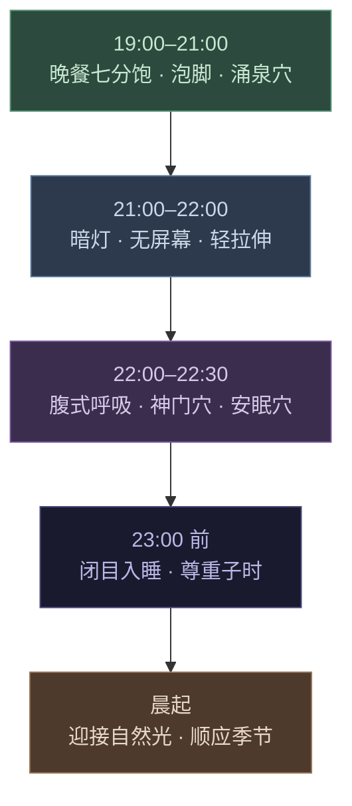

# 第八章 · 睡眠大药

> 卫气昼日行于阳，夜行于阴……阳气尽则卧，阴气尽则寤。
>
> — 《黄帝内经·灵枢·营卫生会篇》（第十八篇）

## 8.1 五小时勋章

周然是一家投资银行的副总裁，三十六岁，朋友圈签名写着"Sleep is for the weak"。他每天凌晨一点睡，早上六点起——五小时，雷打不动。他引以为豪。他觉得这是自律和效率的证明，就像硅谷那些标榜四小时睡眠的创业者一样。

头两年，一切看起来正常。第三年开始，身体悄悄交出了账单。

先是脑雾。下午两点开会，她发现自己听不进任何人说话，脑子像被一层棉花裹住。然后是体重。明明饮食没变，腰围却在半年内增加了六厘米。接着是反复感冒——一个季度三次。最后，年度体检报告上出现了一行红字：空腹血糖 6.8 mmol/L，糖尿病前期。

她的内分泌科医生问了一个问题："你每天睡几个小时？"

周然说五个小时，语气里还带着一丝骄傲。医生沉默了两秒钟，然后说："你的血糖问题、体重增加、免疫力下降，根源可能都不在饮食，而在睡眠。"

两千五百年前，《黄帝内经》的作者们不会用"糖尿病前期"这个词，但他们对睡眠的理解，远比周然——也远比大多数现代人——深刻得多。灵枢第十八篇写道：「卫气昼日行于阳，夜行于阴……阳气尽则卧，阴气尽则寤」（wèi qì zhòu rì xíng yú yáng, yè xíng yú yīn... yáng qì jìn zé wò, yīn qì jìn zé wù）——卫气白天运行在身体表面（阳），夜晚潜入脏腑深处（阴）。阳气耗尽，人就该睡了；阴气运行完毕，人自然就醒了。

睡眠不是可选的休息。它是身体切换到修复与防御模式的生理指令。

---

## 8.2 卫气与睡眠：内经的睡眠模型

内经对睡眠的解释异常精巧。核心概念是**卫气**（wèi qì）——身体的防御能量。

白天（阳相），卫气运行于体表。它负责三件事：维持警觉、调节体温、抵御外邪（病原体）。你白天精力充沛、反应敏锐、体表温暖——这些都是卫气在外运行的表现。

夜晚（阴相），卫气从体表撤回，潜入五脏六腑。它不再守卫外部，而是转向内部修复：修复受损的脏腑组织，重建免疫储备，清理白天积累的代谢废物。

内经记载，卫气每昼夜运行五十个循环——白天二十五个（阳循环），夜晚二十五个（阴循环）。当卫气完成白天的二十五个循环，阳气耗尽，人产生困意；当它完成夜间的二十五个循环，阴相结束，人自然苏醒。

这个模型映射到现代生理学时，精确得令人惊叹：

- **白天**：交感神经主导，皮质醇（cortisol）维持警觉，免疫监控处于"巡逻模式"
- **夜晚**：副交感神经主导，褪黑素（melatonin）诱导睡眠，生长激素（GH）大量分泌，免疫系统进入"深度修复模式"
- **睡眠周期**：现代睡眠科学发现人每晚经历约五个 90 分钟的睡眠周期，合计约 7.5 小时——与内经"夜间二十五个阴循环"的描述惊人地接近

卫气日行于阳、夜行于阴——这不是玄学，这是对人体昼夜节律的高度抽象。

---

## 8.3 大脑的"洗涤"系统：内经说对了

2012 年，罗切斯特大学的丹麦裔神经科学家 Maiken Nedergaard 发现了一个改变神经科学史的系统——**胶质淋巴系统**（glymphatic system）。

她的团队发现：在睡眠期间，大脑中的胶质细胞会收缩约 60%，细胞间隙随之扩大，脑脊液像一台高压清洗机一样涌入，冲刷掉白天积累的代谢废物——包括 β-淀粉样蛋白（amyloid-beta），这种蛋白质的异常堆积正是阿尔茨海默病的核心病理标志。

换句话说，大脑每天晚上都在"洗澡"。而这个清洗过程，**只在睡眠时才充分启动**。清醒状态下，胶质淋巴系统的清除效率下降约 90%。

回头看内经的卫气理论：白天卫气行于体表（外在防御），夜晚卫气撤入脏腑内部（内在修复清理）。大脑在睡眠中将资源从外部警觉重新分配到内部清洗——这正是"卫气夜行于阴"的生理实质。两千五百年前的中国医学家没有显微镜，没有脑脊液示踪剂，但他们通过对无数患者的观察，准确捕捉到了这个核心规律。

Nedergaard 在 2013 年发表于 *Science* 的论文震动了整个医学界。但对读过灵枢的人来说，这个发现并不令人意外——它只是用分子生物学的语言，重新讲述了一个古老的真相。

---

## 8.4 四时睡眠：跟着季节睡觉

内经不认为一年四季都该睡同样的时间。《素问·四气调神大论》（第二篇）为每个季节开出了不同的睡眠处方：

| 季节 | 内经指令 | 建议时长 | 现代解释 |
|------|---------|---------|---------|
| 春 | 夜卧早起 | ~7 小时 | 日照渐长，阳气上升，身体活跃度增加 |
| 夏 | 夜卧早起 | ~6.5–7 小时 | 阳气鼎盛，日照最长，能量外放 |
| 秋 | 早卧早起 | ~7.5–8 小时 | 阳气收敛，开始蓄积，身体需要更多恢复 |
| 冬 | 早卧晚起，必待日光 | ~8–9 小时 | 阴气最盛，日照最短，深度收藏 |

「早卧晚起，必待日光」（zǎo wò wǎn qǐ, bì dài rì guāng）——冬天要早睡晚起，一定要等到太阳出来再起身。这句话是两千五百年前写的，但它精确地描述了现代时间生物学的核心发现：

- 褪黑素的分泌量随季节变化，冬季分泌持续时间更长
- 光照是昼夜节律（circadian rhythm）的主时钟校准信号
- 哺乳动物普遍存在冬季增加睡眠时长的本能
- 高纬度地区冬季日照减少与季节性情绪障碍（SAD）直接相关

现代社会用人造光和闹钟抹杀了四季的睡眠差异。我们强迫自己全年都在同一时间起床。内经会说，这是在对抗天道。

---

## 8.5 子时入睡法则：为什么 23 点很重要

在内经的十二时辰体系中，**子时**（23:00–01:00）对应足少阳胆经。这是一天之中阴气达到极盛、阳气开始萌生的转折点。内经认为，在这个时段进入深度睡眠，是让阴阳顺利交接的关键。

错过子时入睡，就像错过了列车的最佳换乘窗口——后面的一切都会延误。

现代睡眠研究对此的验证：

- **生长激素分泌高峰**出现在入睡后的第一个深度睡眠周期，通常在 23:00–01:00 之间。如果你凌晨两点才入睡，即使睡足八小时，生长激素的分泌量也会大幅减少。
- **褪黑素浓度**在午夜前后达到峰值。延迟入睡会压缩深睡期占比。
- **"第二次清醒"现象**：如果你在晚上十一点前觉得困但硬撑过去，身体会释放一次小剂量的皮质醇来维持清醒——这就是为什么熬夜到凌晨一点反而会觉得"不困了"。但这不是精力恢复，而是应激激活。你欺骗了自己的身体。

子时入睡不是迷信。它是一条经过两千五百年临床观察和现代内分泌学双重验证的生理规律。

---

## 8.6 现代睡眠科学的警告

2017 年，加州大学伯克利分校神经科学家 Matthew Walker 出版了 *Why We Sleep*（《我们为什么要睡觉》），以近乎警报式的口吻向全世界宣告：睡眠不足是现代社会最大的公共健康危机之一。

Walker 和全球睡眠研究者的发现，逐条印证了内经的直觉：

**免疫力**：仅一晚四小时睡眠，自然杀伤细胞（NK cell）活性下降约 70%。NK 细胞是人体抗癌的第一道防线。内经说"卫气夜行于阴"——夜间的免疫重建被剥夺，防御系统就会崩溃。

**代谢**：连续数天睡眠不足（少于六小时），饥饿素（ghrelin）上升，瘦素（leptin）下降——你会更饿、更难停下嘴。周然的腰围增长六厘米，不是因为她吃多了，而是因为她睡少了。

**记忆与认知**：记忆巩固发生在睡眠期间，尤其是快速眼动睡眠（REM）阶段。睡眠不足直接损害工作记忆、创造力和决策能力。内经所说的"脏腑修复"，包括了大脑。

**情绪**：一晚睡眠不足，杏仁核（情绪中枢）的反应性增加约 60%。你不是"脾气不好"——你是睡眠不足。

**癌症风险**：世界卫生组织（WHO）已将夜班工作列为 2A 类致癌物（probable carcinogen）。长期昼夜颠倒，乳腺癌和前列腺癌风险显著上升。

内经没有"致癌物"的概念，但它反复强调：违背昼夜节律就是违背天道，而违背天道的后果是"百病由生"。

---

## 8.7 不寐：内经的失眠分型

内经不把失眠当作单一疾病。它识别了多种"不寐"模式，每一种有不同的病因和对策：

**心肾不交**（xīn shèn bù jiāo）：心属火，肾属水。正常情况下，心火下降温肾，肾水上升济心——水火既济。当这个循环断裂，表现为"脑子停不下来，身体却精疲力竭"。这是现代职场最常见的失眠模式：躺在床上，身体很累，但思维像一台失控的搜索引擎，不断翻检明天的待办事项。对策：睡前泡脚引火下行，按揉涌泉穴。

**肝郁化火**（gān yù huà huǒ）：长期压力和压抑的愤怒让肝气郁结，郁久化火。表现为入睡困难、多梦易醒、醒后烦躁。现代等价物：慢性压力→皮质醇节律紊乱→交感神经持续亢奋。对策：睡前散步释放肝气，避免睡前处理冲突性信息。

**脾胃不和**（pí wèi bù hé）：内经早就知道消化和睡眠的关联。「胃不和则卧不安」——胃里不舒服，就睡不踏实。现代研究证实：睡前两小时内进食高脂肪食物显著增加胃食管反流概率，破坏睡眠结构。对策：晚餐不过饱，睡前三小时不进食。

**心血虚**（xīn xuè xū）：心血不足，无法养神，导致浅睡、多梦、容易惊醒、伴随焦虑心悸。常见于长期用脑过度、饮食不规律的人群。现代对照：铁储备不足和贫血与睡眠质量下降高度相关。对策：补充含铁和B族维生素的食物，规律饮食。

四种失眠，四种原因，四套方案。这就是内经的精准——不是一刀切，而是辨证施治。

---

## 8.8 日常实践：内经安眠方案

将内经的睡眠智慧转化为每日可执行的流程：

**19:00–21:00 · 晚间准备**
- 晚餐七分饱，避免辛辣油腻
- 热水泡脚 15–20 分钟（水温 40–42°C），加入少量生姜或艾叶
- 按揉涌泉穴（足底前三分之一凹陷处），每侧 2–3 分钟

**21:00–22:00 · 感官减速**
- 调暗室内灯光，关闭或屏蔽蓝光屏幕
- 轻度拉伸或站桩 5–10 分钟
- 避免激烈讨论、刺激性新闻、工作邮件

**22:00–22:30 · 呼吸安神**
- 腹式呼吸：吸气四秒（鼻吸），屏气七秒，呼气八秒（口呼）
- 或采用内经调息法：意守丹田，自然呼吸，每次呼气时默念"松"
- 按揉神门穴（手腕横纹尺侧凹陷处）和安眠穴（耳后乳突下方凹陷处）

**23:00 前 · 进入子时**
- 闭目平躺，侧卧亦佳（内经倡导右侧卧）
- 放下一切。明天的事，留给明天的阳气

**晨起 · 迎接阳光**
- 起床后尽快接触自然光（即使是阴天）
- 冬季遵循"必待日光"原则，不强迫自己天黑起床

---

## 8.9 反思时刻

给自己做一个睡眠审计。诚实回答以下五个问题（每题 1–5 分，1 = 完全不符，5 = 完全符合）：

1. 我经常在 23:00 之后才上床。 ___
2. 我的睡眠时间在冬天和夏天完全一样。 ___
3. 我睡前一小时还在看手机或处理工作。 ___
4. 我需要闹钟才能起床（自然醒几乎不存在）。 ___
5. 我白天经常感到困倦或脑雾。 ___

**20–25 分**：你的睡眠正在严重透支身体。回到 8.8 节，今晚就开始调整。

**13–19 分**：你有改善空间。重点关注子时入睡和睡前仪式。

**5–12 分**：你的睡眠节律接近内经的理想状态。注意保持季节性调整。

睡眠不是浪费时间。它是你的身体每天为你开出的最强处方。撕掉那枚"五小时勋章"吧——它不是荣耀，是债务。

---

### 今日行动

- ⚡ 检查你的卧室：有没有待机的电子设备发出光源？把它们遮住或移出卧室。黑暗是褪黑素的朋友。
- ⚡ 今晚试一次"数字宵禁"——23:00 前把手机放到卧室外面充电，哪怕只做一晚。
- 🔄 从今晚开始，建立一个 15 分钟的固定睡前仪式（泡脚/拉伸/呼吸/阅读纸质书——选任意一种），连续 14 天不中断。

### 21 天微实验

**"子时入睡实验"**——连续 21 天在 23:00 前上床，关灯，放下手机。每天早晨醒来时记录两个数字：自评睡眠质量（1-5 分）和醒来时的精力评分（1-5 分）。第三周结束时，计算平均分并与第一周对比。

### 证据强度标注

| 内经原则 | 证据等级 | 说明 |
|---------|---------|------|
| 卫气昼行于阳、夜行于阴 | ✓ 已证实 | 交感（日）/副交感（夜）神经系统切换 + 免疫细胞的昼夜节律已被充分记录 |
| 睡眠时内脏修复 | ✓ 已证实 | 胶质淋巴系统（glymphatic system）2013 年发现：睡眠时大脑清除代谢废物 |
| 四时调整睡眠时长 | ✓ 已证实 | 季节性褪黑素分泌变化 + 光周期影响睡眠需求，有流行病学数据支持 |
| 子时（23:00-1:00）入睡最关键 | ? 合理假说 | 生长激素在前半夜深睡期峰值分泌属实，但最佳入睡时间因个体 chronotype 而异 |
| 心肾不交导致失眠 | ? 合理假说 | "racing mind + exhausted body" 模式在失眠患者中极常见，但中医脏腑归因缺乏精确验证 |

---

## 8.10 总结与过渡

在前面的章节中，你校准了昼夜节律（第二章），调整了饮食结构（第三章），学会了疏导情绪（第四章），找到了运动的平衡（第五章），理解了阴阳平衡的深层逻辑（第七章）。现在你看到了它们的汇合点——**睡眠**。

睡眠是所有养生支柱的交汇处。节律紊乱，你无法在子时入睡。饮食过重，脾胃不和让你辗转难眠。情绪积压，肝郁化火点燃夜晚。运动不足或过度，气血不能顺利从阳转阴。每一根支柱的失守，最终都在睡眠中暴露。

反过来说，如果你的睡眠是好的——深沉、完整、顺应季节——那说明你的节律、饮食、情志、运动大概率都在正常运转。睡眠是身体健康的终极指示器。

卫气白天守护你的世界，夜晚修复你的身体。不要剥夺它工作的时间。

周然后来把入睡时间调到了 22:30。三个月后，空腹血糖回到了 5.6 mmol/L。脑雾消散了，腰围缩回去了两厘米。他的朋友圈签名换成了"Sleep is medicine"。他终于明白了——那五个小时的睡眠不是效率的证明，而是身体开出的一张张透支账单，只不过身体一直在沉默地等他还债。

现在，所有的拼图都已就位。下一章，我们把它们组装起来。**第九章将为你提供一套完整的九十天养生重启方案**——从第一周的微调到第十二周的深度整合，把两千五百年前的智慧，变成你明天就能开始的行动。

---

## 参考文献

1. 《黄帝内经·灵枢》第 18 篇（营卫生会篇），《黄帝内经·素问》第 2 篇（四气调神大论）
2. Walker, M. *Why We Sleep: Unlocking the Power of Sleep and Dreams*. Scribner, 2017.
3. Xie, L., Kang, H., Xu, Q. et al. "Sleep drives metabolite clearance from the adult brain." *Science*, 342(6156), 373–377, 2013.
4. Van Cauter, E. & Plat, L. "Physiology of growth hormone secretion during sleep." *Journal of Pediatrics*, 128(5), S32–S37, 1996.
5. Irwin, M. et al. "Partial night sleep deprivation reduces natural killer cell activity in humans." *Psychosomatic Medicine*, 58(5), 493–498, 1996.
6. IARC Monographs Vol. 124. "Night shift work." WHO/International Agency for Research on Cancer, 2019.
7. Wehr, T.A. "Photoperiodism in humans and other primates: Evidence and implications." *Journal of Biological Rhythms*, 16(4), 348–364, 2001.
