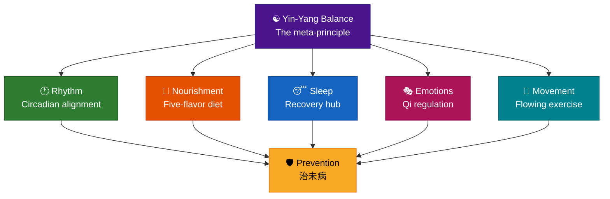

# Chapter 9 · Your 90-Day Wellness Reset

> 知其要者，一言而终；不知其要者，流散无穷。
> *Zhī qí yào zhě, yī yán ér zhōng; bù zhī qí yào zhě, liú sàn wú qióng.*
>
> "Those who grasp the essential can say it in one word. Those who don't will wander endlessly."
>
> — *Su Wen*, Chapter 25 (宝命全形论)

## 9.1 The Emperor's Final Question

This book began with a question.

The Yellow Emperor asked Qi Bo: the ancients lived to a hundred with vitality intact. People today decline at fifty. Has the world changed — or have we lost the Way?

Over eight chapters, Qi Bo's answer has unfolded into a complete tapestry. Live in rhythm (Chapter 2). Let food be your nourishment (Chapter 3). Tend your emotions as you would a garden (Chapter 4). Move like water (Chapter 5). Prevent rather than treat (Chapter 6). Follow Yin and Yang (Chapter 7). Honor sleep as the master healer (Chapter 8). Each chapter was one thread; none was the whole cloth.

Now it's your turn to weave your own answer.

There is a line in *Su Wen* Chapter 25 that could serve as the thesis statement for the entire Neijing: "Those who grasp the essential can say it in one word. Those who don't will wander endlessly." After 2,500 years of commentary, the essential word is: **和 (hé)** — harmony. Harmony with Yin and Yang. Harmony with the seasons. Harmony among the five flavors, the seven emotions, movement and stillness, waking and sleeping. This chapter turns 和 into a roadmap: a ninety-day plan you can follow starting tomorrow.

Why ninety days? Because it spans one season — the Neijing's fundamental unit of biological rhythm. And because modern behavioral science converges on a similar number: Phillippa Lally's 2010 study found that new habits take an average of 66 days to become automatic, with more complex behaviors requiring longer. Ninety days is where ancient wisdom and modern research meet — long enough to rewire habits, short enough to sustain motivation.

---

## 9.2 The Five Pillars — A Recap

Before the plan, a map. Here is the book's core framework in one view.

| Pillar | Chapter | Key Principle | One-Sentence Summary |
|--------|---------|---------------|---------------------|
| Rhythm | Ch 2 | 子午流注 Body Clock | Live in sync with your biological timetable |
| Nourishment | Ch 3 | 五味平衡 Five Flavors | Balance five flavors, eat with the seasons |
| Emotions | Ch 4 | 七情调和 Seven Emotions | Emotions are Qi — regulate, don't suppress |
| Movement | Ch 5 | 形劳不倦 Effortless Effort | Move like water — flowing, not forcing |
| Prevention | Ch 6 | 治未病 Treat Before Illness | Prevent rather than treat |

Yin-Yang balance (Chapter 7) is the meta-principle governing all five. Sleep (Chapter 8) is the master recovery mechanism. Think of the pillars as the foundation, Yin-Yang as the roof, and sleep as the central column holding everything up.

---

## 9.3 Phase 1: Foundation (Days 1–30) — 筑基

Theme: establish the rhythmic foundation. Don't overhaul your life overnight — calibrate the clock first.

### Weeks 1–2: Sleep Reset

Sleep is ground zero. Chapter 8's core argument: the 子时 (zǐ shí) window — 11 PM to 1 AM — is when Yin energy peaks and the body enters its deepest repair cycle. Missing this window is like missing a flight that doesn't reschedule.

Four actions:
- Set a fixed bedtime before 11 PM and protect it like a meeting with your CEO
- No screens for one hour before bed
- Get natural sunlight within 30 minutes of waking
- A 15-minute warm foot soak before sleep (simple, remarkably effective)

Don't underestimate these four moves. Andrew Huberman's neuroscience research at Stanford has repeatedly confirmed that morning light exposure and consistent sleep timing are the two most powerful levers for resetting your circadian rhythm — a finding that aligns precisely with the Neijing's call to "model on Yin and Yang, harmonize with the arts of calculation."

### Weeks 3–4: Rhythm Alignment

Once sleep stabilizes, calibrate daytime rhythm.

- Eat breakfast between 7–9 AM (辰时, chén shí, when the Stomach meridian is most active) — make it the biggest meal of the day
- Finish dinner before 7 PM, keep it light
- One 15-minute walk per day, mornings preferred
- A 2-minute morning breathing practice (diaphragmatic breathing, calm the mind before the day begins)

**Phase 1 success criteria:**
- Asleep before 11 PM ≥ 5 nights per week
- Eating breakfast ≥ 5 days per week
- Daily walk ≥ 5 days per week

Perfection is not the standard. The Neijing's 70% rule activates here — consistent execution at 70% beats an ambitious plan that collapses at 100%.

---

## 9.4 Phase 2: Expansion (Days 31–60) — 拓展

Theme: layer food wisdom and emotional awareness onto the rhythmic foundation.

### Weeks 5–6: The Five-Flavor Diet

- Audit your current diet: which flavors dominate? (For most modern eaters: sweet and salty)
- Add one "missing flavor" per week — bitter (green tea, dark leafy greens), sour (fermented foods, vinegar), pungent (ginger, garlic, fresh herbs)
- At least one warm breakfast daily (congee, oatmeal, soup — not iced coffee and cold cereal)
- Practice 七分饱 (qī fēn bǎo) — stop eating when you're 70% full, when you could eat a few more bites but choose not to

Five-flavor balance is addition, not restriction. Chapter 3's core insight: the question is never "what must I give up?" but "what's missing?" When your taste map expands from two colors to five, eating becomes richer and more interesting, not more austere.

### Weeks 7–8: Emotional Hygiene

- A 3-minute morning emotional check-in (journal or mental scan: what is my emotional weather right now?)
- Identify your dominant emotional pattern — anger? overthinking? anxiety?
- Practice 以情胜情 (yǐ qíng shèng qíng, counter-emotion therapy) once per week — 怒则走 (when angry, take a walk), 忧则歌 (when melancholy, listen to music or sing), 恐则思 (when fearful, engage rational analysis)
- Replace one daily doomscrolling session with a 10-minute walk
- Remember Chapter 4's core principle: emotions are not the enemy — they are Qi in motion. The goal is not elimination but flow.

**Phase 2 success criteria:**
- Conscious five-flavor practice in ≥ 3 meals per week
- Morning emotional check-in ≥ 4 days per week
- Can name your dominant emotional pattern

---

## 9.5 Phase 3: Integration (Days 61–90) — 融合

Theme: from deliberate practice to second nature. Neijing wisdom dissolves into the fabric of daily life.

### Weeks 9–10: Movement Evolution

- Upgrade the daily walk to 30 minutes
- Add one Tai Chi, Qigong, or stretching session per week (a YouTube tutorial is a perfectly fine starting point)
- Follow the Neijing movement schedule: morning stretching, afternoon peak exercise (3–5 PM, when the Bladder meridian is active and physical performance peaks), gentle evening wind-down
- Practice "Five Exhaustions" awareness: change posture every 50 minutes (prolonged looking harms Blood, prolonged sitting harms Flesh, prolonged standing harms Bone, prolonged walking harms Sinews, prolonged lying harms Qi)

### Weeks 11–12: Seasonal Attunement and Prevention

- Adjust sleep timing and food choices to the current season (revisit the seasonal guides in Chapters 2 and 3)
- Weekly body scan: rate energy, sleep, digestion, mood, and pain on a 1–5 scale — five questions, five minutes
- Build your personal constitution profile (revisit the nine types in Chapter 6)
- Start planning your NEXT 90 days — this is a lifestyle, not a program with an expiration date

**Phase 3 success criteria:**
- Exercise ≥ 4 days per week (varied, moderate)
- Seasonal awareness reflected in daily choices
- Weekly self-monitoring established as habit

---

## 9.6 The Weekly Rhythm Template

All elements woven into one executable weekly plan.

| Time | Monday–Friday | Saturday | Sunday |
|------|-------------|----------|--------|
| 6:00–7:00 | Wake, sunlight, breathing | Sleep in (seasonal) | Sleep in |
| 7:00–9:00 | Warm breakfast (biggest meal) | Market visit, seasonal cooking | Relaxed brunch |
| 9:00–12:00 | Work (50-min focus + movement snacks) | Outdoor exercise / Tai Chi | Rest, read, reflect |
| 12:00–13:00 | Moderate lunch, brief rest | Light lunch | Light lunch |
| 15:00–17:00 | Exercise window (walk / workout) | Social time / leisure | Time in nature |
| 18:00–19:00 | Light dinner | Light dinner | Meal prep for the week |
| 21:00–22:00 | Wind down, foot soak, no screens | Same | Weekly body scan |
| Before 23:00 | Sleep | Sleep | Sleep |

This is not a military schedule — it's rhythmic scaffolding. Once the scaffold becomes habit, you won't even notice it's there.

---

## 9.7 Common Obstacles and Neijing Solutions

| Obstacle | Neijing Perspective | Practical Solution |
|----------|-------------------|-------------------|
| "I'm too busy" | 过劳伤气 — overwork depletes Qi. Being busy is the reason to practice, not the excuse to skip. | Start with ONE change (fix your sleep time). 10 minutes a day is enough to begin. |
| "I travel constantly" | 因时制宜 — adapt to context, but anchor the essentials | Keep the 11 PM sleep rule regardless of time zone. It's your non-negotiable. |
| "I hate morning exercise" | 因人制宜 — adapt to the person | Good news: the Neijing's peak exercise window is 3–5 PM, not dawn. |
| "Healthy food is boring" | 五味平衡 — balance, not restriction | Add flavors, don't subtract them. Ginger, garlic, fermented foods, fresh herbs — allies, not enemies. |
| "I can't control my emotions" | 情志有法 — there are methods | Don't control. Start with 觉察 (awareness). Name the emotion. Locate it in your body. That alone changes everything. |
| "This is too much at once" | 和 (harmony), not 完 (perfection) | The 70% rule: consistency at 70% beats perfection that crumbles. |

---

## 9.8 Your Wellness Dashboard

Once a month, take five minutes for this self-assessment. Pen and paper is all you need — no apps, no devices. The Neijing is analog wisdom; honor it with analog tracking.

**Five-Pillar Score (rate each 1–5):**

1. **Sleep** — Quality and timing (falling asleep easily? waking refreshed?)
2. **Nourishment** — Five-flavor balance and rhythm (eating breakfast? stopping at 70% full?)
3. **Emotions** — Awareness and regulation (do you know your emotional state? are you tending it?)
4. **Movement** — Consistency and variety (moving regularly? in more than one way?)
5. **Vitality** — Overall 精气神 (Jīng-Qì-Shén) — compared to last month, trending up or down?

Record monthly. Don't chase numbers — chase direction. After three months, the trend tells a clearer story than any single score.

---

### Evidence Check

| Principle | Evidence Level | Notes |
|-----------|---------------|-------|
| 90 days is sufficient to change habits | ✓ Confirmed | Lally 2010 found an average of 66 days to habit automaticity; 90 days provides a safe margin |
| Gradual change outperforms radical overhaul | ✓ Confirmed | Behavioral science consensus: tiny-habit strategies succeed at far higher rates than total-reform approaches |
| The 70% rule (70% consistency > 100% perfection) | ? Plausible hypothesis | Intuitively sound, consistent with "perfect is the enemy of good," but lacks direct quantitative comparison studies |
| Social support enhances health behavior | ✓ Confirmed | Blue Zones research + multiple behavioral intervention RCTs confirm peer support significantly improves adherence |
| The season as the fundamental unit of wellness | ? Plausible hypothesis | The Neijing's four-season framework has philosophical grounding, but the "exactly 90 days" correspondence to season length is approximate, not precise |

---

## 9.9 The Emperor's Answer

Let us return to page one.

The Yellow Emperor asked: people today decline at fifty, while the ancients lived to a hundred. Has the world changed, or have we lost the Way?

Qi Bo's answer sits in the opening passage of *Su Wen*, Chapter 1 — and at the end of this book:

「上古之人，其知道者，法于阴阳，和于术数，食饮有节，起居有常，不妄作劳，故能形与神俱，而尽终其天年，度百岁乃去。」

*Shàng gǔ zhī rén, qí zhī dào zhě, fǎ yú yīn yáng, hé yú shù shù, shí yǐn yǒu jié, qǐ jū yǒu cháng, bù wàng zuò láo, gù néng xíng yǔ shén jù, ér jìn zhōng qí tiān nián, dù bǎi suì nǎi qù.*

"The ancients who understood the Way modeled on Yin and Yang, harmonized with the arts of calculation, ate and drank with moderation, lived with regularity, and did not overexert recklessly. Thus their form and spirit were complete, and they lived out their natural span of years, departing only after a hundred."

Twenty-five centuries later, this remains the finest wellness prescription ever written. 法于阴阳 — follow nature's laws. 和于术数 — master the methods of balance. 食饮有节 — eat with measure. 起居有常 — live with rhythm. 不妄作劳 — don't spend what you can't replenish.

The Way was never lost. It was only forgotten — buried under blue-light screens at midnight, under delivery meals at 11 PM, under work sprints that burn through weekends, under emotions suppressed rather than tended. But the Way is still there. In the rhythm of sunrise and sunset. In the richness of five flavors on a simple plate. In the calm that follows a deep breath. In the clarity that greets you after a night of genuine rest.

This book has not taught you anything new. It has helped you remember what your body already knew.

The final question is not Qi Bo's. It's yours: starting tomorrow, what will you choose to do differently?

---

## 9.10 Reflection Moment

Three questions. Three actions.

First: **Which single Neijing principle resonated most deeply with you?** The circadian wisdom of 子午流注? The dietary philosophy of five-flavor balance? The emotional method of 以情胜情? The preventive art of 治未病? Write it down. Put it where you'll see it every day.

Second: **What is the FIRST change you will make tomorrow?** Not three changes. Not five. One. Perhaps it's being in bed by 11 tonight. Perhaps it's eating a warm breakfast tomorrow morning. Perhaps it's stepping outside for ten minutes the next time anger rises. The smallest change, consistently executed, is a hundred times more powerful than the perfect plan left on a shelf.

Third: **Who will you share this journey with?** Blue Zones research reveals the same pattern again and again: the defining feature of the world's longest-lived communities is not genetics, not diet, not climate — it's connection. Find a partner, a friend, a family member. Walk these ninety days together.

「知其要者，一言而终。」

The word is **和** — harmony.

And the action starts tomorrow.

---

## References

1. *Huangdi Neijing Su Wen*, Chapters 1 (上古天真论), 2 (四气调神大论), and 25 (宝命全形论).
2. Lally, P., van Jaarsveld, C.H.M., Potts, H.W.W., & Wardle, J. (2010). "How are habits formed: Modelling habit formation in the real world." *European Journal of Social Psychology*, 40(6), 998–1009.
3. Huberman, A. (2021). "Using Light for Health." *Huberman Lab Podcast*, Stanford University.
4. Buettner, Dan. *The Blue Zones: Lessons for Living Longer from the People Who've Lived the Longest*. National Geographic, 2008.
5. Clear, James. *Atomic Habits: An Easy & Proven Way to Build Good Habits & Break Bad Ones*. Avery, 2018.
6. American College of Lifestyle Medicine. "The Six Pillars of Lifestyle Medicine." ACLM Position Statement, 2024.
7. Walker, Matthew. *Why We Sleep: Unlocking the Power of Sleep and Dreams*. Scribner, 2017.
