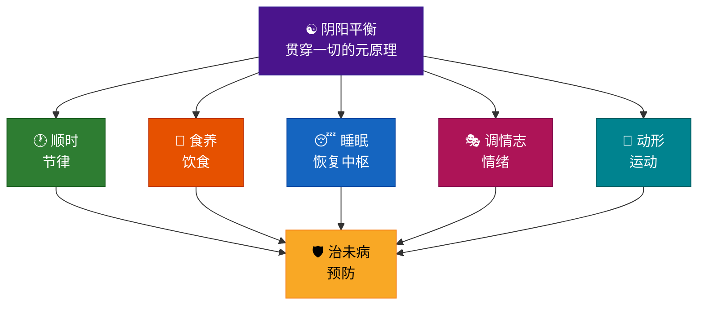

# 第九章 · 九十天养生计划

> 知其要者，一言而终；不知其要者，流散无穷。
>
> — 《黄帝内经·素问·宝命全形论》

## 9.1 黄帝的最后一问

这本书始于一个问题。

黄帝问岐伯：上古之人，春秋皆度百岁而动作不衰；今时之人，年半百而动作皆衰。时世异耶？人将失之耶？是时代变了，还是人自己把路走偏了？

八个章节以来，岐伯的回答已经展开成一幅完整的画卷。活在节律之中（第二章）。以食为养（第三章）。情志有法（第四章）。动静相宜（第五章）。治未病（第六章）。阴阳为纲（第七章）。以睡为本（第八章）。每一章都是答案的一部分，但没有哪一章是全部。

现在，到了你自己给出答案的时候了。

《素问·宝命全形论》有一句话，几乎可以为整部《内经》做总结：「知其要者，一言而终；不知其要者，流散无穷。」——抓住核心的人，一个字就能说完。抓不住的人，会在无穷的细节里迷失。

那个字是什么？**和**。和谐、平衡、合于自然。前八章的所有原则最终指向同一个字——和于阴阳，和于四时，和于五味，和于情志，和于动静，和于睡醒。这一章的任务是把"和"变成一张你可以照着走的路线图：一个九十天的实践计划。

为什么是九十天？因为它恰好是一个季节的长度——内经以四季为生命节律的基本单位。同时，现代行为科学的研究也给出了相似的答案：Phillippa Lally 等人在 2010 年的研究发现，一个新习惯从刻意执行到自动化平均需要 66 天，更复杂的行为变化可能需要更久。九十天是科学与传统的交汇点——足够长以重塑习惯，又足够短以保持动力。

---

## 9.2 五柱总览

在进入具体计划之前，让我们用一张表格回顾全书的核心框架。

| 支柱 | 章节 | 核心原则 | 一句话总结 |
|------|------|---------|-----------|
| 顺时 | 第二章 | 子午流注 | 活在身体的时间表里 |
| 食养 | 第三章 | 五味平衡 | 平衡五味，顺时而食 |
| 调情志 | 第四章 | 七情调和 | 情绪是气——调节，而非压抑 |
| 动形 | 第五章 | 形劳不倦 | 如水般流动，不对抗，不过度 |
| 治未病 | 第六章 | 上工治未病 | 预防先于治疗 |

阴阳（第七章）是贯穿一切的元原理。睡眠（第八章）是核心恢复机制。五柱是地基，阴阳是屋顶，睡眠是中央支柱。

---

## 9.3 第一阶段：筑基（第 1-30 天）

主题：建立节律基础。不要同时改变一切——先把生活的"钟"校准。

### 第 1-2 周：睡眠重置

睡眠是一切的起点。第八章的核心论述是：子时（23:00-01:00）阴气最盛，是身体深度修复的关键窗口。错过子时入睡，如同错过一趟不可补签的航班。

四个行动：
- 设定固定就寝时间，在 23:00 前上床
- 睡前 1 小时停止所有屏幕使用
- 起床后 30 分钟内接触自然光
- 睡前热水泡脚 15 分钟（简单但强大的安神法）

不要小看这四件事。Andrew Huberman 的神经科学研究反复证实，晨光暴露和稳定的就寝时间是调节昼夜节律最有效的两个杠杆——这与内经"法于阴阳，和于术数"的表述完全吻合。

### 第 3-4 周：节律校准

睡眠稳定后，开始校准白天的节律。

- 7:00-9:00 吃早餐（辰时，胃经当令），让早餐成为一天中最丰盛的一餐
- 晚餐在 19:00 前完成，份量轻简
- 每天一次 15 分钟的步行（晨间优先）
- 每天早晨 2 分钟呼吸练习（腹式呼吸，静心开局）

**第一阶段达标线：**
- 23:00 前入睡 ≥ 每周 5 晚
- 吃早餐 ≥ 每周 5 天
- 每日步行 ≥ 每周 5 天

不追求完美。内经的七分法则在这里就生效了——70% 的执行率远胜 100% 的计划。

---

## 9.4 第二阶段：拓展（第 31-60 天）

主题：在节律基础上叠加饮食智慧和情绪觉察。

### 第 5-6 周：五味饮食

- 审视你目前的饮食：哪些味道占主导？（多数现代人的答案是甜和咸）
- 每周增加一种"缺席的味道"——苦（绿茶、苦瓜）、酸（发酵食品、醋）、辛（姜、蒜、香料）
- 每天至少一顿温热早餐（粥、汤、燕麦——不是冰咖啡和冷沙拉）
- 践行「七分饱」原则——吃到感觉"还能再吃几口"时放下筷子

五味平衡不是限制，而是扩展。第三章的核心洞见是：不是"不能吃什么"，而是"还缺什么"。当味觉的地图从两种颜色变成五种，饮食反而变得更丰富、更有趣。

### 第 7-8 周：情志卫生

- 每天早晨 3 分钟情绪签到（日记或默想：此刻的情绪底色是什么？）
- 识别你的主导情绪模式——容易怒？容易忧思？容易焦虑？
- 每周实践一次"以情胜情"——怒则走（愤怒时去散步）、忧则歌（忧郁时听音乐或唱歌）、恐则思（恐惧时用理性分析）
- 把每天的一次"刷手机"替换为 10 分钟散步
- 记住第四章的核心法则：情绪不是敌人——它是气的表达。目标不是消灭情绪，而是让气流动起来。

**第二阶段达标线：**
- 每周 ≥ 3 餐有意识地实践五味平衡
- 晨间情绪签到 ≥ 每周 4 天
- 能说出自己的主导情绪模式

---

## 9.5 第三阶段：融合（第 61-90 天）

主题：从刻意练习到自然而然。把内经的智慧融入日常的肌理。

### 第 9-10 周：运动进阶

- 将每日步行升级为 30 分钟
- 每周增加一次太极、八段锦或拉伸练习（YouTube 视频引导即可）
- 遵循内经的运动时间表：晨起拉伸、午后运动高峰（15:00-17:00，膀胱经当令，体能最佳）、傍晚柔缓
- 实践"五劳"觉察——每 50 分钟变换姿势（久视伤血、久坐伤肉、久立伤骨、久行伤筋、久卧伤气）

### 第 11-12 周：四时调摄与治未病

- 根据当前季节调整睡眠和饮食（回顾第二章和第三章的季节指导）
- 每周进行一次身体扫描：精力、睡眠、消化、情绪、疼痛——五个维度，每个打 1-5 分
- 构建你的个人体质档案（回顾第六章的九种体质）
- 开始规划下一个九十天——这不是一个项目，而是一种生活方式

**第三阶段达标线：**
- 每周运动 ≥ 4 天（多样化、适度）
- 日常选择中体现季节意识
- 每周自我监测已成习惯

---

## 9.6 每周节律模板

将所有要素融合成一张可执行的周计划。

| 时间 | 周一至周五 | 周六 | 周日 |
|------|-----------|------|------|
| 6:00-7:00 | 起床、晨光、呼吸练习 | 可适当晚起 | 可适当晚起 |
| 7:00-9:00 | 温热早餐（一天最丰盛） | 逛市场、烹饪时令食材 | 轻松早午餐 |
| 9:00-12:00 | 工作（50 分钟专注 + 运动间隙） | 户外运动/太极 | 休息/阅读/反思 |
| 12:00-13:00 | 适量午餐，短暂休息 | 轻简午餐 | 轻简午餐 |
| 15:00-17:00 | 运动窗口（散步/锻炼） | 社交/休闲 | 亲近自然 |
| 18:00-19:00 | 清淡晚餐 | 清淡晚餐 | 备餐（为下周准备） |
| 21:00-22:00 | 放松、泡脚、远离屏幕 | 同左 | 每周身体扫描 |
| 23:00 前 | 入睡 | 入睡 | 入睡 |

这不是军事化时间表——它是节律的脚手架。当脚手架成为习惯后，你甚至不会注意到它的存在。

---

## 9.7 常见障碍与内经解法

| 障碍 | 内经视角 | 实用解法 |
|------|---------|---------|
| "我太忙了" | 过劳伤气——忙不是理由，而是最该养生的原因 | 从一件事开始（固定睡觉时间）。每天 10 分钟就足够启动改变。 |
| "我经常出差" | 因时制宜——环境在变，原则不变 | 守住"锚点"：不论哪个时区，23:00 规则不动摇 |
| "我讨厌早起运动" | 因人制宜——不必强迫 | 下午 15:00-17:00 才是内经的运动高峰窗口 |
| "健康饮食太无聊" | 五味平衡——是加法，不是减法 | 加味道，别减味道。姜、蒜、香料、发酵食品都是盟友。 |
| "我控制不了情绪" | 情志有法——先觉察，再调节 | 别控制，先命名。说出那个情绪的名字，找到它在身体里的位置。 |
| "这些加起来太多了" | 和，不是完 | 七分法则：70% 的持续性胜过 100% 的完美主义 |

---

## 9.8 你的健康仪表盘

每月用五分钟完成这个自评——纸笔即可，不需要任何 App。内经是模拟时代的智慧，用模拟的方式记录就好。

**五柱评分（每项 1-5 分）：**

1. **睡眠**：质量与时机（入睡顺畅？醒来精神？）
2. **饮食**：五味平衡与节律（早餐有吃？七分饱做到了？）
3. **情志**：觉察与调节（知道自己的情绪状态？有在调节？）
4. **运动**：持续性与多样性（每周有在动？不只一种方式？）
5. **整体活力**：精气神总体感受（和上个月比，是上升还是下降？）

每月记录一次。不要追求分数——追求趋势。连续三个月看下来，方向比数字重要。

---

### 证据强度标注

| 原则 | 证据等级 | 说明 |
|------|---------|------|
| 90 天足以改变习惯 | ✓ 已证实 | Lally 2010 研究平均 66 天形成习惯，90 天提供安全余量 |
| 渐进式改变优于激进式 | ✓ 已证实 | 行为科学共识：微习惯（tiny habits）策略的成功率远超全面改革 |
| 七分法则（70% 持续性 > 100% 完美）| ? 合理假说 | 直觉合理，与"完美是好的敌人"一致，但缺乏直接对比的量化研究 |
| 社交支持增强健康行为 | ✓ 已证实 | 蓝区研究 + 多项行为干预 RCT 证实同伴支持显著提高依从性 |
| 季节为养生基本单位 | ? 合理假说 | 内经以四季为框架有哲学基础，但"恰好 90 天"与季节长度的对应是近似而非精确 |

---

## 9.9 黄帝的答案

让我们回到这本书的第一页。

黄帝问：今时之人，年半百而动作皆衰者，时世异耶？人将失之耶？——是时代变了，还是人把道弄丢了？

岐伯的回答，在《素问》第一篇的开头，也在这本书的结尾：

「上古之人，其知道者，法于阴阳，和于术数，食饮有节，起居有常，不妄作劳，故能形与神俱，而尽终其天年，度百岁乃去。」

*Shàng gǔ zhī rén, qí zhī dào zhě, fǎ yú yīn yáng, hé yú shù shù, shí yǐn yǒu jié, qǐ jū yǒu cháng, bù wàng zuò láo, gù néng xíng yǔ shén jù, ér jìn zhōng qí tiān nián, dù bǎi suì nǎi qù.*

上古那些懂得养生之道的人，以阴阳为法则，以术数为调和，饮食有节制，起居有规律，不过度劳作。所以他们形体与精神合一，得以尽享天年，活过百岁才离去。

两千五百年后，这段话仍然是最好的养生处方。法于阴阳——遵循自然规律。和于术数——掌握平衡的方法。食饮有节——饮食有度。起居有常——生活有律。不妄作劳——不过度消耗。

道从未丢失。它只是被遗忘了。被手机屏幕的蓝光、深夜的外卖、无尽的加班、被压抑而非疏导的情绪所遮蔽。但道一直在那里——在日升月落的节律里，在五谷五味的丰饶里，在深呼吸后的平静里，在一夜好眠后的清明里。

这本书不是在教你新东西。它是在帮你想起你的身体本来就知道的事。

最后的问题不是岐伯的，而是你的：明天开始，你打算做出什么不同的选择？

---

## 9.10 反思时刻

三个问题，三个行动。

1. **内经的哪一个原则最打动你？** 是子午流注的时间智慧？五味平衡的饮食哲学？以情胜情的调节之法？还是治未病的预防思维？把那个原则写下来，贴在你每天能看到的地方。

2. **明天你要做的第一个改变是什么？** 不是三个，不是五个。一个就够。也许是今晚 23:00 前上床，也许是明天早上吃一顿温热的早餐，也许是在愤怒涌起时出去走十分钟。最小的改变，持续执行，比最完美的计划搁置在那里强一百倍。

3. **你会和谁分享这段旅程？** 蓝区研究反复发现：长寿社区的共同特征不是基因、不是饮食、不是气候——而是连接。找一个伙伴、一个朋友、一个家人，一起走这九十天。

「知其要者，一言而终。」

那个字是**和**。

而行动，从明天开始。

---

## 参考文献

1. 《黄帝内经·素问》第 1 篇（上古天真论）、第 2 篇（四气调神大论）、第 25 篇（宝命全形论）
2. Lally, P., van Jaarsveld, C.H.M., Potts, H.W.W., & Wardle, J. (2010). "How are habits formed: Modelling habit formation in the real world." *European Journal of Social Psychology*, 40(6), 998–1009.
3. Huberman, A. (2021). "Using Light for Health." *Huberman Lab Podcast*, Stanford University.
4. Buettner, Dan. *The Blue Zones: Lessons for Living Longer from the People Who've Lived the Longest*. National Geographic, 2008.
5. Clear, James. *Atomic Habits: An Easy & Proven Way to Build Good Habits & Break Bad Ones*. Avery, 2018.
6. American College of Lifestyle Medicine. "The Six Pillars of Lifestyle Medicine." ACLM Position Statement, 2024.
7. Walker, Matthew. *Why We Sleep: Unlocking the Power of Sleep and Dreams*. Scribner, 2017.
